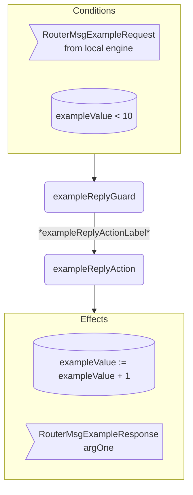

??? code "Juvix imports"

    ```juvix
    module arch.node.engines.router_behaviour;

    import arch.node.engines.router_messages open;
    import arch.node.engines.router_config open;
    import arch.node.engines.router_environment open;

    import arch.node.types.basics open;
    import arch.node.types.identities open;
    import arch.node.types.messages open;
    import arch.node.types.engine open;
    import arch.node.types.anoma as Anoma open;
    ```

---

# Router Behaviour

---

## Overview

A router engine acts in the ways described on this page.
The action labels correspond to the actions that can be performed by the engine.
Using the action labels, we describe the effects of the actions.

---

## Router Action Flowchart

---

### `exampleReply` Flowchart

<figure markdown>



<figcaption markdown="span">

`exampleReply` flowchart

</figcaption>
</figure>


---

## Action arguments

The action arguments are set by a guard
and passed to the action function as part of the `GuardOutput`.

---

### `RouterActionArguments`

<!-- --8<-- [start:RouterActionArguments] -->
```juvix
RouterActionArguments : Type := Unit;
```
<!-- --8<-- [end:RouterActionArguments] -->

---

## Actions

??? code "Auxiliary Juvix code"

    ---

    ### `RouterAction`

    <!-- --8<-- [start:RouterAction] -->
    ```juvix
    RouterAction : Type :=
      Action
        RouterLocalCfg
        RouterLocalState
        RouterMailboxState
        RouterTimerHandle
        RouterActionArguments
        Anoma.Msg
        Anoma.Cfg
        Anoma.Env;
    ```
    <!-- --8<-- [end:RouterAction] -->

    ---

    ### `RouterActionInput`

    <!-- --8<-- [start:RouterActionInput] -->
    ```juvix
    RouterActionInput : Type :=
      ActionInput
        RouterLocalCfg
        RouterLocalState
        RouterMailboxState
        RouterTimerHandle
        RouterActionArguments
        Anoma.Msg;
    ```
    <!-- --8<-- [end:RouterActionInput] -->

    ---

    ### `RouterActionEffect`

    <!-- --8<-- [start:RouterActionEffect] -->
    ```juvix
    RouterActionEffect : Type :=
      ActionEffect
        RouterLocalState
        RouterMailboxState
        RouterTimerHandle
        Anoma.Msg
        Anoma.Cfg
        Anoma.Env;
    ```
    <!-- --8<-- [end:RouterActionEffect] -->

    ---

    ### `RouterActionExec`

    <!-- --8<-- [start:RouterActionExec] -->
    ```juvix
    RouterActionExec : Type :=
      ActionExec
        RouterLocalCfg
        RouterLocalState
        RouterMailboxState
        RouterTimerHandle
        RouterActionArguments
        Anoma.Msg
        Anoma.Cfg
        Anoma.Env;
    ```
    <!-- --8<-- [end:RouterActionExec] -->

---

#### `exampleReplyAction`

Respond with a `RouterMsgExampleReply`.

State update
: The state remains unchanged.

Messages to be sent
: A `RouterMsgExampleReply` message with the data set by `exampleReplyGuard`.

Engines to be spawned
: No engine is created by this action.

Timer updates
: No timers are set or cancelled.

<!-- --8<-- [start:exampleReplyAction] -->
```juvix
exampleReplyAction
  (input : RouterActionInput)
  : Option RouterActionEffect :=
  TODO {-
  let
    cfg := ActionInput.cfg input;
    env := ActionInput.env input;
    trigger := ActionInput.trigger input;
    args := ActionInput.args input;
  in
    case getEngineMsgFromTimestampedTrigger trigger of {
    | some mkEngineMsg@{
        msg := Anoma.MsgRouter (RouterMsgExampleRequest req);
        sender := sender;
        target := target;
        mailbox := mailbox;
      } :=
      some mkActionEffect@{
        env := env;
        msgs := [
          mkEngineMsg@{
            sender := getEngineIDFromEngineCfg cfg;
            target := sender;
            mailbox := some 0;
            msg :=
              Anoma.MsgRouter
                (RouterMsgExampleReply
                  (ok mkExampleReplyOk@{
                    argOne := ExampleRequest.argOne req;
                  }));
          }
        ];
        timers := [];
        eng ines := [];
      }
  | _ := none
  -};
```
<!-- --8<-- [end:exampleReplyAction] -->

---

## Action Labels

---

### `exampleReplyActionLabel`

```juvix
exampleReplyActionLabel : RouterActionExec := Seq [ exampleReplyAction ];
```

---

## Guards

??? code "Auxiliary Juvix code"

    ### `RouterGuard`

    <!-- --8<-- [start:RouterGuard] -->
    ```juvix
    RouterGuard : Type :=
      Guard
        RouterLocalCfg
        RouterLocalState
        RouterMailboxState
        RouterTimerHandle
        RouterActionArguments
        Anoma.Msg
        Anoma.Cfg
        Anoma.Env;
    ```
    <!-- --8<-- [end:RouterGuard] -->

    ### `RouterGuardOutput`

    <!-- --8<-- [start:RouterGuardOutput] -->
    ```juvix
    RouterGuardOutput : Type :=
      GuardOutput
        RouterLocalCfg
        RouterLocalState
        RouterMailboxState
        RouterTimerHandle
        RouterActionArguments
        Anoma.Msg
        Anoma.Cfg
        Anoma.Env;
    ```
    <!-- --8<-- [end:RouterGuardOutput] -->

    ### `RouterGuardEval`

    <!-- --8<-- [start:RouterGuardEval] -->
    ```juvix
    RouterGuardEval : Type :=
      GuardEval
        RouterLocalCfg
        RouterLocalState
        RouterMailboxState
        RouterTimerHandle
        RouterActionArguments
        Anoma.Msg
        Anoma.Cfg
        Anoma.Env;
    ```
    <!-- --8<-- [end:RouterGuardEval] -->

---

### `exampleReplyGuard`

Guard description (optional).

Condition
: Message type is `RouterMsgExampleRequest`.

<!-- --8<-- [start:exampleReplyGuard] -->
```juvix
exampleReplyGuard
  (trigger : RouterTimestampedTrigger)
  (cfg : RouterCfg)
  (env : RouterEnv)
  : Option RouterGuardOutput :=
  TODO {-
  case getEngineMsgFromTimestampedTrigger trigger of {
    | some mkEngineMsg@{
        msg := Anoma.MsgRouter (RouterMsgExampleRequest req);
        sender := mkPair none _; -- from local engines only (NodeID is none)
      } := some mkGuardOutput@{
        action := exampleReplyActionLabel;
        args := [];
      }
    | _ := none
  -};
```
<!-- --8<-- [end:exampleReplyGuard] -->

---

## The Router behaviour

---

### `RouterBehaviour`

<!-- --8<-- [start:RouterBehaviour] -->
```juvix
RouterBehaviour : Type :=
  EngineBehaviour
    RouterLocalCfg
    RouterLocalState
    RouterMailboxState
    RouterTimerHandle
    RouterActionArguments
    Anoma.Msg
    Anoma.Cfg
    Anoma.Env;
```
<!-- --8<-- [end:RouterBehaviour] -->

---

#### Instantiation

<!-- --8<-- [start:exRouterBehaviour] -->
```juvix
module router_behaviour_example;

exRouterBehaviour : RouterBehaviour :=
  mkEngineBehaviour@{
    guards :=
      First [
        exampleReplyGuard;
      ];
  };

end;
```
<!-- --8<-- [end:exRouterBehaviour] -->
