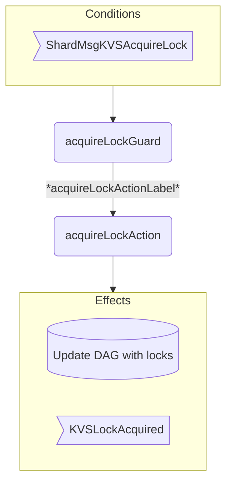
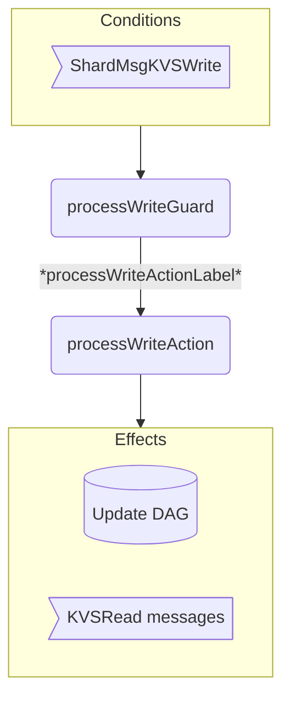
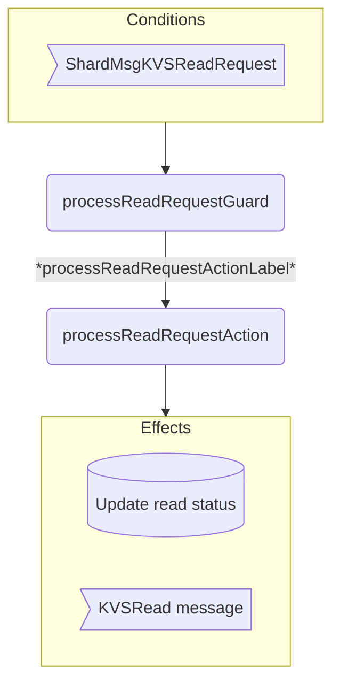
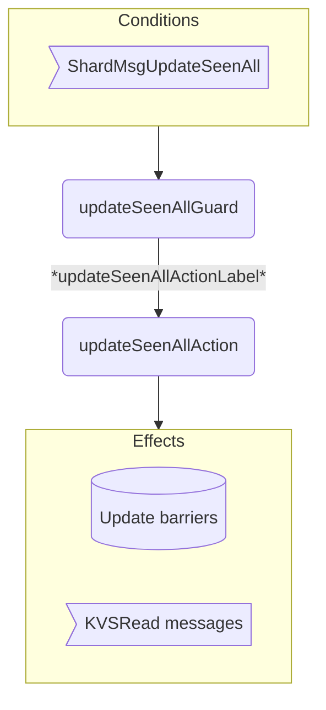

??? quote "Juvix imports"

    ```juvix
    module arch.node.engines.shard_2_behaviour;

    import arch.node.engines.shard_2_messages open;
    import arch.node.engines.shard_2_config open;
    import arch.node.engines.shard_2_environment open;

    import Stdlib.Data.Nat open;
    import Stdlib.Data.List open;
    import prelude open;
    import arch.node.types.basics open;
    import arch.node.types.identities open;
    import arch.node.types.messages open;
    import arch.node.types.engine open;
    import arch.node.types.anoma as Anoma open;
    ```

# Shard Behaviour

## Action arguments

### `ShardActionArgument`

<!-- --8<-- [start:ShardActionArgument] -->
```juvix
type ShardActionArgument :=
  | ShardActionArgumentReplyTo EngineID;
```
<!-- --8<-- [end:ShardActionArgument] -->

### `ShardActionArguments`

<!-- --8<-- [start:shard-action-arguments] -->
```juvix
ShardActionArguments : Type := List ShardActionArgument;
```
<!-- --8<-- [end:shard-action-arguments] -->

## Helper Functions

```juvix
maximumBy
 {A : Type}
 (f : A -> Nat)
 (lst : List A)
 : Option A :=
 let maxHelper := \{curr acc :=
   case acc of {
     | none := some curr
     | some maxVal :=
       case f curr > f maxVal of {
         | true := some curr
         | false := some maxVal
       }
   }
 };
 in foldr maxHelper none lst;
```

```juvix
findMostRecentWrite
  (dag : DAGStructure)
  (key : KVSKey)
  (timestamp : TxFingerprint)
  : Option KVSDatum :=
  case Map.lookup key (DAGStructure.keyAccesses dag) of {
    | none := none
    | some timestampMap :=
      let validEntries :=
        filter
          \{entry :=
            (fst entry) < timestamp &&
            case KeyAccess.writeStatus (snd entry) of {
              | some writeStatus :=
                  not (WriteStatus.mayWrite writeStatus) &&
                  WriteStatus.data writeStatus /= none
              | none := false
            }
          }
          (Map.toList timestampMap);
      in case maximumBy \{entry := fst entry} validEntries of {
        | some (mkPair _ access) :=
            case KeyAccess.writeStatus access of {
              | some writeStatus := WriteStatus.data writeStatus
              | none := none
            }
        | none := none
      }
  };
```

-- add write lock
```juvix
addReadAccess
  (dag : DAGStructure)
  (key : KVSKey)
  (timestamp : TxFingerprint)
  (readStatus : ReadStatus)
  : DAGStructure :=
  let keyMap := case Map.lookup key (DAGStructure.keyAccesses dag) of {
    | none := Map.empty
    | some m := m
  };
    existingAccess := case Map.lookup timestamp keyMap of {
    | none := mkKeyAccess@{ readStatus := none; writeStatus := none }
    | some access := access
  };
    newAccess := existingAccess@KeyAccess{ readStatus := some readStatus };
    newKeyMap := Map.insert timestamp newAccess keyMap;
    newKeyAccesses := Map.insert key newKeyMap (DAGStructure.keyAccesses dag);
  in dag@DAGStructure{ keyAccesses := newKeyAccesses };
```

-- add write lock
```juvix
addWriteAccess
  (dag : DAGStructure)
  (key : KVSKey)
  (timestamp : TxFingerprint)
  (writeStatus : WriteStatus)
  : DAGStructure :=
  let keyMap := case Map.lookup key (DAGStructure.keyAccesses dag) of {
    | none := Map.empty
    | some m := m
  };
    existingAccess := case Map.lookup timestamp keyMap of {
    | none := mkKeyAccess@{ readStatus := none; writeStatus := none }
    | some access := access
  };
    newAccess := existingAccess@KeyAccess{ writeStatus := some writeStatus };
    newKeyMap := Map.insert timestamp newAccess keyMap;
    newKeyAccesses := Map.insert key newKeyMap (DAGStructure.keyAccesses dag);
  in dag@DAGStructure{ keyAccesses := newKeyAccesses };
```

-- Replaces if read lock exists
```juvix
replaceReadAccess
  (dag : DAGStructure)
  (key : KVSKey)
  (timestamp : TxFingerprint)
  : Option DAGStructure :=
  let keyMap := case Map.lookup key (DAGStructure.keyAccesses dag) of {
        | none := Map.empty
        | some m := m
      };
      access := case Map.lookup timestamp keyMap of {
        | none := none
        | some a := some a
      };
  in case access of {
    | some a :=
      case KeyAccess.readStatus a of {
        | none := none -- Fail if no readStatus/no lock
        | some rs :=
          let updatedReadStatus := rs@ReadStatus{ hasBeenRead := true };
              updatedAccess := a@KeyAccess{ readStatus := some updatedReadStatus };
              updatedKeyMap := Map.insert timestamp updatedAccess keyMap;
              updatedKeyAccesses := Map.insert key updatedKeyMap (DAGStructure.keyAccesses dag);
          in some dag@DAGStructure{ keyAccesses := updatedKeyAccesses }
      }
    | none := none -- Fail if no access exists for the timestamp
  };
```

-- Replaces if write lock exists
```juvix
replaceWriteAccess
  (dag : DAGStructure)
  (key : KVSKey)
  (timestamp : TxFingerprint)
  (newWriteStatus : WriteStatus)
  : Option DAGStructure :=
  let keyMap := case Map.lookup key (DAGStructure.keyAccesses dag) of {
        | none := Map.empty
        | some m := m
      };
  in case Map.lookup timestamp keyMap of {
    | some a :=
      case KeyAccess.writeStatus a of {
        | none := none -- Fail if no writeStatus exists/no write lock
        | some _ :=
          let updatedAccess := a@KeyAccess{ writeStatus := some newWriteStatus };
              updatedKeyMap := Map.insert timestamp updatedAccess keyMap;
              updatedKeyAccesses := Map.insert key updatedKeyMap (DAGStructure.keyAccesses dag);
          in some dag@DAGStructure{ keyAccesses := updatedKeyAccesses }
      }
    | none := none -- Fail if no access exists for the timestamp
  };
```

```juvix
generateReadMsg
  (sender : EngineID)
  (key : KVSKey)
  (timestamp : TxFingerprint)
  (data : KVSDatum)
  (executor : EngineID)
  : EngineMsg Msg :=
  mkEngineMsg@{
    sender := sender;
    target := executor;
    mailbox := some 0;
    msg := Anoma.MsgShard (ShardMsgKVSRead mkKVSReadMsg@{
      timestamp := timestamp;
      key := key;
      data := data
    })
  };
```

```juvix
-- Try to send a read message for a valid, pending eager read lock.
processKeyAccess
  (sender : EngineID)
  (dag : DAGStructure)
  (key : KVSKey)
  (timestamp : TxFingerprint)
  (access : KeyAccess)
  : Option (Pair DAGStructure (EngineMsg Msg)) :=
  case KeyAccess.readStatus access of {
    | some readStatus :=
      case ReadStatus.isEager readStatus && not (ReadStatus.hasBeenRead readStatus) of {
        | true :=
          case timestamp < DAGStructure.heardAllWrites dag &&
               timestamp >= DAGStructure.heardAllReads dag of {
            | true :=
              case findMostRecentWrite dag key timestamp of {
                | some data :=
                  let newReadStatus := readStatus@ReadStatus{
                        hasBeenRead := true
                      };
                      newDag := addReadAccess dag key timestamp newReadStatus;
                      msg := generateReadMsg sender key timestamp data (ReadStatus.executor readStatus);
                  in some (mkPair newDag msg)
                | none := none
              }
            | false := none
          }
        | false := none
      }
    | none := none
  };
```

```juvix
-- Try to send a read messages for valid, pending eager read locks of a key.
processKeyTimestamps
  (sender : EngineID)
  (dag : DAGStructure)
  (key : KVSKey)
  (timestampMap : Map TxFingerprint KeyAccess)
  : Pair DAGStructure (List (EngineMsg Msg)) :=
  let processTimestamp := \{k v acc :=
    case acc of {
      | mkPair currDag msgs :=
        case processKeyAccess sender currDag key k v of {
          | some processed := mkPair (fst processed) ((snd processed) :: msgs)
          | none := acc
        }
    }
  };
  in Map.foldr processTimestamp (mkPair dag []) timestampMap;
```

```juvix
-- Try to send all read messages for valid, pending eager read locks.
updateEagerReads
  (sender : EngineID)
  (dag : DAGStructure)
  : Pair DAGStructure (List (EngineMsg Msg)) :=
  let processKey := \{k v acc :=
    case acc of {
      | mkPair currDag msgs :=
        let processed := processKeyTimestamps sender currDag k v;
        in mkPair (fst processed) (msgs ++ snd processed)
    }
  };
  in Map.foldr processKey (mkPair dag []) (DAGStructure.keyAccesses dag);
```

## Actions

??? quote "Auxiliary Juvix code"

    ### `ShardAction`

    ```juvix
    ShardAction : Type :=
      Action
        ShardCfg
        ShardLocalState
        ShardMailboxState
        ShardTimerHandle
        ShardActionArguments
        Anoma.Msg
        Anoma.Cfg
        Anoma.Env;
    ```

    ### `ShardActionInput`

    ```juvix
    ShardActionInput : Type :=
      ActionInput
        ShardCfg
        ShardLocalState
        ShardMailboxState
        ShardTimerHandle
        ShardActionArguments
        Anoma.Msg;
    ```

    ### `ShardActionEffect`

    ```juvix
    ShardActionEffect : Type :=
      ActionEffect
        ShardLocalState
        ShardMailboxState
        ShardTimerHandle
        Anoma.Msg
        Anoma.Cfg
        Anoma.Env;
    ```

    ### `ShardActionExec`

    ```juvix
    ShardActionExec : Type :=
      ActionExec
        ShardCfg
        ShardLocalState
        ShardMailboxState
        ShardTimerHandle
        ShardActionArguments
        Anoma.Msg
        Anoma.Cfg
        Anoma.Env;
    ```

### `acquireLockAction`

Process lock acquisition request and send confirmation.

State update
: Update DAG with new read/write accesses.

Messages to be sent
: KVSLockAcquired message to curator.

<!-- --8<-- [start:acquireLockAction] -->
```juvix
acquireLockAction
  (input : ShardActionInput)
  : Option ShardActionEffect :=
  let cfg := ActionInput.cfg input;
      env := ActionInput.env input;
      local := EngineEnv.localState env;
      trigger := ActionInput.trigger input;
  in case getEngineMsgFromTimestampedTrigger trigger of {
    | some mkEngineMsg@{
        msg := Anoma.MsgShard (ShardMsgKVSAcquireLock lockMsg)
      } :=
      let addReadAccesses := \{key dag :=
            let readStatus := mkReadStatus@{
                  hasBeenRead := false;
                  isEager := true;
                  executor := KVSAcquireLockMsg.executor lockMsg
                };
            in addReadAccess dag key (KVSAcquireLockMsg.timestamp lockMsg) readStatus
            };
          addLazyReadAccesses := \{key dag :=
            let readStatus := mkReadStatus@{
                  hasBeenRead := false;
                  isEager := false;
                  executor := KVSAcquireLockMsg.executor lockMsg
                };
            in addReadAccess dag key (KVSAcquireLockMsg.timestamp lockMsg) readStatus
            };
          addWillWriteAccesses := \{key dag :=
            let writeStatus := mkWriteStatus@{
                  data := none;
                  mayWrite := false
                };
            in addWriteAccess dag key (KVSAcquireLockMsg.timestamp lockMsg) writeStatus
            };
          addMayWriteAccesses := \{key dag :=
            let writeStatus := mkWriteStatus@{
                  data := none;
                  mayWrite := true
                };
            in addWriteAccess dag key (KVSAcquireLockMsg.timestamp lockMsg) writeStatus
            };
          dagWithReads := Set.foldr addReadAccesses (ShardLocalState.dagStructure local) (KVSAcquireLockMsg.eager_read_keys lockMsg);
          dagWithLazyReads := Set.foldr addLazyReadAccesses dagWithReads (KVSAcquireLockMsg.lazy_read_keys lockMsg);
          dagWithWillWrites := Set.foldr addWillWriteAccesses dagWithLazyReads (KVSAcquireLockMsg.will_write_keys lockMsg);
          dagWithAllWrites := Set.foldr addMayWriteAccesses dagWithWillWrites (KVSAcquireLockMsg.may_write_keys lockMsg);
          propagationResult := updateEagerReads (getEngineIDFromEngineCfg cfg) dagWithAllWrites;
          newLocal := local@ShardLocalState{dagStructure := fst propagationResult};
          newEnv := env@EngineEnv{localState := newLocal};
      in some mkActionEffect@{
        env := newEnv;
        msgs :=
          mkEngineMsg@{
            sender := getEngineIDFromEngineCfg (ActionInput.cfg input);
            target := KVSAcquireLockMsg.curator lockMsg;
            mailbox := some 0;
            msg := Anoma.MsgShard (ShardMsgKVSLockAcquired
              mkKVSLockAcquiredMsg@{timestamp := KVSAcquireLockMsg.timestamp lockMsg})
          } :: snd propagationResult;
        timers := [];
        engines := []
      }
    | _ := none
  };
```
<!-- --8<-- [end:acquireLockAction] -->

### `processWriteAction`

Process write request and potentially trigger eager reads.

State update
: Update DAG with write data and trigger eager reads.

Messages to be sent
: KVSRead messages if eligible eager reads are found.

<!-- --8<-- [start:processWriteAction] -->
```juvix
processWriteAction
  (input : ShardActionInput)
  : Option ShardActionEffect :=
  let cfg := ActionInput.cfg input;
      env := ActionInput.env input;
      local := EngineEnv.localState env;
      trigger := ActionInput.trigger input;
  in case getEngineMsgFromTimestampedTrigger trigger of {
    | some mkEngineMsg@{
        msg := Anoma.MsgShard (ShardMsgKVSWrite writeMsg)
      } :=
      let dag := ShardLocalState.dagStructure local;
          key := KVSWriteMsg.key writeMsg;
          timestamp := KVSWriteMsg.timestamp writeMsg;
          writeStatus := mkWriteStatus@{
            data := KVSWriteMsg.datum writeMsg;
            mayWrite := false
          };
      in case replaceWriteAccess dag key timestamp writeStatus of {
        | some updatedDag :=
          let propagationResult := updateEagerReads (getEngineIDFromEngineCfg cfg) updatedDag;
              newLocal := local@ShardLocalState{ dagStructure := fst propagationResult };
              newEnv := env@EngineEnv{ localState := newLocal };
              readMsgs := snd propagationResult;
          in some mkActionEffect@{
            env := newEnv;
            msgs := readMsgs;
            timers := [];
            engines := []
          }
        | none := none
      }
    | _ := none
  };

```
<!-- --8<-- [end:processWriteAction] -->

### `processReadRequestAction`

Process read request and potentially send read response.

State update
: Update DAG with read request status.

Messages to be sent
: KVSRead message if read data is available.

<!-- --8<-- [start:processReadRequestAction] -->
```juvix
processReadRequestAction
  (input : ShardActionInput)
  : Option ShardActionEffect :=
  let cfg := ActionInput.cfg input;
      env := ActionInput.env input;
      local := EngineEnv.localState env;
      trigger := ActionInput.trigger input;
  in case getEngineMsgFromTimestampedTrigger trigger of {
    | some mkEngineMsg@{
        sender := sender;
        msg := Anoma.MsgShard (ShardMsgKVSReadRequest readReqMsg)
      } :=
      let dag := ShardLocalState.dagStructure local;
          key := KVSReadRequestMsg.key readReqMsg;
          timestamp := KVSReadRequestMsg.timestamp readReqMsg;
          actual := KVSReadRequestMsg.actual readReqMsg;
      in case timestamp >= DAGStructure.heardAllReads dag of {
        | false := none
        | true :=
          case replaceReadAccess dag key timestamp of {
            | none := none -- Fail if no valid read lock exists
            | some updatedDag :=
              case actual of {
                | false :=
                  -- If `actual` is false, just update the DAG and return.
                  let newLocal := local@ShardLocalState{ dagStructure := updatedDag };
                      newEnv := env@EngineEnv{ localState := newLocal };
                  in some mkActionEffect@{
                    env := newEnv;
                    msgs := [];
                    timers := [];
                    engines := []
                  }
                | true :=
                  case findMostRecentWrite updatedDag key timestamp of {
                    | none := none
                    | some data :=
                      let readMsg := mkEngineMsg@{
                            sender := getEngineIDFromEngineCfg cfg;
                            target := sender;
                            mailbox := some 0;
                            msg := Anoma.MsgShard (ShardMsgKVSRead mkKVSReadMsg@{
                              timestamp := timestamp;
                              key := key;
                              data := data
                            })
                          };
                          newLocal := local@ShardLocalState{ dagStructure := updatedDag };
                          newEnv := env@EngineEnv{ localState := newLocal };
                      in some mkActionEffect@{
                        env := newEnv;
                        msgs := [readMsg];
                        timers := [];
                        engines := []
                      }
                  }
              }
          }
      }
    | _ := none
  };
```
<!-- --8<-- [end:processReadRequestAction] -->

### `updateSeenAllAction`

Process seen-all update and potentially trigger eager reads.

State update
: Update DAG barriers and trigger eager reads.

Messages to be sent
: KVSRead messages if eligible eager reads are found.

<!-- --8<-- [start:updateSeenAllAction] -->
```juvix
updateSeenAllAction
  (input : ShardActionInput)
  : Option ShardActionEffect :=
  let cfg := ActionInput.cfg input;
      env := ActionInput.env input;
      local := EngineEnv.localState env;
      trigger := ActionInput.trigger input;
  in case getEngineMsgFromTimestampedTrigger trigger of {
    | some mkEngineMsg@{
        msg := Anoma.MsgShard (ShardMsgUpdateSeenAll updateMsg)
      } :=
      let oldDag := ShardLocalState.dagStructure local;
          newDag := case UpdateSeenAllMsg.write updateMsg of {
            | true := oldDag@DAGStructure{
                heardAllWrites := UpdateSeenAllMsg.timestamp updateMsg
              }
            | false := oldDag@DAGStructure{
                heardAllReads := UpdateSeenAllMsg.timestamp updateMsg
              }
          };
          propagationResult := case UpdateSeenAllMsg.write updateMsg of {
            | true := updateEagerReads (getEngineIDFromEngineCfg cfg) newDag
            | false := mkPair newDag []
          };
          newLocal := local@ShardLocalState{dagStructure := fst propagationResult};
          newEnv := env@EngineEnv{localState := newLocal};
          readMsgs := snd propagationResult;
      in some mkActionEffect@{
          env := newEnv;
          msgs := readMsgs;
          timers := [];
          engines := []
        }
    | _ := none
  };
```
<!-- --8<-- [end:updateSeenAllAction] -->

## Action Labels

### `acquireLockActionLabel`

```juvix
acquireLockActionLabel : ShardActionExec := Seq [ acquireLockAction ];
```

### `processWriteActionLabel`

```juvix
processWriteActionLabel : ShardActionExec := Seq [ processWriteAction ];
```

### `processReadRequestActionLabel`

```juvix
processReadRequestActionLabel : ShardActionExec := Seq [ processReadRequestAction ];
```

### `updateSeenAllActionLabel`

```juvix
updateSeenAllActionLabel : ShardActionExec := Seq [ updateSeenAllAction ];
```

## Guards

??? quote "Auxiliary Juvix code"

    ### `ShardGuard`

    ```juvix
    ShardGuard : Type :=
      Guard
        ShardCfg
        ShardLocalState
        ShardMailboxState
        ShardTimerHandle
        ShardActionArguments
        Anoma.Msg
        Anoma.Cfg
        Anoma.Env;
    ```

    ### `ShardGuardOutput`

    ```juvix
    ShardGuardOutput : Type :=
      GuardOutput
        ShardCfg
        ShardLocalState
        ShardMailboxState
        ShardTimerHandle
        ShardActionArguments
        Anoma.Msg
        Anoma.Cfg
        Anoma.Env;
    ```

    ### `ShardGuardEval`

    ```juvix
    ShardGuardEval : Type :=
      GuardEval
        ShardCfg
        ShardLocalState
        ShardMailboxState
        ShardTimerHandle
        ShardActionArguments
        Anoma.Msg
        Anoma.Cfg
        Anoma.Env;
    ```

### `acquireLockGuard`

Condition
: Message type is ShardMsgKVSAcquireLock.

<!-- --8<-- [start:acquireLockGuard] -->
```juvix
acquireLockGuard
  (trigger : TimestampedTrigger ShardTimerHandle Anoma.Msg)
  (cfg : EngineCfg ShardCfg)
  (env : ShardEnv)
  : Option ShardGuardOutput :=
  case getEngineMsgFromTimestampedTrigger trigger of {
    | some mkEngineMsg@{
        msg := Anoma.MsgShard (ShardMsgKVSAcquireLock _)
      } :=
      some mkGuardOutput@{
        action := acquireLockActionLabel;
        args := []
      }
    | _ := none
  };
```
<!-- --8<-- [end:acquireLockGuard] -->

### `processWriteGuard`

Condition
: Message type is ShardMsgKVSWrite.

<!-- --8<-- [start:processWriteGuard] -->
```juvix
processWriteGuard
  (trigger : TimestampedTrigger ShardTimerHandle Anoma.Msg)
  (cfg : EngineCfg ShardCfg)
  (env : ShardEnv)
  : Option ShardGuardOutput :=
  case getEngineMsgFromTimestampedTrigger trigger of {
    | some mkEngineMsg@{
        msg := Anoma.MsgShard (ShardMsgKVSWrite _)
      } :=
      some mkGuardOutput@{
        action := processWriteActionLabel;
        args := []
      }
    | _ := none
  };
```
<!-- --8<-- [end:processWriteGuard] -->

### `processReadRequestGuard`

Condition
: Message type is ShardMsgKVSReadRequest.

<!-- --8<-- [start:processReadRequestGuard] -->
```juvix
processReadRequestGuard
  (trigger : TimestampedTrigger ShardTimerHandle Anoma.Msg)
  (cfg : EngineCfg ShardCfg)
  (env : ShardEnv)
  : Option ShardGuardOutput :=
  case getEngineMsgFromTimestampedTrigger trigger of {
    | some mkEngineMsg@{
        msg := Anoma.MsgShard (ShardMsgKVSReadRequest _)
      } :=
      some mkGuardOutput@{
        action := processReadRequestActionLabel;
        args := []
      }
    | _ := none
  };
```
<!-- --8<-- [end:processReadRequestGuard] -->

### `updateSeenAllGuard`

Condition
: Message type is ShardMsgUpdateSeenAll.

<!-- --8<-- [start:updateSeenAllGuard] -->
```juvix
updateSeenAllGuard
  (trigger : TimestampedTrigger ShardTimerHandle Anoma.Msg)
  (cfg : EngineCfg ShardCfg)
  (env : ShardEnv)
  : Option ShardGuardOutput :=
  case getEngineMsgFromTimestampedTrigger trigger of {
    | some mkEngineMsg@{
        msg := Anoma.MsgShard (ShardMsgUpdateSeenAll _)
      } :=
      some mkGuardOutput@{
        action := updateSeenAllActionLabel;
        args := []
      }
    | _ := none
  };
```
<!-- --8<-- [end:updateSeenAllGuard] -->

## The Shard Behaviour

### `ShardBehaviour`

<!-- --8<-- [start:ShardBehaviour] -->
```juvix
ShardBehaviour : Type :=
  EngineBehaviour
    ShardCfg
    ShardLocalState
    ShardMailboxState
    ShardTimerHandle
    ShardActionArguments
    Anoma.Msg
    Anoma.Cfg
    Anoma.Env;
```
<!-- --8<-- [end:ShardBehaviour] -->

#### Instantiation

<!-- --8<-- [start:shardBehaviour] -->
```juvix
shardBehaviour : ShardBehaviour :=
  mkEngineBehaviour@{
    guards := First [
      acquireLockGuard;
      processWriteGuard;
      processReadRequestGuard;
      updateSeenAllGuard
    ]
  };
```
<!-- --8<-- [end:shardBehaviour] -->

## Shard Action Flowchart

### `acquireLock` Flowchart

<figure markdown>



<figcaption markdown="span">
`acquireLock` flowchart
</figcaption>
</figure>

### `processWrite` Flowchart

<figure markdown>



<figcaption markdown="span">
`processWrite` flowchart
</figcaption>
</figure>

### `processReadRequest` Flowchart

<figure markdown>



<figcaption markdown="span">
`processReadRequest` flowchart
</figcaption>
</figure>

### `updateSeenAll` Flowchart

<figure markdown>



<figcaption markdown="span">
`updateSeenAll` flowchart
</figcaption>
</figure>