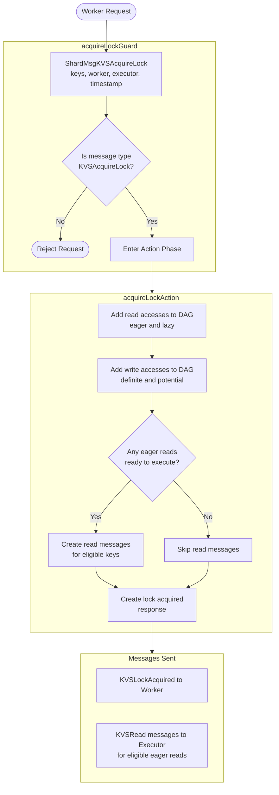
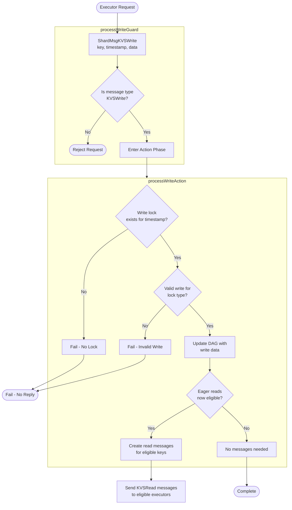
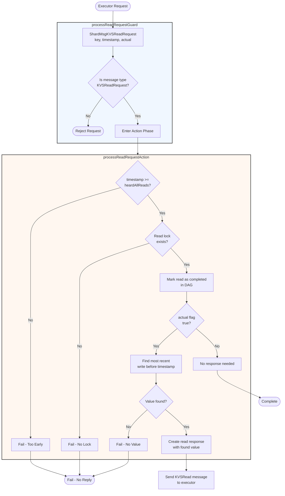
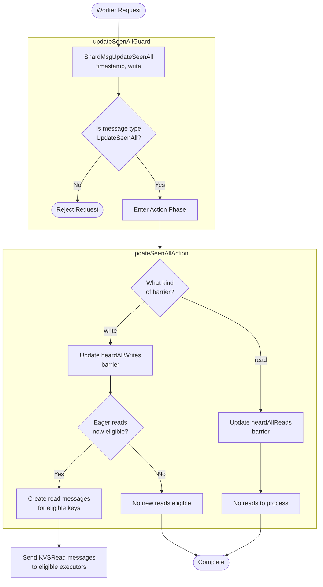

??? quote "Juvix imports"

    ```juvix
    module arch.node.engines.shard_behaviour;

    import arch.node.engines.shard_messages open;
    import arch.node.engines.shard_config open;
    import arch.node.engines.shard_environment open;

    import Stdlib.Data.Nat open;
    import Stdlib.Data.List as List;
    import prelude open;
    import arch.node.types.basics open;
    import arch.node.types.identities open;
    import arch.node.types.messages open;
    import arch.node.types.engine open;
    import arch.node.types.anoma as Anoma open;
    ```

# Shard Behaviour

## Shard Action Flowchart

### `acquireLock` Flowchart

<figure markdown>



<figcaption markdown="span">
`acquireLock` flowchart
</figcaption>
</figure>

#### Explanation

1. **Initial Request**
   - A Mempool Worker sends a `ShardMsgKVSAcquireLock` containing:
     - `lazy_read_keys`: Keys that might be read during execution.
     - `eager_read_keys`: Keys that will definitely be read.
     - `will_write_keys`: Keys that will definitely be written.
     - `may_write_keys`: Keys that might be written.
     - `worker`: ID of the requesting worker engine.
     - `executor`: ID of the executor that will process this transaction.
     - `timestamp`: Logical timestamp for transaction ordering.

2. **Guard Phase** (`acquireLockGuard`)
   - Verifies message type is `ShardMsgKVSAcquireLock`.
   - If validation fails, request is rejected immediately.
   - On success, passes control to `acquireLockActionLabel`.

3. **Action Phase** (`acquireLockAction`)
   - Processes valid lock requests through these steps:
     - Adds read accesses to DAG for both eager and lazy reads.
     - Adds write accesses to DAG for both definite and potential writes.
     - Checks for any eager reads that are immediately eligible for execution.
     - Creates read messages for eligible eager reads.
     - Prepares lock acquisition acknowledgment.
     - Records all lock information in DAG structure.

4. **Reply Generation**
   - **Always Sends**:
     - `KVSLockAcquired` message back to worker containing:
       - `timestamp`: Same timestamp as request.
   - **Conditionally Sends**:
     - If eligible eager reads found:
       - `KVSRead` messages to executor containing:
         - `timestamp`: Transaction timestamp.
         - `key`: Key that was read.
         - `data`: Value at that timestamp.

5. **Reply Delivery**
   - Lock acknowledgment sent to original worker.
   - Any read messages sent to specified executor.
   - Uses mailbox 0 (the standard mailbox for responses).

### `processWrite` Flowchart

<figure markdown>



<figcaption markdown="span">
`processWrite` flowchart
</figcaption>
</figure>

#### Explanation

1. **Initial Request**
   - A client sends a `ShardMsgKVSWrite` containing:
     - `key`: The state key to write to.
     - `timestamp`: The transaction's logical timestamp.
     - `datum`: The value to write (or None for null writes).
   - This request comes from an Executor Engine that previously acquired write locks.

2. **Guard Phase** (`processWriteGuard`)
   - Verifies message type is `ShardMsgKVSWrite`.
   - If validation fails, request is rejected immediately.
   - On success, passes control to `processWriteActionLabel`.

3. **Action Phase** (`processWriteAction`)
   - Processes valid write requests through these steps:
     - Checks if write lock exists for the key at given timestamp.
     - Validates write against lock type (null writes only valid for `mayWrite` locks).
     - Updates DAG structure with new write data.
     - Checks for eligible eager reads that can now proceed.
     - Constructs appropriate read messages for any newly eligible reads.

4. **Error Cases**
   - **No Lock Case**: Returns none if:
     - No write access exists for the timestamp.
     - Write access exists but no `writeStatus` (no write lock).
   - **Invalid Write Case**: Returns none if:
     - Attempting null write on definite write lock.
     - Lock exists but write is invalid for lock type.

5. **Reply Delivery**
   - On success, sends `KVSRead` messages to Executors for any eligible eager reads.
   - The original write request does not receive a direct response.
   - All messages use mailbox 0 (the standard mailbox for responses).

### `processReadRequest` Flowchart

<figure markdown>



<figcaption markdown="span">
`processReadRequest` flowchart
</figcaption>
</figure>

#### Explanation

1. **Initial Request**
   - An executor sends a `ShardMsgKVSReadRequest` containing:
     - `key`: The state key to read.
     - `timestamp`: The logical timestamp of the requesting transaction.
     - `actual`: Boolean flag indicating if this is a real read or just cleanup.
   - The key must be one that this shard is responsible for managing.

2. **Guard Phase** (`processReadRequestGuard`)
   - Verifies message type is `ShardMsgKVSReadRequest`.
   - If validation fails, request is rejected immediately.
   - On success, passes control to `processReadRequestActionLabel`.

3. **Action Phase** (`processReadRequestAction`)
   - Processes valid read requests through these steps:
     - Checks if timestamp is at or after the `heardAllReads` barrier.
     - Verifies a read lock exists for this key at this timestamp.
     - Marks the read as completed in the DAG structure.
     - If `actual` flag is true, finds the most recent write value.
     - Constructs appropriate response based on result.

4. **Reply Generation**
   - **Successful Case (actual = true)**
     - Creates `ShardMsgKVSRead` with:
       - `timestamp`: Original request timestamp.
       - `key`: Original request key.
       - `data`: Found historical value.
   - **Successful Case (actual = false)**
     - No response message generated.
     - Only updates internal state.
   - **Error Cases**
     - No response sent if:
       - Timestamp is before `heardAllReads`.
       - No valid read lock exists.
       - No historical value found.

5. **Reply Delivery**
   - Success response sent directly to requesting executor.
   - Uses mailbox 0 (the standard mailbox for responses).

### `updateSeenAll` Flowchart

<figure markdown>



<figcaption markdown="span">
`updateSeenAll` flowchart
</figcaption>
</figure>

#### Explanation

1. **Initial Request**
   - A worker sends a `ShardMsgUpdateSeenAll` containing:
     - `timestamp`: The new barrier position in the transaction timeline.
     - `write`: Boolean flag indicating if this updates the write barrier or read barrier.
   - This represents a guarantee from the worker about transaction ordering.

2. **Guard Phase** (`updateSeenAllGuard`)
   - Verifies message type is `ShardMsgUpdateSeenAll`.
   - If validation fails, request is rejected immediately.
   - On success, passes control to `updateSeenAllActionLabel`.

3. **Action Phase** (`updateSeenAllAction`)
   - Processes valid update requests through these steps:
     - Determines barrier type (write vs read) from message.
     - For write barriers:
       - Updates `heardAllWrites` to new timestamp.
       - Checks for eager reads that can now execute.
       - Prepares read messages for eligible reads.
     - For read barriers:
       - Updates `heardAllReads` to new timestamp.
       - No immediate read processing needed.

4. **Reply Generation**
   - For write barrier updates:
     - If eligible eager reads found:
       - Creates `KVSRead` messages for each eligible read.
       - Includes value and timestamp for each read.
     - If no eligible reads, completes with no messages.
   - For read barrier updates:
     - Always completes with no messages.
     - Read barrier updates are used for garbage collection, not triggering reads.

5. **Message Delivery**
   - Any generated read messages are sent to their respective executors.
   - No acknowledgment is sent back to the worker.

## Action arguments

### `ShardActionArgument`

<!-- --8<-- [start:ShardActionArgument] -->
```juvix
type ShardActionArgument :=
  | ShardActionArgumentReplyTo EngineID;
```
<!-- --8<-- [end:ShardActionArgument] -->

### `ShardActionArguments`

<!-- --8<-- [start:shard-action-arguments] -->
```juvix
ShardActionArguments : Type := List ShardActionArgument;
```
<!-- --8<-- [end:shard-action-arguments] -->

## Helper Functions

```juvix
findMostRecentWrite
  {KVSKey KVSDatum} {{Ord KVSKey}}
  (dag : DAGStructure KVSKey KVSDatum)
  (key : KVSKey)
  (timestamp : TxFingerprint)
  : Option KVSDatum :=
  case Map.lookup key (DAGStructure.keyAccesses dag) of {
    | none := none
    | some timestampMap :=
      let validEntries :=
        List.filter
          \{entry :=
            (fst entry) < timestamp &&
            case KeyAccess.writeStatus (snd entry) of {
              | some writeStatus :=
                  -- Ignore empty maywrites.
                  not (WriteStatus.mayWrite writeStatus &&
                       isNone (WriteStatus.data writeStatus))
              | none := false
            }
          }
          (Map.toList timestampMap);
      in case maximumBy \{entry := fst entry} validEntries of {
        | some (mkPair _ access) :=
            case KeyAccess.writeStatus access of {
              | some writeStatus := WriteStatus.data writeStatus
              | none := none
            }
        | none := none
      }
  };
```

-- add read without prior lock
```juvix
addReadAccess
  {KVSKey KVSDatum} {{Ord KVSKey}}
  (dag : DAGStructure KVSKey KVSDatum)
  (key : KVSKey)
  (timestamp : TxFingerprint)
  (readStatus : ReadStatus)
  : DAGStructure KVSKey KVSDatum :=
  let keyMap := case Map.lookup key (DAGStructure.keyAccesses dag) of {
    | none := Map.empty
    | some m := m
  };
    existingAccess := case Map.lookup timestamp keyMap of {
    | none := mkKeyAccess@{ readStatus := none; writeStatus := none }
    | some access := access
  };
    newAccess := existingAccess@KeyAccess{ readStatus := some readStatus };
    newKeyMap := Map.insert timestamp newAccess keyMap;
    newKeyAccesses := Map.insert key newKeyMap (DAGStructure.keyAccesses dag);
  in dag@DAGStructure{ keyAccesses := newKeyAccesses };
```

-- add write without prior lock
```juvix
addWriteAccess
  {KVSKey KVSDatum} {{Ord KVSKey}}
  (dag : DAGStructure KVSKey KVSDatum)
  (key : KVSKey)
  (timestamp : TxFingerprint)
  (writeStatus : WriteStatus KVSDatum)
  : DAGStructure KVSKey KVSDatum :=
  let keyMap := case Map.lookup key (DAGStructure.keyAccesses dag) of {
    | none := Map.empty
    | some m := m
  };
    existingAccess := case Map.lookup timestamp keyMap of {
    | none := mkKeyAccess@{ readStatus := none; writeStatus := none }
    | some access := access
  };
    newAccess := existingAccess@KeyAccess{ writeStatus := some writeStatus };
    newKeyMap := Map.insert timestamp newAccess keyMap;
    newKeyAccesses := Map.insert key newKeyMap (DAGStructure.keyAccesses dag);
  in dag@DAGStructure{ keyAccesses := newKeyAccesses };
```

-- Replaces if read lock exists
```juvix
replaceReadAccess {KVSKey KVSDatum : Type}  {{Ord KVSKey}}
  (dag : DAGStructure KVSKey KVSDatum)
  (key : KVSKey)
  (timestamp : TxFingerprint)
  : Option (DAGStructure KVSKey KVSDatum) :=
  let keyMap := case Map.lookup key (DAGStructure.keyAccesses dag) of {
        | none := Map.empty
        | some m := m
      };
      access := case Map.lookup timestamp keyMap of {
        | none := none
        | some a := some a
      };
  in case access of {
    | some a :=
      case KeyAccess.readStatus a of {
        | none := none -- Fail if no readStatus/no lock
        | some rs :=
          let updatedReadStatus := rs@ReadStatus{ hasBeenRead := true };
              updatedAccess := a@KeyAccess{ readStatus := some updatedReadStatus };
              updatedKeyMap := Map.insert timestamp updatedAccess keyMap;
              updatedKeyAccesses := Map.insert key updatedKeyMap (DAGStructure.keyAccesses dag);
          in some dag@DAGStructure{ keyAccesses := updatedKeyAccesses }
      }
    | none := none -- Fail if no access exists for the timestamp
  };
```

-- Replaces if write lock exists
```juvix
replaceWriteAccess {KVSKey KVSDatum : Type} {{Ord KVSKey}}
  (dag : DAGStructure KVSKey KVSDatum)
  (key : KVSKey)
  (timestamp : TxFingerprint)
  (newData : Option KVSDatum)
  : Option (DAGStructure KVSKey KVSDatum) :=
  let keyMap := case Map.lookup key (DAGStructure.keyAccesses dag) of {
        | none := Map.empty
        | some m := m
      };
  in case Map.lookup timestamp keyMap of {
    | some a :=
      case KeyAccess.writeStatus a of {
        | none := none -- Fail if no writeStatus exists/no write lock
        | some ws := case isNone newData && not (WriteStatus.mayWrite ws) of {
            | true := none -- null writes can only happen on mayWrites
            | false :=
                let data := case newData of {
                              | none := WriteStatus.data ws -- Do not update and do not fail if nothing needs to be written.
                              | some dat := some dat
                    };
                    updatedAccess := a@KeyAccess{ writeStatus := some ws@WriteStatus{ data := data } };
                    updatedKeyMap := Map.insert timestamp updatedAccess keyMap;
                    updatedKeyAccesses := Map.insert key updatedKeyMap (DAGStructure.keyAccesses dag);
                in some dag@DAGStructure{ keyAccesses := updatedKeyAccesses }
        }
      }
    | none := none -- Fail if no access exists for the timestamp
  };
```

```juvix
generateReadMsg {KVSKey KVSDatum Executable : Type}
  (sender : EngineID)
  (key : KVSKey)
  (timestamp : TxFingerprint)
  (data : KVSDatum)
  (executor : EngineID)
  : EngineMsg (PreMsg KVSKey KVSDatum Executable) :=
  mkEngineMsg@{
    sender := sender;
    target := executor;
    mailbox := some 0;
    msg := Anoma.MsgShard (ShardMsgKVSRead mkKVSReadMsg@{
      timestamp := timestamp;
      key := key;
      data := data
    })
  };
```

```juvix
-- Try to send a read message for a valid, pending eager read lock.
execEagerReadsAtTime {KVSKey KVSDatum Executable : Type} {{Ord KVSKey}}
  (sender : EngineID)
  (dag : DAGStructure KVSKey KVSDatum)
  (key : KVSKey)
  (timestamp : TxFingerprint)
  (access : KeyAccess KVSDatum)
  : Option (Pair (DAGStructure KVSKey KVSDatum) (EngineMsg (Anoma.PreMsg KVSKey KVSDatum Executable))) :=
  case KeyAccess.readStatus access of {
    | some readStatus :=
      case ReadStatus.isEager readStatus && not (ReadStatus.hasBeenRead readStatus) of {
        | true :=
          case timestamp < DAGStructure.heardAllWrites dag &&
               timestamp >= DAGStructure.heardAllReads dag of {
            | true :=
              case findMostRecentWrite dag key timestamp of {
                | some data :=
                  let newReadStatus := readStatus@ReadStatus{
                        hasBeenRead := true
                      };
                      newDag := addReadAccess dag key timestamp newReadStatus;
                      msg := generateReadMsg sender key timestamp data (ReadStatus.executor readStatus);
                  in some (mkPair newDag msg)
                | none := none
              }
            | false := none
          }
        | false := none
      }
    | none := none
  };
```

```juvix
-- Try to send a read messages for valid, pending eager read locks of a key.
execEagerReadsAtKey {KVSKey KVSDatum Executable : Type} {{Ord KVSKey}}
  (sender : EngineID)
  (dag : DAGStructure KVSKey KVSDatum)
  (key : KVSKey)
  (timestampMap : Map TxFingerprint (KeyAccess KVSDatum))
  : Pair (DAGStructure KVSKey KVSDatum) (List (EngineMsg (Anoma.PreMsg KVSKey KVSDatum Executable))) :=
  let processTimestamp := \{k v acc :=
    case acc of {
      | mkPair currDag msgs :=
        case execEagerReadsAtTime sender currDag key k v of {
          | some processed := mkPair (fst processed) ((snd processed) :: msgs)
          | none := acc
        }
    }
  };
  in Map.foldr processTimestamp (mkPair dag []) timestampMap;
```

```juvix
-- Try to send all read messages for valid, pending eager read locks.
execEagerReads {KVSKey KVSDatum Executable : Type} {{Ord KVSKey}}
  (sender : EngineID)
  (dag : DAGStructure KVSKey KVSDatum)
  : Pair (DAGStructure KVSKey KVSDatum) (List (EngineMsg (Anoma.PreMsg KVSKey KVSDatum Executable))) :=
  let processKey := \{k v acc :=
    case acc of {
      | mkPair currDag msgs :=
        let processed := execEagerReadsAtKey sender currDag k v;
        in mkPair (fst processed) (msgs ++ snd processed)
    }
  };
  in Map.foldr processKey (mkPair dag []) (DAGStructure.keyAccesses dag);
```

## Actions

??? quote "Auxiliary Juvix code"

    ### `ShardAction`

    ```juvix
    ShardAction (KVSKey KVSDatum Executable ProgramState : Type) : Type :=
      Action
        ShardCfg
        (ShardLocalState KVSKey KVSDatum)
        ShardMailboxState
        ShardTimerHandle
        ShardActionArguments
        (Anoma.PreMsg KVSKey KVSDatum Executable)
        (Anoma.PreCfg KVSKey KVSDatum Executable)
        (Anoma.PreEnv KVSKey KVSDatum Executable ProgramState);
    ```

    ### `ShardActionInput`

    ```juvix
    ShardActionInput (KVSKey KVSDatum Executable : Type) : Type :=
      ActionInput
        ShardCfg
        (ShardLocalState KVSKey KVSDatum)
        ShardMailboxState
        ShardTimerHandle
        ShardActionArguments
        (Anoma.PreMsg KVSKey KVSDatum Executable);
    ```

    ### `ShardActionEffect`

    ```juvix
    ShardActionEffect (KVSKey KVSDatum Executable ProgramState : Type) : Type :=
      ActionEffect
        (ShardLocalState KVSKey KVSDatum)
        ShardMailboxState
        ShardTimerHandle
        (Anoma.PreMsg KVSKey KVSDatum Executable)
        (Anoma.PreCfg KVSKey KVSDatum Executable)
        (Anoma.PreEnv KVSKey KVSDatum Executable ProgramState);
    ```

    ### `ShardActionExec`

    ```juvix
    ShardActionExec (KVSKey KVSDatum Executable ProgramState : Type) : Type :=
      ActionExec
        ShardCfg
        (ShardLocalState KVSKey KVSDatum)
        ShardMailboxState
        ShardTimerHandle
        ShardActionArguments
        (Anoma.PreMsg KVSKey KVSDatum Executable)
        (Anoma.PreCfg KVSKey KVSDatum Executable)
        (Anoma.PreEnv KVSKey KVSDatum Executable ProgramState);
    ```

### `acquireLockAction`

Process lock acquisition request and send confirmation.

State update
: Update DAG with new read/write accesses.

Messages to be sent
: KVSLockAcquired message to worker.

<!-- --8<-- [start:acquireLockAction] -->
```juvix
acquireLockAction {KVSKey KVSDatum Executable ProgramState : Type} {{Ord KVSKey}}
  (input : ShardActionInput KVSKey KVSDatum Executable)
  : Option (ShardActionEffect KVSKey KVSDatum Executable ProgramState) :=
  let cfg := ActionInput.cfg input;
      env := ActionInput.env input;
      local := EngineEnv.localState env;
      trigger := ActionInput.trigger input;
  in case getEngineMsgFromTimestampedTrigger trigger of {
    | some mkEngineMsg@{
        msg := Anoma.MsgShard (ShardMsgKVSAcquireLock lockMsg)
      } :=
      let addEagerReadAccesses := \{key dag :=
            let readStatus := mkReadStatus@{
                  hasBeenRead := false;
                  isEager := true;
                  executor := KVSAcquireLockMsg.executor lockMsg
                };
            in addReadAccess dag key (KVSAcquireLockMsg.timestamp lockMsg) readStatus
            };
          addLazyReadAccesses := \{key dag :=
            let readStatus := mkReadStatus@{
                  hasBeenRead := false;
                  isEager := false;
                  executor := KVSAcquireLockMsg.executor lockMsg
                };
            in addReadAccess dag key (KVSAcquireLockMsg.timestamp lockMsg) readStatus
            };
          addWillWriteAccesses := \{key dag :=
            let writeStatus := mkWriteStatus@{
                  data := none;
                  mayWrite := false
                };
            in addWriteAccess dag key (KVSAcquireLockMsg.timestamp lockMsg) writeStatus
            };
          addMayWriteAccesses := \{key dag :=
            let writeStatus := mkWriteStatus@{
                  data := none;
                  mayWrite := true
                };
            in addWriteAccess dag key (KVSAcquireLockMsg.timestamp lockMsg) writeStatus
            };
          dagWithEagerReads := Set.foldr addEagerReadAccesses (ShardLocalState.dagStructure local) (KVSAcquireLockMsg.eager_read_keys lockMsg);
          dagWithAllReads := Set.foldr addLazyReadAccesses dagWithEagerReads (KVSAcquireLockMsg.lazy_read_keys lockMsg);
          dagWithWillWrites := Set.foldr addWillWriteAccesses dagWithAllReads (KVSAcquireLockMsg.will_write_keys lockMsg);
          dagWithAllWrites := Set.foldr addMayWriteAccesses dagWithWillWrites (KVSAcquireLockMsg.may_write_keys lockMsg);
          propagationResult := execEagerReads (getEngineIDFromEngineCfg cfg) dagWithAllWrites;
          newLocal := local@ShardLocalState{dagStructure := fst propagationResult};
          newEnv := env@EngineEnv{localState := newLocal};
      in some mkActionEffect@{
        env := newEnv;
        msgs :=
          mkEngineMsg@{
            sender := getEngineIDFromEngineCfg (ActionInput.cfg input);
            target := KVSAcquireLockMsg.worker lockMsg;
            mailbox := some 0;
            msg := Anoma.MsgShard (ShardMsgKVSLockAcquired mkKVSLockAcquiredMsg@{timestamp := KVSAcquireLockMsg.timestamp lockMsg})
          } :: snd propagationResult;
        timers := [];
        engines := []
      }
    | _ := none
  };
```
<!-- --8<-- [end:acquireLockAction] -->

### `processWriteAction`

Process write request and potentially trigger eager reads.

State update
: Update DAG with write data and trigger eager reads.

Messages to be sent
: KVSRead messages if eligible eager reads are found.

<!-- --8<-- [start:processWriteAction] -->
```juvix
processWriteAction {KVSKey KVSDatum Executable ProgramState : Type} {{Ord KVSKey}}
  (input : ShardActionInput KVSKey KVSDatum Executable)
  : Option (ShardActionEffect KVSKey KVSDatum Executable ProgramState) :=
  let cfg := ActionInput.cfg input;
      env := ActionInput.env input;
      local := EngineEnv.localState env;
      trigger := ActionInput.trigger input;
  in case getEngineMsgFromTimestampedTrigger trigger of {
    | some mkEngineMsg@{
        msg := Anoma.MsgShard (ShardMsgKVSWrite writeMsg)
      } :=
      let dag := ShardLocalState.dagStructure local;
          key := KVSWriteMsg.key writeMsg;
          timestamp := KVSWriteMsg.timestamp writeMsg;
      in case replaceWriteAccess dag key timestamp (KVSWriteMsg.datum writeMsg) of {
        | some updatedDag :=
          let propagationResult := execEagerReads (getEngineIDFromEngineCfg cfg) updatedDag;
              newLocal := local@ShardLocalState{ dagStructure := fst propagationResult };
              newEnv := env@EngineEnv{ localState := newLocal };
              readMsgs := snd propagationResult;
          in some mkActionEffect@{
            env := newEnv;
            msgs := readMsgs;
            timers := [];
            engines := []
          }
        | none := none
      }
    | _ := none
  };

```
<!-- --8<-- [end:processWriteAction] -->

### `processReadRequestAction`

Process read request and potentially send read response.

State update
: Update DAG with read request status.

Messages to be sent
: KVSRead message if read data is available.

<!-- --8<-- [start:processReadRequestAction] -->
```juvix
processReadRequestAction {KVSKey KVSDatum Executable ProgramState : Type} {{Ord KVSKey}}
  (input : ShardActionInput KVSKey KVSDatum Executable)
  : Option (ShardActionEffect KVSKey KVSDatum Executable ProgramState) :=
  let cfg := ActionInput.cfg input;
      env := ActionInput.env input;
      local := EngineEnv.localState env;
      trigger := ActionInput.trigger input;
  in case getEngineMsgFromTimestampedTrigger trigger of {
    | some mkEngineMsg@{
        sender := sender;
        msg := Anoma.MsgShard (ShardMsgKVSReadRequest readReqMsg)
      } :=
      let dag := ShardLocalState.dagStructure local;
          key := KVSReadRequestMsg.key readReqMsg;
          timestamp := KVSReadRequestMsg.timestamp readReqMsg;
          actual := KVSReadRequestMsg.actual readReqMsg;
      in case timestamp >= DAGStructure.heardAllReads dag of {
        | false := none
        | true :=
          case replaceReadAccess dag key timestamp of {
            | none := none -- Fail if no valid read lock exists
            | some updatedDag :=
              case actual of {
                | false :=
                  -- If `actual` is false, just update the DAG and return.
                  let newLocal := local@ShardLocalState{ dagStructure := updatedDag };
                      newEnv := env@EngineEnv{ localState := newLocal };
                  in some mkActionEffect@{
                    env := newEnv;
                    msgs := [];
                    timers := [];
                    engines := []
                  }
                | true :=
                  case findMostRecentWrite updatedDag key timestamp of {
                    | none := none
                    | some data :=
                      let readMsg := mkEngineMsg@{
                            sender := getEngineIDFromEngineCfg cfg;
                            target := sender;
                            mailbox := some 0;
                            msg := Anoma.MsgShard (ShardMsgKVSRead mkKVSReadMsg@{
                              timestamp := timestamp;
                              key := key;
                              data := data
                            })
                          };
                          newLocal := local@ShardLocalState{ dagStructure := updatedDag };
                          newEnv := env@EngineEnv{ localState := newLocal };
                      in some mkActionEffect@{
                        env := newEnv;
                        msgs := [readMsg];
                        timers := [];
                        engines := []
                      }
                  }
              }
          }
      }
    | _ := none
  };
```
<!-- --8<-- [end:processReadRequestAction] -->

### `updateSeenAllAction`

Process seen-all update and potentially trigger eager reads.

State update
: Update DAG barriers and trigger eager reads.

Messages to be sent
: KVSRead messages if eligible eager reads are found.

<!-- --8<-- [start:updateSeenAllAction] -->
```juvix
updateSeenAllAction {KVSKey KVSDatum Executable ProgramState : Type} {{Ord KVSKey}}
  (input : ShardActionInput KVSKey KVSDatum Executable)
  : Option (ShardActionEffect KVSKey KVSDatum Executable ProgramState) :=
  let cfg := ActionInput.cfg input;
      env := ActionInput.env input;
      local := EngineEnv.localState env;
      trigger := ActionInput.trigger input;
  in case getEngineMsgFromTimestampedTrigger trigger of {
    | some mkEngineMsg@{
        msg := Anoma.MsgShard (ShardMsgUpdateSeenAll updateMsg)
      } :=
      let oldDag := ShardLocalState.dagStructure local;
          newDag := case UpdateSeenAllMsg.write updateMsg of {
            | true := oldDag@DAGStructure{
                heardAllWrites := UpdateSeenAllMsg.timestamp updateMsg
              }
            | false := oldDag@DAGStructure{
                heardAllReads := UpdateSeenAllMsg.timestamp updateMsg
              }
          };
          propagationResult := case UpdateSeenAllMsg.write updateMsg of {
            | true := execEagerReads (getEngineIDFromEngineCfg cfg) newDag
            | false := mkPair newDag []
          };
          newLocal := local@ShardLocalState{dagStructure := fst propagationResult};
          newEnv := env@EngineEnv{localState := newLocal};
          readMsgs := snd propagationResult;
      in some mkActionEffect@{
          env := newEnv;
          msgs := readMsgs;
          timers := [];
          engines := []
        }
    | _ := none
  };
```
<!-- --8<-- [end:updateSeenAllAction] -->

## Action Labels

### `acquireLockActionLabel`

```juvix
acquireLockActionLabel {KVSKey KVSDatum Executable ProgramState : Type} {{Ord KVSKey}} : ShardActionExec KVSKey KVSDatum Executable ProgramState := Seq [ acquireLockAction ];
```

### `processWriteActionLabel`

```juvix
processWriteActionLabel {KVSKey KVSDatum Executable ProgramState : Type} {{Ord KVSKey}} : ShardActionExec KVSKey KVSDatum Executable ProgramState := Seq [ processWriteAction ];
```

### `processReadRequestActionLabel`

```juvix
processReadRequestActionLabel {KVSKey KVSDatum Executable ProgramState : Type} {{Ord KVSKey}} : ShardActionExec KVSKey KVSDatum Executable ProgramState := Seq [ processReadRequestAction ];
```

### `updateSeenAllActionLabel`

```juvix
updateSeenAllActionLabel {KVSKey KVSDatum Executable ProgramState : Type} {{Ord KVSKey}} : ShardActionExec KVSKey KVSDatum Executable ProgramState := Seq [ updateSeenAllAction ];
```

## Guards

??? quote "Auxiliary Juvix code"

    ### `ShardGuard`

    ```juvix
    ShardGuard (KVSKey KVSDatum Executable ProgramState : Type) : Type :=
      Guard
        ShardCfg
        (ShardLocalState KVSKey KVSDatum)
        ShardMailboxState
        ShardTimerHandle
        ShardActionArguments
        (Anoma.PreMsg KVSKey KVSDatum Executable)
        (Anoma.PreCfg KVSKey KVSDatum Executable)
        (Anoma.PreEnv KVSKey KVSDatum Executable ProgramState);
    ```

    ### `ShardGuardOutput`

    ```juvix
    ShardGuardOutput (KVSKey KVSDatum Executable ProgramState : Type) : Type :=
      GuardOutput
        ShardCfg
        (ShardLocalState KVSKey KVSDatum)
        ShardMailboxState
        ShardTimerHandle
        ShardActionArguments
        (Anoma.PreMsg KVSKey KVSDatum Executable)
        (Anoma.PreCfg KVSKey KVSDatum Executable)
        (Anoma.PreEnv KVSKey KVSDatum Executable ProgramState);
    ```

    ### `ShardGuardEval`

    ```juvix
    ShardGuardEval (KVSKey KVSDatum Executable ProgramState : Type) : Type :=
      GuardEval
        ShardCfg
        (ShardLocalState KVSKey KVSDatum)
        ShardMailboxState
        ShardTimerHandle
        ShardActionArguments
        (Anoma.PreMsg KVSKey KVSDatum Executable)
        (Anoma.PreCfg KVSKey KVSDatum Executable)
        (Anoma.PreEnv KVSKey KVSDatum Executable ProgramState);
    ```

### `acquireLockGuard`

Condition
: Message type is ShardMsgKVSAcquireLock.

<!-- --8<-- [start:acquireLockGuard] -->
```juvix
acquireLockGuard {KVSKey KVSDatum Executable ProgramState : Type} {{Ord KVSKey}}
  (trigger : TimestampedTrigger ShardTimerHandle (Anoma.PreMsg KVSKey KVSDatum Executable))
  (cfg : EngineCfg ShardCfg)
  (env : ShardEnv KVSKey KVSDatum)
  : Option (ShardGuardOutput KVSKey KVSDatum Executable ProgramState) :=
  case getEngineMsgFromTimestampedTrigger trigger of {
    | some mkEngineMsg@{
        msg := Anoma.MsgShard (ShardMsgKVSAcquireLock _)
      } :=
      some mkGuardOutput@{
        action := acquireLockActionLabel;
        args := []
      }
    | _ := none
  };
```
<!-- --8<-- [end:acquireLockGuard] -->

### `processWriteGuard`

Condition
: Message type is ShardMsgKVSWrite.

<!-- --8<-- [start:processWriteGuard] -->
```juvix
processWriteGuard {KVSKey KVSDatum Executable ProgramState : Type} {{Ord KVSKey}}
  (trigger : TimestampedTrigger ShardTimerHandle (Anoma.PreMsg KVSKey KVSDatum Executable))
  (cfg : EngineCfg ShardCfg)
  (env : ShardEnv KVSKey KVSDatum)
  : Option (ShardGuardOutput KVSKey KVSDatum Executable ProgramState) :=
  case getEngineMsgFromTimestampedTrigger trigger of {
    | some mkEngineMsg@{
        msg := Anoma.MsgShard (ShardMsgKVSWrite _)
      } :=
      some mkGuardOutput@{
        action := processWriteActionLabel;
        args := []
      }
    | _ := none
  };
```
<!-- --8<-- [end:processWriteGuard] -->

### `processReadRequestGuard`

Condition
: Message type is ShardMsgKVSReadRequest.

<!-- --8<-- [start:processReadRequestGuard] -->
```juvix
processReadRequestGuard {KVSKey KVSDatum Executable ProgramState : Type} {{Ord KVSKey}}
  (trigger : TimestampedTrigger ShardTimerHandle (Anoma.PreMsg KVSKey KVSDatum Executable))
  (cfg : EngineCfg ShardCfg)
  (env : ShardEnv KVSKey KVSDatum)
  : Option (ShardGuardOutput KVSKey KVSDatum Executable ProgramState) :=
  case getEngineMsgFromTimestampedTrigger trigger of {
    | some mkEngineMsg@{
        msg := Anoma.MsgShard (ShardMsgKVSReadRequest _)
      } :=
      some mkGuardOutput@{
        action := processReadRequestActionLabel;
        args := []
      }
    | _ := none
  };
```
<!-- --8<-- [end:processReadRequestGuard] -->

### `updateSeenAllGuard`

Condition
: Message type is ShardMsgUpdateSeenAll.

<!-- --8<-- [start:updateSeenAllGuard] -->
```juvix
updateSeenAllGuard {KVSKey KVSDatum Executable ProgramState : Type} {{Ord KVSKey}}
  (trigger : TimestampedTrigger ShardTimerHandle (Anoma.PreMsg KVSKey KVSDatum Executable))
  (cfg : EngineCfg ShardCfg)
  (env : ShardEnv KVSKey KVSDatum)
  : Option (ShardGuardOutput KVSKey KVSDatum Executable ProgramState) :=
  case getEngineMsgFromTimestampedTrigger trigger of {
    | some mkEngineMsg@{
        msg := Anoma.MsgShard (ShardMsgUpdateSeenAll _)
      } :=
      some mkGuardOutput@{
        action := updateSeenAllActionLabel;
        args := []
      }
    | _ := none
  };
```
<!-- --8<-- [end:updateSeenAllGuard] -->

## The Shard Behaviour

### `ShardBehaviour`

<!-- --8<-- [start:ShardBehaviour] -->
```juvix
ShardBehaviour (KVSKey KVSDatum Executable ProgramState : Type) : Type :=
  EngineBehaviour
    ShardCfg
    (ShardLocalState KVSKey KVSDatum)
    ShardMailboxState
    ShardTimerHandle
    ShardActionArguments
    (Anoma.PreMsg KVSKey KVSDatum Executable)
    (Anoma.PreCfg KVSKey KVSDatum Executable)
    (Anoma.PreEnv KVSKey KVSDatum Executable ProgramState);
```
<!-- --8<-- [end:ShardBehaviour] -->

#### Instantiation

<!-- --8<-- [start:shardBehaviour] -->
```juvix
shardBehaviour : ShardBehaviour String String ByteString String :=
  mkEngineBehaviour@{
    guards := First [
      acquireLockGuard;
      processWriteGuard;
      processReadRequestGuard;
      updateSeenAllGuard
    ]
  };
```
<!-- --8<-- [end:shardBehaviour] -->
