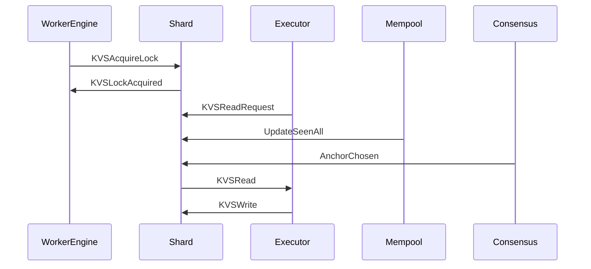

??? quote "Juvix imports"

    ```juvix
    module arch.node.engines.shard_messages;
    import prelude open;
    import arch.node.types.basics open;
    import arch.node.types.identities open;
    ```

# Shard Messages

These are the messages that the Shard engine can receive/respond to.

## Message interface

??? quote "Auxiliary Juvix code"

    ```juvix
    syntax alias KVSKey := String;
    syntax alias KVSDatum := String;
    syntax alias TxFingerprint := Nat;
    syntax alias ChainId := String;
    syntax alias Height := Nat;
    syntax alias NarwhalBlock := String;
    syntax alias Learner := String;
    ```

### `ShardMsgKVSReadRequest KVSReadRequestMsg`

Read request from an executor.

<!-- --8<-- [start:KVSReadRequestMsg] -->
```juvix
type KVSReadRequestMsg : Type :=
  mkKVSReadRequestMsg {
    timestamp : TxFingerprint;
    key : KVSKey;
    actual : Bool
  }
```
<!-- --8<-- [end:KVSReadRequestMsg] -->

???+ quote "Arguments"

    `timestamp`
    : The logical timestamp at which to read

    `key`
    : The key to read

    `actual`
    : True if value is actually needed, false if just cleaning up lazy read

### `ShardMsgKVSWrite KVSWriteMsg`

Write request from an executor.

<!-- --8<-- [start:KVSWriteMsg] -->
```juvix
type KVSWriteMsg : Type :=
  mkKVSWriteMsg {
    timestamp : TxFingerprint;
    key : KVSKey;
    datum : Option KVSDatum
  }
```
<!-- --8<-- [end:KVSWriteMsg] -->

???+ quote "Arguments"

    `timestamp`
    : The timestamp identifying the transaction in which to write

    `key`
    : The key to write to

    `datum`
    : The data to write, or None to indicate no write

### `ShardMsgUpdateSeenAll UpdateSeenAllMsg`

Update about seen transactions from mempool.

<!-- --8<-- [start:UpdateSeenAllMsg] -->
```juvix
type UpdateSeenAllMsg : Type :=
  mkUpdateSeenAllMsg {
    timestamp : TxFingerprint;
    write : Bool
  }
```
<!-- --8<-- [end:UpdateSeenAllMsg] -->

???+ quote "Arguments"

    `timestamp`
    : The logical timestamp at which to push the SeenAll value.

    `write`
    : Whether it is the `SeenAllReads` or `SeenAllWrites` to update.


### `ShardMsgKVSAcquireLock KVSAcquireLockMsg`

Request to acquire locks for transaction execution.

<!-- --8<-- [start:KVSAcquireLockMsg] -->
```juvix
type KVSAcquireLockMsg : Type :=
  mkKVSAcquireLockMsg {
    lazy_read_keys : Set KVSKey;
    eager_read_keys : Set KVSKey;
    will_write_keys : Set KVSKey;
    may_write_keys : Set KVSKey;
    curator : EngineID;
    executor : EngineID;
    timestamp : TxFingerprint
  }
```
<!-- --8<-- [end:KVSAcquireLockMsg] -->

???+ quote "Arguments"

    `lazy_read_keys`
    : Keys this transaction may read (only send values read in response to KVSReadRequests)

    `eager_read_keys`
    : Keys this transaction will read (send values read as soon as possible)

    `will_write_keys`
    : Keys this transaction will write

    `may_write_keys`
    : Keys this transaction may write

    `curator`
    : The Worker Engine in charge of the transaction

    `executor`
    : The Executor for this transaction

    `timestamp`
    : Specifies the transaction affiliated with these locks

### `ShardMsgKVSLockAcquired KVSLockAcquiredMsg`

Confirmation that locks were acquired.

<!-- --8<-- [start:KVSLockAcquiredMsg] -->
```juvix
type KVSLockAcquiredMsg : Type :=
  mkKVSLockAcquiredMsg {
    timestamp : TxFingerprint
  }
```
<!-- --8<-- [end:KVSLockAcquiredMsg] -->

???+ quote "Arguments"

    `timestamp`
    : The timestamp of the transaction which was locked.

### `ShardMsgKVSRead KVSReadMsg`

Value read response to executor.

<!-- --8<-- [start:KVSReadMsg] -->
```juvix
type KVSReadMsg : Type :=
  mkKVSReadMsg {
    timestamp : TxFingerprint;
    key : KVSKey;
    data : KVSDatum
  }
```
<!-- --8<-- [end:KVSReadMsg] -->

???+ quote "Arguments"

    `timestamp`
    : The timestamp of the transaction which was read.

    `key`
    : The key which was read.

    `data`
    : The the data read.

### `ShardMsg`

<!-- --8<-- [start:ShardMsg] -->
```juvix
type ShardMsg :=
  | ShardMsgKVSReadRequest KVSReadRequestMsg
  | ShardMsgKVSWrite KVSWriteMsg
  | ShardMsgKVSAcquireLock KVSAcquireLockMsg
  | ShardMsgKVSLockAcquired KVSLockAcquiredMsg
  | ShardMsgKVSRead KVSReadMsg
  | ShardMsgUpdateSeenAll UpdateSeenAllMsg
  ;
```
<!-- --8<-- [end:ShardMsg] -->

## Sequence Diagrams

### Transaction Lock and Read Flow

<!-- --8<-- [start:message-sequence-diagram] -->
<figure markdown="span">



<figcaption markdown="span">
Sequence Diagram: Transaction Lock and Read Flow
</figcaption>
</figure>
<!-- --8<-- [end:message-sequence-diagram] -->
