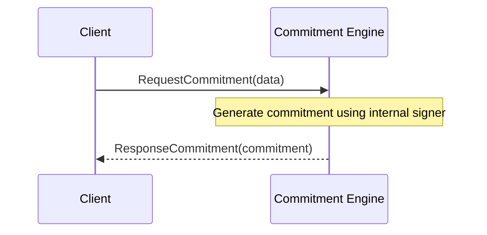

??? quote "Juvix imports"

    ```juvix
    module arch.node.engines.shard_messages;
    import prelude open;
    ```

# Shard Messages

## Message interface

### `KVSAcquireLock`

```juvix
type KVSAcquireLock := mkKVSAcquireLock {
  lazy_read_keys : Set KVSKey; -- Keys this transaction _may_ read (only send values read in response to [[KVSReadRequest]]s)
  eager_read_keys : Set KVSKey; -- Keys this transaction _will_ read (send values read as soon as possible)
  will_write_keys : Set KVSKey; -- Keys this transaction _will_ write. Future reads are dependent _only_ on the [[KVSWrite]] for this [[TxFingerprint]].
  may_write_keys : Set KVSKey; -- Keys this transaction _may_ write. Future reads are dependent on the [[KVSWrite]] for this [[TxFingerprint]], or, if that has a `None`, the previous value.
  curator : ExternalIdentity; -- the [[Worker Engine]] in charge of the corresponding transactions
  executor : ExternalIdentity; -- the [[Executor|Executor]] for this [[TransactionCandidate]]
  timestamp : TxFingerprint; -- specifies the transaction affiliated with these locks.
};
```
!!! todo
    make this type check properly (may require introduing TxFingerprint and such types somewhere)

!!! todo
    figure out how we're expressing Sets like this in Juvix. Probably some kind of Set typeclass, and then there can be different instances for each of the input Sets, but that starts to seem unnecessarily verbose.


Inform the shard about keys that a transaction may/will read and/or
 write, at a transaction fingerprint.

???+ quote "Arguments"

    `lazy_read_keys`:
    : Keys this transaction _may_ read (only send values read in response to [[KVSReadRequest]]s)

    `eager_read_keys`:
    : Keys this transaction _will_ read (send values read as soon as possible)

    `will_write_keys`:
    : Keys this transaction _will_ write. Future reads are dependent _only_ on the [[KVSWrite]] for this [[TxFingerprint]].

    `may_write_keys`:
    : Keys this transaction _may_ write. Future reads are dependent on the [[KVSWrite]] for this [[TxFingerprint]], or, if that has a `None`, the previous value.

    `curator`:
    : the [[Worker Engine]] in charge of the corresponding transactions

    `executor`:
    : the [[Executor|Executor]] for this [[TransactionCandidate]]

    `timestamp`:
    : specifies the transaction affiliated with these locks.

There must be one `KVSAcquireLock` per [[Shard]]
 per [[TxFingerprint]]: for a given [[Shard]] and [[TxFingerprint]],
 all information is to be provided in totality or not at all.
(Note that transaction requests come with all this information
    at once for each transaction candidate.)

Note that prefix-lookup keys (such as proposed for Blob storage) are allowed, so some keys may reference ``subsets'' of data from others.


Sent _from_ [[Mempool Worker]]


#### Effects

- The [[Shard]] stores the respective "locks" for all keys in its timeline.
  - these are the "markers" described in [[Shard]] State.
- The `eager_read_keys` will be served as soon as possible
  (by sending `KVSRead`-messages to the [[Executor|executor]]).
- The [[Shard]] immediately informs the [[Worker Engine|curator]] that
   the locks are acquired, using a [[KVSLockAcquired]] message, so the
   [[Worker Engine|curator]] can prepare [[UpdateSeenAll]] messages.

#### Triggers

- _to_ [[Worker Engine]]: [[KVSLockAcquired]]
  send a [[KVSLockAcquired]] message to the [[Worker Engine|curator]],
      signaling that the locks of this message will be accounted for.
- to [[Executor|executor]]:  [[KVSRead]]
  `for each` recorded `eager_read_key` in this shard's timeline
  for which the most recent written value is established:
  send a [[KVSRead]] message to the [[Executor|Executor]].


### `KVSReadRequest`
```juvix
type KVSReadRequest := mkKVSReadRequest {
  timestamp : TxFingerprint; -- we need the value at this logical timestamp
  key : KVSKey; -- the value corresponds to this key
  actual : bool; -- `true` iff we actually want a response (as opposed to just releasing a lock)
};
```
!!! todo
    make this type check properly (may require introduing TxFingerprint and such types somewhere)

Informs the Shard about a new read request, which happens
in either of the following cases:

- An [[Executor|Executor]] has determined that it actually needs
   the value at some [[KVSkey|key]] for which it has a lazy read
   (a may_read in the [[TransactionLabel]] of the
   [[TransactionCandidate]]).
  Now the executor is requesting that value from the Shard that stores
   it.
- A [[Executor|Executor]] has finished and does not need
  the value for some [[KVSkey|key]]
  for which it has a lazy read (a may_read in the
   [[TransactionLabel]]).

???+ quote "Arguments"
    `timestamp`:
    : we need the value at this logical timestamp

    `key`:
    : the value corresponds to this key

    `actual`:
    : `true` iff we actually want a response (as opposed to just releasing a lock)

If `actual` is `false`, this just means that there is no dependency on
 this key in the current execution; we're just releasing the lock.

Sent _from_ [[Executor]]

#### Effects

A [[Shard]] should delay processing a [[KVSReadRequest]] until it has
 completed processing [[KVSAcquireLock]] for the
 [[TxFingerprint|same timestamp]].

Then, if `actual` is false, the Shard is done reading the value, and
 can remove the *may read* marker from state.

If `actual` is true, the Shard replaces the *may read* marker with a
 *will read* marker.
If the Shard knows the unique previous value written before
 [[TxFingerprint|this timestamp]], it sends that value in a [[KVSRead]] to
 the [[Executor|Executor]] and removes the *will read* marker from state.
Otherwise, future [[KVSWrite]]s and/or [[UpdateSeenAll]]s will
 identify this unique previous value written, and trigger the
 [[KVSRead]].

#### Triggers

- _to_ [[Executor|Executor]]: [[KVSRead]]
  `if` the Shard has determined the unique value written prior to this "lock"
  `then` send a [[KVSRead]]-message to the relevant [[Executor|Executor]]
  to inform them of the value

### `KVSWrite`
```juvix
type KVSWrite := mkKVSWrite {
  timestamp : TxFingerprint; -- the logical time at which we are writing this data.
  key : KVSKey; -- the key used. With fancy hierarchical keys or suchlike, we could even specify a range of keys
  datum : Maybe KVSDatum; -- the new data to be associated with the key. No datum should only be used in a "may_write," and means don't change this value
}
```
!!! todo
    make this type check properly (may require introduing TxFingerprint and such types somewhere)

Informs the Shard about a new write request, which happens
in either of the following two cases:

- A [[TransactionExecutable]] has determined that it actually will
   write the value at some [[KVSKey|key]] for which it has a write
   (in its [[TransactionLabel]]).
  Now the [[Executor|Executor]] is requesting that value from the [[Shard]]
   that stores it.
- A [[TransactionExecutable]] has finished, and does not actually need
   to write a value for some [[KVSKey|key]] for which it has a lazy write
   (a may_write in the [[TransactionLabel]]).

???+ quote "Arguments"
  `timestamp`:
  : the logical time at which we are writing this data.

  `key`:
  : the key used. With fancy hierarchical keys or suchlike, we could even specify a range of keys

  `datum`:
  : the new data to be associated with the key. No datum should only be used in a "may_write," and means don't change this value

Sent _from_ [[Executor]]


#### Effects

A [[Shard]] should delay processing a [[KVSWrite]] until it has
 completed processing [[KVSAcquireLock]] for the
 [[TxFingerprint|same timestamp]].

If the `datum` is `None`, then remove the *may write* marker from
 [[TxFingerprint|this timestamp]] in state.
Any reads waiting to read what is written here must instead read from
 the previous write.
- One way to accomplish this is to copy the previous write as a
    "value written" at [[TxFingerprint|this timestamp]] in state.

If `datum` is occupied, then remove the *may write* or *will write*
 marker from  [[TxFingerprint|this timestamp]] in state, and record the
 value written at [[TxFingerprint|this timestamp]] in state.

This may trigger a [[KVSRead]] if there are any *will read* markers
 for which  [[TxFingerprint|this timestamp]] is the unique previous
 write.

Any garbage collection of old locking info is elided in V0.2.0 and earlier

#### Triggers

- _to_ [[Executor|Executor]]: [[KVSRead]]
   `for each` *will read* lock dependent on this write:
    send a [[KVSRead]] to the  [[Executor|relevant Executor]] with the value written.


### `UpdateSeenAll`
```juvix
type UpdateSeenAll := mkUpdateSeenAll {
  timestamp : TxFingerprint; -- represents a the position in the total order (in V0.2.0 and earlier)
  write : bool; -- seen all read and seen all write can (and should) be separate
}
```
!!! todo
    make this type check properly (may require introduing TxFingerprint and such types somewhere)

In order to actually serve read requests,
the Shard needs to know that it will not receive more
write requests before a  [[TxFingerprint|certain timestamp]].
These are in general broadcast to all [[Shard]]s.

It is important that  [[Worker Engine|the mempool worker]] has received
[[KVSLockAcquired]]-messages for all [[KVSAcquireLock]]s it has sent (or will ever send) at or before [[TxFingerprint|the timestamp]].
This ensures that, for example, reads before the `write` `UpdateSeenAll` [[TxFingerprint|timestamp]] are final: no new write will come along and change what was supposed to have been read.

Each [[Worker Engine|worker engine]] only needs to send the [[Shard]] [[UpdateSeenAll]] messages concerning worker-specific ordering (batch number and sequence number within the batch).
This means that each [[Shard]] needs to hear from  [[Worker Engine|every Worker Engine]] periodically to be sure it is not waiting for any transactions.
From there, the Shard uses [[TimestampOrderingInformation]] about the Narwhal DAG and Consensus to fill in a total order.

???+ quote "Arguments"
    `timestamp`:
    : represents a the position in the total order (in V0.2.0 and earlier)

    `write`:
    : seen all read and seen all write can (and should) be separate

For V0.2.0 and earlier, we only care about `write = true`
because we don't garbage collect and assume multi-version storage.

Sent _from_ [[Mempool]]. In v0.2.0 and earlier, this will be sent from the one and only [[Mempool Worker]].

#### Effects
Shards can now identify the unique previous write prior to each read at or before [[TxFingerprint|this timestamp]].
(In versions after 0.2.0, this may not necessarily be true: consensus may be necessary.)
If that unique previous write has a value written, and the read is marked *will read*, they can send a [[KVSRead]] with that value to the [[Executor|relevant Executor]].

#### Triggers
- _to_ [[Executor|Executor]]: [[KVSRead]]
  `for each` *will read* for which we have established a unique previous write value
  send a `KVSRead` message to the relevant [[Executor|Executor]]


### `TimestampOrderingInformation`
```juvix
type TimestampOrderingInformation := MkTimestampOrderingInformation {
}
```
!!! todo
    figure out what information is necessary to translate TxFingerprints to a partial order (in v0.2.0 and earlier, a total order)


While each transaction comes with a [[TxFingerprint]], the shards do not actually know the order of those until workers order them and the DAG is built, and consensus decisions are made. This message represents the mempool communicating (partial) timestamp ordering. These are broadcast to all shards.

Sent _from_ [[Mempool]].

#### Effects

As shards learn more ordering information, they can finally complete reads (since they learn which writes most recently occurred).

#### Triggers

- _to_ [Executor](./index.md): [`KVSRead`](../executor/kvs_read.md)
  `for each` locked key for which we have established a unique write value,
  send a `KVSRead` message to the appropriate Executor

### `AnchorChosen`
These are not used in v0.2.0 and earlier.

Inform shards about the most recently decided value by the consensus.

Sent _from_ [[Consensus]].

#### Effects

The shard learns more ordering information. In particular, with this and enough `TimestampOrderingInformation` messages, it should be able to order all transactions before the new `anchor`.


Once we have enough ordering information to establish the unique write preceding a key on which there is a read lock, and we have a value for that write, we can send that value to the relevant Executor.

#### Triggers

- to [Executor](./../executor/index.md): [`KVSRead`](../executor/kvs_read.md)
  `for each` locked key for which we have established a unique write value,
  send a `KVSRead` message to the appropriate Executor.


## Message sequence diagrams

### Shard TransactionRequest Sequence
!!! todo
    Using the template from commitment messages, make a mermaid diagram with a typical transactionRequest sequence.

<!-- --8<-- [start:message-sequence-diagram] -->
<figure markdown="span">



<figcaption markdown="span">
Sequence diagram for commitment generation.
</figcaption>
</figure>
<!-- --8<-- [end:message-sequence-diagram] -->

## Engine Components

- [[Shard Environment]]
- [[Shard Behaviour]]
