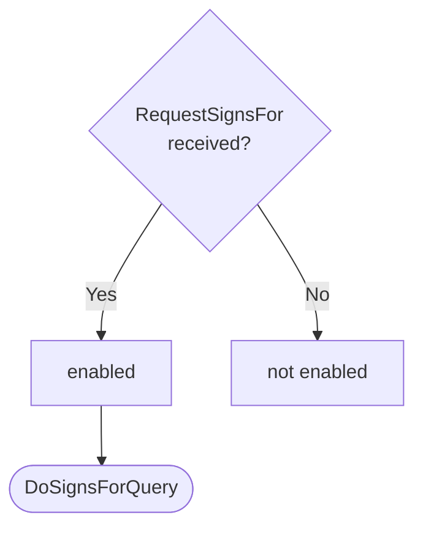
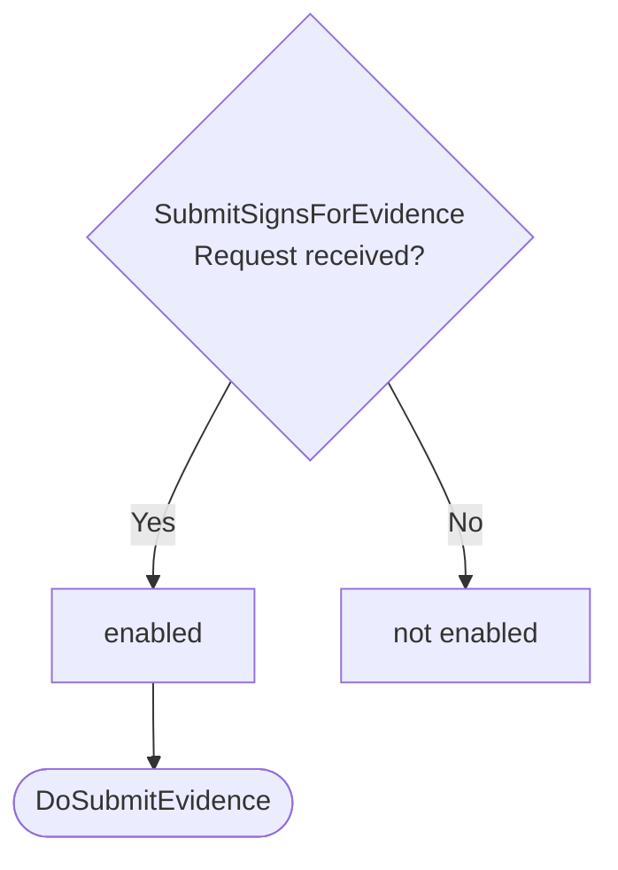
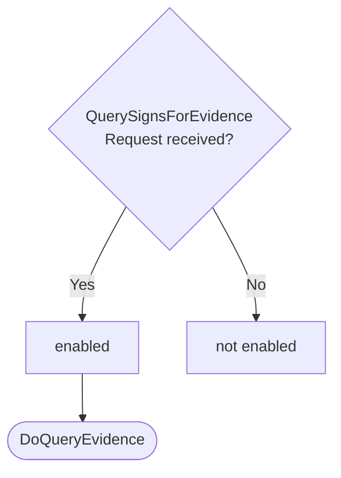

??? quote "Juvix imports"

    ```juvix
    module arch.node.engines.signs_for_behaviour;

    import prelude open;
    import arch.node.types.messages open;
    import arch.node.types.engine_behaviour open;
    import arch.node.types.engine_environment open;
    import arch.node.types.identities open;
    import arch.node.engines.signs_for_environment open;
    import arch.node.engines.signs_for_messages open;
    import arch.node.types.anoma_message open;
    ```

# Signs For Behaviour

## Overview

The behavior of the Signs For Engine defines how it processes incoming messages and updates
its state accordingly.

## Action labels

### `DoSignsForQuery`

```juvix
type DoSignsForQuery := mkDoSignsForQuery {
  externalIdentityA : ExternalIdentity;
  externalIdentityB : ExternalIdentity
};
```

This action label corresponds to processing a signs_for query.

???+ quote "Arguments"

    `externalIdentityA`:
    : The first external identity in the query.

    `externalIdentityB`:
    : The second external identity in the query.

???+ quote "`DoSignsForQuery` action effect"

    This action does the following:

    | Aspect | Description |
    |--------|-------------|
    | State update          | The state remains unchanged. |
    | Messages to be sent   | A `ResponseSignsFor` message is sent back to the requester. |
    | Engines to be spawned | No engine is created by this action. |
    | Timer updates         | No timers are set or cancelled. |

### `DoSubmitEvidence`

```juvix
type DoSubmitEvidence := mkDoSubmitEvidence {
  evidence : SignsForEvidence
};
```

This action label corresponds to submitting new signs_for evidence.

???+ quote "Arguments"

    `evidence`:
    : The signs_for evidence to submit.

???+ quote "`DoSubmitEvidence` action effect"

    This action does the following:

    | Aspect | Description |
    |--------|-------------|
    | State update          | If the evidence doesn't already exist and is valid, it's added to the `evidenceStore` in the local state. |
    | Messages to be sent   | A `ResponseSubmitSignsForEvidence` message is sent back to the requester. |
    | Engines to be spawned | No engine is created by this action. |
    | Timer updates         | No timers are set or cancelled. |

### `DoQueryEvidence`

```juvix
type DoQueryEvidence := mkDoQueryEvidence {
  externalIdentity : ExternalIdentity
};
```

This action label corresponds to querying signs_for evidence for a specific identity.

???+ quote "Arguments"

    `externalIdentity`:
    : The external identity to query evidence for.

???+ quote "`DoQueryEvidence` action effect"

    This action does the following:

    | Aspect | Description |
    |--------|-------------|
    | State update          | The state remains unchanged. |
    | Messages to be sent   | A `ResponseQuerySignsForEvidence` message is sent back to the requester. |
    | Engines to be spawned | No engine is created by this action. |
    | Timer updates         | No timers are set or cancelled. |

### `SignsForActionLabel`

```juvix
type SignsForActionLabel :=
  | SignsForActionLabelDoSignsForQuery DoSignsForQuery
  | SignsForActionLabelDoSubmitEvidence DoSubmitEvidence
  | SignsForActionLabelDoQueryEvidence DoQueryEvidence
;
```

## Matchable arguments

### `ReplyTo`

```juvix
type ReplyTo := mkReplyTo {
  whoAsked : Option EngineID;
  mailbox : Option MailboxID
};
```

???+ quote "Arguments"

    `whoAsked`:
    : The engine ID of the requester.

    `mailbox`:
    : The mailbox ID where the response should be sent.

### `SignsForMatchableArgument`

```juvix
type SignsForMatchableArgument :=
  | SignsForMatchableArgumentReplyTo ReplyTo
;
```

## Precomputation results

The Signs For Engine does not require any non-trivial pre-computations.

```juvix
syntax alias SignsForPrecomputation := Unit;
```

## Guards

??? quote "Auxiliary Juvix code"

    Type alias for the guard.

    ```juvix
    SignsForGuard : Type :=
      Guard
        SignsForLocalState
        SignsForMailboxState
        SignsForTimerHandle
        SignsForMatchableArgument
        SignsForActionLabel
        SignsForPrecomputation;

    SignsForGuardOutput : Type :=
      GuardOutput
        SignsForMatchableArgument
        SignsForActionLabel
        SignsForPrecomputation;
    ```

### `signsForQueryGuard`

<figure markdown>

<figcaption>signsForQueryGuard flowchart</figcaption>
</figure>

<!-- --8<-- [start:signsForQueryGuard] -->
```juvix
signsForQueryGuard
  (t : TimestampedTrigger SignsForTimerHandle)
  (env : SignsForEnvironment) : Option SignsForGuardOutput
  := case getMessageFromTimestampedTrigger t of {
      | some (MsgSignsFor (MsgSignsForRequest (mkRequestSignsFor x y))) := do {
        sender <- getSenderFromTimestampedTrigger t;
        pure (mkGuardOutput@{
                matchedArgs := [SignsForMatchableArgumentReplyTo (mkReplyTo (some sender) none)] ;
                actionLabel := SignsForActionLabelDoSignsForQuery (mkDoSignsForQuery x y);
                precomputationTasks := unit
        });}
      | _ := none
  };
```
<!-- --8<-- [end:signsForQueryGuard] -->

### `submitEvidenceGuard`

<figure markdown>

<figcaption>submitEvidenceGuard flowchart</figcaption>
</figure>

<!-- --8<-- [start:submitEvidenceGuard] -->
```juvix
submitEvidenceGuard
  (t : TimestampedTrigger SignsForTimerHandle)
  (env : SignsForEnvironment) : Option SignsForGuardOutput
  := case getMessageFromTimestampedTrigger t of {
      | some (MsgSignsFor (MsgSubmitSignsForEvidenceRequest (mkRequestSubmitSignsForEvidence x))) := do {
        sender <- getSenderFromTimestampedTrigger t;
        pure (mkGuardOutput@{
                matchedArgs := [SignsForMatchableArgumentReplyTo (mkReplyTo (some sender) none)] ;
                actionLabel := SignsForActionLabelDoSubmitEvidence (mkDoSubmitEvidence x);
                precomputationTasks := unit
        });}
      | _ := none
  };
```
<!-- --8<-- [end:submitEvidenceGuard] -->

### `queryEvidenceGuard`

<figure markdown>

<figcaption>queryEvidenceGuard flowchart</figcaption>
</figure>

<!-- --8<-- [start:queryEvidenceGuard] -->
```juvix
queryEvidenceGuard
  (t : TimestampedTrigger SignsForTimerHandle)
  (env : SignsForEnvironment) : Option SignsForGuardOutput
  := case getMessageFromTimestampedTrigger t of {
      | some (MsgSignsFor (MsgQuerySignsForEvidenceRequest (mkRequestQuerySignsForEvidence x))) := do {
        sender <- getSenderFromTimestampedTrigger t;
        pure (mkGuardOutput@{
                matchedArgs := [SignsForMatchableArgumentReplyTo (mkReplyTo (some sender) none)] ;
                actionLabel := SignsForActionLabelDoQueryEvidence (mkDoQueryEvidence x);
                precomputationTasks := unit
                });
        }
      | _ := none
  };
```
<!-- --8<-- [end:queryEvidenceGuard] -->

## Action function

??? quote "Auxiliary Juvix code"

    Type alias for the action function.

    ```juvix
    SignsForActionInput : Type :=
      ActionInput
        SignsForLocalState
        SignsForMailboxState
        SignsForTimerHandle
        SignsForMatchableArgument
        SignsForActionLabel
        SignsForPrecomputation;

    SignsForActionEffect : Type :=
      ActionEffect
        SignsForLocalState
        SignsForMailboxState
        SignsForTimerHandle
        SignsForMatchableArgument
        SignsForActionLabel
        SignsForPrecomputation;
    ```

### `signsForAction`

<!-- --8<-- [start:signsForAction] -->
```juvix
signsForAction (input : SignsForActionInput) : SignsForActionEffect :=
  let env := ActionInput.env input;
      out := ActionInput.guardOutput input;
      localState := EngineEnvironment.localState env;
  in
  case GuardOutput.actionLabel out of {
    | SignsForActionLabelDoSignsForQuery (mkDoSignsForQuery externalIdentityA externalIdentityB) :=
      case GuardOutput.matchedArgs out of {
        | SignsForMatchableArgumentReplyTo (mkReplyTo (some whoAsked) _) :: _ := let
            hasEvidence := isElement \{a b := a && b} true (map \{ evidence :=
              isEqual (Ord.cmp (SignsForEvidence.fromIdentity evidence) externalIdentityA) &&
              isEqual (Ord.cmp (SignsForEvidence.toIdentity evidence) externalIdentityB)
            } (Set.toList (SignsForLocalState.evidenceStore localState)));
            responseMsg := mkResponseSignsFor@{
              signsFor := hasEvidence;
              err := none
            };
          in mkActionEffect@{
            newEnv := env; -- No state change
            producedMessages := [mkEngineMsg@{
              sender := mkPair none (some (EngineEnvironment.name env));
              target := whoAsked;
              mailbox := some 0;
              msg := MsgSignsFor (MsgSignsForResponse responseMsg)
            }];
            timers := [];
            spawnedEngines := []
          }
        | _ := mkActionEffect@{newEnv := env; producedMessages := []; timers := []; spawnedEngines := []}
      }
    | SignsForActionLabelDoSubmitEvidence (mkDoSubmitEvidence evidence) :=
      case GuardOutput.matchedArgs out of {
        | SignsForMatchableArgumentReplyTo (mkReplyTo (some whoAsked) _) :: _ :=
            let isValid := SignsForLocalState.verifyEvidence localState evidence;
            in
            case isValid of {
              | true :=
                  let alreadyExists :=
                    isElement \{a b := a && b} true (map \{e :=
                        isEqual (Ord.cmp e evidence)
                      } (Set.toList (SignsForLocalState.evidenceStore localState)));
                  in
                  case alreadyExists of {
                    | true :=
                        let responseMsg := mkResponseSubmitSignsForEvidence@{
                              err := some "Evidence already exists."
                            };
                        in mkActionEffect@{
                          newEnv := env;
                          producedMessages := [mkEngineMsg@{
                            sender := mkPair none (some (EngineEnvironment.name env));
                            target := whoAsked;
                            mailbox := some 0;
                            msg := MsgSignsFor (MsgSubmitSignsForEvidenceResponse responseMsg)
                          }];
                          timers := [];
                          spawnedEngines := []
                        }
                    | false :=
                        let newEvidenceStore := Set.insert evidence (SignsForLocalState.evidenceStore localState);
                            updatedLocalState := localState@SignsForLocalState{
                              evidenceStore := newEvidenceStore
                            };
                            newEnv' := env@EngineEnvironment{
                              localState := updatedLocalState
                            };
                            responseMsg := mkResponseSubmitSignsForEvidence@{
                              err := none
                            };
                        in mkActionEffect@{
                          newEnv := newEnv';
                          producedMessages := [mkEngineMsg@{
                            sender := mkPair none (some (EngineEnvironment.name env));
                            target := whoAsked;
                            mailbox := some 0;
                            msg := MsgSignsFor (MsgSubmitSignsForEvidenceResponse responseMsg)
                          }];
                          timers := [];
                          spawnedEngines := []
                        }
                  }
              | false :=
                  let responseMsg := mkResponseSubmitSignsForEvidence@{
                        err := some "Invalid evidence provided."
                      };
                  in mkActionEffect@{
                    newEnv := env;
                    producedMessages := [mkEngineMsg@{
                      sender := mkPair none (some (EngineEnvironment.name env));
                      target := whoAsked;
                      mailbox := some 0;
                      msg := MsgSignsFor (MsgSubmitSignsForEvidenceResponse responseMsg)
                    }];
                    timers := [];
                    spawnedEngines := []
                  }
            }
        | _ := mkActionEffect@{
            newEnv := env;
            producedMessages := [];
            timers := [];
            spawnedEngines := []
          }
      }
    | SignsForActionLabelDoQueryEvidence (mkDoQueryEvidence externalIdentity') :=
      case GuardOutput.matchedArgs out of {
        | SignsForMatchableArgumentReplyTo (mkReplyTo (some whoAsked) _) :: _ := let
            relevantEvidence := AVLTree.filter \{evidence :=
              isEqual (Ord.cmp (SignsForEvidence.fromIdentity evidence) externalIdentity') ||
              isEqual (Ord.cmp (SignsForEvidence.toIdentity evidence) externalIdentity')
            } (SignsForLocalState.evidenceStore localState);
            responseMsg := mkResponseQuerySignsForEvidence@{
              externalIdentity := externalIdentity';
              evidence := relevantEvidence;
              err := none
            };
          in mkActionEffect@{
            newEnv := env; -- No state change
            producedMessages := [mkEngineMsg@{
              sender := mkPair none (some (EngineEnvironment.name env));
              target := whoAsked;
              mailbox := some 0;
              msg := MsgSignsFor (MsgQuerySignsForEvidenceResponse responseMsg)
            }];
            timers := [];
            spawnedEngines := []
          }
        | _ := mkActionEffect@{newEnv := env; producedMessages := []; timers := []; spawnedEngines := []}
      }
};
```
<!-- --8<-- [end:signsForAction] -->

## Conflict solver

### `signsForConflictSolver`

```juvix
signsForConflictSolver : Set SignsForMatchableArgument -> List (Set SignsForMatchableArgument)
  | _ := [];
```

## The Signs For Behaviour

### `SignsForBehaviour`

<!-- --8<-- [start:SignsForBehaviour] -->
```juvix
SignsForBehaviour : Type :=
  EngineBehaviour
    SignsForLocalState
    SignsForMailboxState
    SignsForTimerHandle
    SignsForMatchableArgument
    SignsForActionLabel
    SignsForPrecomputation;
```
<!-- --8<-- [end:SignsForBehaviour] -->

### Instantiation

<!-- --8<-- [start:signsForBehaviour] -->
```juvix
signsForBehaviour : SignsForBehaviour :=
  mkEngineBehaviour@{
    guards := [signsForQueryGuard; submitEvidenceGuard; queryEvidenceGuard];
    action := signsForAction;
    conflictSolver := signsForConflictSolver;
  };
```
<!-- --8<-- [end:signsForBehaviour] -->
