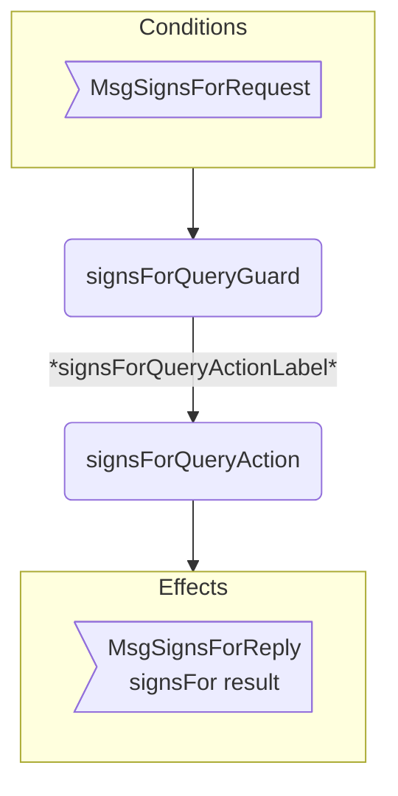
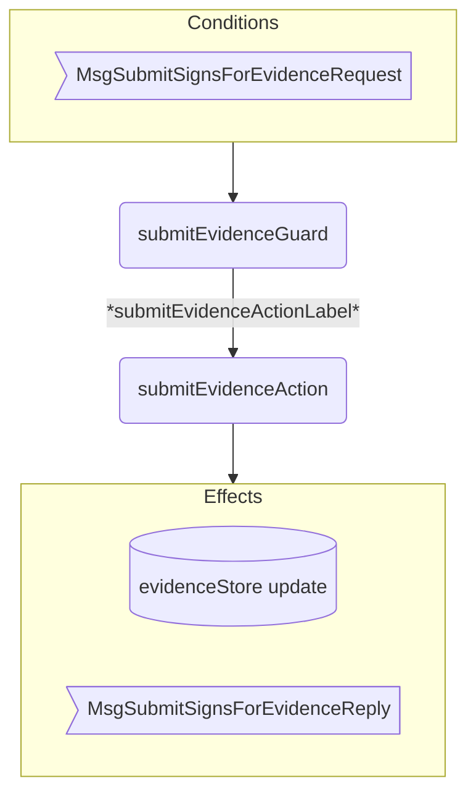
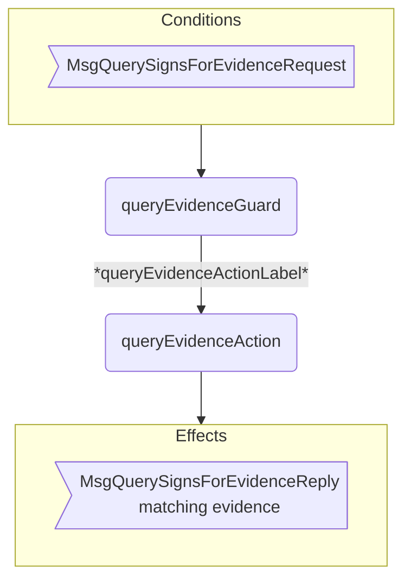

??? code "Juvix imports"

    ```juvix
    module arch.node.engines.signs_for_behaviour;

    import prelude open;
    import arch.node.types.messages open;
    import arch.node.types.engine open;
    import arch.node.types.identities open;
    import arch.node.engines.signs_for_environment open;
    import arch.node.engines.signs_for_messages open;
    import arch.node.engines.signs_for_config open;
    import arch.node.types.anoma as Anoma open;
    ```

# SignsFor Behaviour

## Overview

The behavior of the SignsFor Engine defines how it processes incoming messages and updates
its state accordingly.

## Action arguments

### `SignsForActionArgumentReplyTo ReplyTo`

```juvix
type ReplyTo := mkReplyTo@{
  whoAsked : Option EngineID;
  mailbox : Option MailboxID;
};
```

This action argument contains the address and mailbox ID of where the
response message should be sent.

`whoAsked`:
: The engine ID of the requester.

`mailbox`:
: The mailbox ID where the response should be sent.

### `SignsForActionArgument`

<!-- --8<-- [start:SignsForActionArgument] -->
```juvix
type SignsForActionArgument :=
  | SignsForActionArgumentReplyTo ReplyTo
  ;
```
<!-- --8<-- [end:SignsForActionArgument] -->

### `SignsForActionArguments`

<!-- --8<-- [start:signs-for-action-arguments] -->
```juvix
SignsForActionArguments : Type := List SignsForActionArgument;
```
<!-- --8<-- [end:signs-for-action-arguments] -->

## Actions

??? code "Auxiliary Juvix code"

    ### SignsForAction

    ```juvix
    SignsForAction : Type :=
      Action
        SignsForCfg
        SignsForLocalState
        SignsForMailboxState
        SignsForTimerHandle
        SignsForActionArguments
        Anoma.Msg
        Anoma.Cfg
        Anoma.Env;
    ```

    ### SignsForActionInput

    ```juvix
    SignsForActionInput : Type :=
      ActionInput
        SignsForCfg
        SignsForLocalState
        SignsForMailboxState
        SignsForTimerHandle
        SignsForActionArguments
        Anoma.Msg;
    ```

    ### SignsForActionEffect

    ```juvix
    SignsForActionEffect : Type :=
      ActionEffect
        SignsForLocalState
        SignsForMailboxState
        SignsForTimerHandle
        Anoma.Msg
        Anoma.Cfg
        Anoma.Env;
    ```

    ### SignsForActionExec

    ```juvix
    SignsForActionExec : Type :=
      ActionExec
        SignsForCfg
        SignsForLocalState
        SignsForMailboxState
        SignsForTimerHandle
        SignsForActionArguments
        Anoma.Msg
        Anoma.Cfg
        Anoma.Env;
    ```

### `signsForQueryAction`

Respond to a signs_for query.

State update
: The state remains unchanged.

Messages to be sent
: A `ReplySignsFor` message is sent back to the requester.

Engines to be spawned
: No engine is created by this action.

Timer updates
: No timers are set or cancelled.

```juvix
signsForQueryAction
  (input : SignsForActionInput)
  : Option SignsForActionEffect :=
  let
    env := ActionInput.env input;
    cfg := ActionInput.cfg input;
    tt := ActionInput.trigger input;
    localState := EngineEnv.localState env;
  in
    case getEngineMsgFromTimestampedTrigger tt of {
    | some EngineMsg.mk@{
        msg := Anoma.PreMsg.MsgSignsFor (SignsForMsg.SignsForRequest (RequestSignsFor.mkRequestSignsFor externalIdentityA externalIdentityB));
        sender := msgSender
      } :=
      let
        hasEvidence := isElement \{a b := a && b} true (map \{ evidence :=
          isEqual (Ord.compare (SignsForEvidence.fromIdentity evidence) externalIdentityA) &&
          isEqual (Ord.compare (SignsForEvidence.toIdentity evidence) externalIdentityB)
        } (Set.toList (SignsForLocalState.evidenceStore localState)));
        responseMsg := ReplySignsFor.mkReplySignsFor@{
          signsFor := hasEvidence;
          err := none
        };
      in some ActionEffect.mkActionEffect@{
        env := env;
        msgs := [EngineMsg.mk@{
          sender := getEngineIDFromEngineCfg cfg;
          target := msgSender;
          mailbox := some 0;
          msg := Anoma.PreMsg.MsgSignsFor (SignsForMsg.SignsForReply responseMsg)
        }];
        timers := [];
        engines := []
      }
    | _ := none
    }
```

### `submitEvidenceAction`

Submit new signs_for evidence.

State update
: If the evidence doesn't already exist and is valid, it's added to the `evidenceStore` in the local state.

Messages to be sent
: A `ReplySubmitSignsForEvidence` message is sent back to the requester.

Engines to be spawned
: No engine is created by this action.

Timer updates
: No timers are set or cancelled.

```juvix
submitEvidenceAction
  (input : SignsForActionInput)
  : Option SignsForActionEffect :=
  let
    env := ActionInput.env input;
    cfg := ActionInput.cfg input;
    tt := ActionInput.trigger input;
    localState := EngineEnv.localState env;
  in
    case getEngineMsgFromTimestampedTrigger tt of {
    | some EngineMsg.mk@{
        msg := Anoma.PreMsg.MsgSignsFor (SignsForMsg.SubmitSignsForEvidenceRequest (RequestSubmitSignsForEvidence.mkRequestSubmitSignsForEvidence evidence));
        sender := msgSender
      } := case verifyEvidence evidence of {
        | true :=
          let
            alreadyExists := isElement \{a b := a && b} true (map \{e :=
              isEqual (Ord.compare e evidence)
            } (Set.toList (SignsForLocalState.evidenceStore localState)));
          in case alreadyExists of {
            | true :=
              let
                responseMsg := ReplySubmitSignsForEvidence.mkReplySubmitSignsForEvidence@{
                  err := some "Evidence already exists."
                };
              in some ActionEffect.mkActionEffect@{
                env := env;
                msgs := [EngineMsg.mk@{
                  sender := getEngineIDFromEngineCfg cfg;
                  target := msgSender;
                  mailbox := some 0;
                  msg := Anoma.PreMsg.MsgSignsFor (SignsForMsg.SubmitSignsForEvidenceReply responseMsg)
                }];
                timers := [];
                engines := []
              }
            | false :=
              let
                newEvidenceStore := Set.insert evidence (SignsForLocalState.evidenceStore localState);
                updatedLocalState := localState@SignsForLocalState{
                  evidenceStore := newEvidenceStore
                };
                newEnv := env@EngineEnv{
                  localState := updatedLocalState
                };
                responseMsg := ReplySubmitSignsForEvidence.mkReplySubmitSignsForEvidence@{
                  err := none
                };
              in some ActionEffect.mkActionEffect@{
                env := newEnv;
                msgs := [EngineMsg.mk@{
                  sender := getEngineIDFromEngineCfg cfg;
                  target := msgSender;
                  mailbox := some 0;
                  msg := Anoma.PreMsg.MsgSignsFor (SignsForMsg.SubmitSignsForEvidenceReply responseMsg)
                }];
                timers := [];
                engines := []
              }
          }
        | false :=
          let
            responseMsg := ReplySubmitSignsForEvidence.mkReplySubmitSignsForEvidence@{
              err := some "Invalid evidence provided."
            };
          in some ActionEffect.mkActionEffect@{
            env := env;
            msgs := [EngineMsg.mk@{
              sender := getEngineIDFromEngineCfg cfg;
              target := msgSender;
              mailbox := some 0;
              msg := Anoma.PreMsg.MsgSignsFor (SignsForMsg.SubmitSignsForEvidenceReply responseMsg)
            }];
            timers := [];
            engines := []
          }
      }
    | _ := none
    }
```

### `queryEvidenceAction`

Query signs_for evidence for a specific identity.

State update
: The state remains unchanged.

Messages to be sent
: A `ReplyQuerySignsForEvidence` message is sent back to the requester.

Engines to be spawned
: No engine is created by this action.

Timer updates
: No timers are set or cancelled.

```juvix
queryEvidenceAction
  (input : SignsForActionInput)
  : Option SignsForActionEffect :=
  let
    env := ActionInput.env input;
    cfg := ActionInput.cfg input;
    tt := ActionInput.trigger input;
    localState := EngineEnv.localState env;
  in
    case getEngineMsgFromTimestampedTrigger tt of {
    | some EngineMsg.mk@{
        msg := Anoma.PreMsg.MsgSignsFor (SignsForMsg.QuerySignsForEvidenceRequest (RequestQuerySignsForEvidence.mkRequestQuerySignsForEvidence externalIdentity));
        sender := msgSender
      } :=
      let
        relevantEvidence := Set.filter \{evidence :=
          isEqual (Ord.compare (SignsForEvidence.fromIdentity evidence) externalIdentity) ||
          isEqual (Ord.compare (SignsForEvidence.toIdentity evidence) externalIdentity)
        } (SignsForLocalState.evidenceStore localState);
        responseMsg := ReplyQuerySignsForEvidence.mkReplyQuerySignsForEvidence@{
          externalIdentity := externalIdentity;
          evidence := relevantEvidence;
          err := none
        };
      in some ActionEffect.mkActionEffect@{
        env := env;
        msgs := [EngineMsg.mk@{
          sender := getEngineIDFromEngineCfg cfg;
          target := msgSender;
          mailbox := some 0;
          msg := Anoma.PreMsg.MsgSignsFor (SignsForMsg.QuerySignsForEvidenceReply responseMsg)
        }];
        timers := [];
        engines := []
      }
    | _ := none
    }
```

## Action Labels

### `signsForQueryActionLabel`

```juvix
signsForQueryActionLabel : SignsForActionExec := ActionExec.Seq [ signsForQueryAction ];
```

### `submitEvidenceActionLabel`

```juvix
submitEvidenceActionLabel : SignsForActionExec := ActionExec.Seq [ submitEvidenceAction ];
```

### `queryEvidenceActionLabel`

```juvix
queryEvidenceActionLabel : SignsForActionExec := ActionExec.Seq [ queryEvidenceAction ];
```

## Guards

??? code "Auxiliary Juvix code"

    ### `SignsForGuard`

    <!-- --8<-- [start:SignsForGuard] -->
    ```juvix
    SignsForGuard : Type :=
      Guard
        SignsForCfg
        SignsForLocalState
        SignsForMailboxState
        SignsForTimerHandle
        SignsForActionArguments
        Anoma.Msg
        Anoma.Cfg
        Anoma.Env;
    ```
    <!-- --8<-- [end:SignsForGuard] -->

    ### `SignsForGuardOutput`

    <!-- --8<-- [start:SignsForGuardOutput] -->
    ```juvix
    SignsForGuardOutput : Type :=
      GuardOutput
        SignsForCfg
        SignsForLocalState
        SignsForMailboxState
        SignsForTimerHandle
        SignsForActionArguments
        Anoma.Msg
        Anoma.Cfg
        Anoma.Env;
    ```
    <!-- --8<-- [end:SignsForGuardOutput] -->

    ### `SignsForGuardEval`

    <!-- --8<-- [start:SignsForGuardEval] -->
    ```juvix
    SignsForGuardEval : Type :=
      GuardEval
        SignsForCfg
        SignsForLocalState
        SignsForMailboxState
        SignsForTimerHandle
        SignsForActionArguments
        Anoma.Msg
        Anoma.Cfg
        Anoma.Env;
    ```
    <!-- --8<-- [end:SignsForGuardEval] -->

### `signsForQueryGuard`

Condition
: Message type is `MsgSignsForRequest`.

<!-- --8<-- [start:signsForQueryGuard] -->
```juvix
signsForQueryGuard
  (tt : TimestampedTrigger SignsForTimerHandle Anoma.Msg)
  (cfg : EngineCfg SignsForCfg)
  (env : SignsForEnv)
  : Option SignsForGuardOutput :=
  case getEngineMsgFromTimestampedTrigger tt of {
    | some EngineMsg.mk@{
        msg := Anoma.PreMsg.MsgSignsFor (SignsForMsg.SignsForRequest _);
      } := some GuardOutput.mkGuardOutput@{
        action := signsForQueryActionLabel;
        args := []
      }
    | _ := none
    };
```
<!-- --8<-- [end:signsForQueryGuard] -->

### `submitEvidenceGuard`

Condition
: Message type is `MsgSubmitSignsForEvidenceRequest`.

<!-- --8<-- [start:submitEvidenceGuard] -->
```juvix
submitEvidenceGuard
  (tt : TimestampedTrigger SignsForTimerHandle Anoma.Msg)
  (cfg : EngineCfg SignsForCfg)
  (env : SignsForEnv)
  : Option SignsForGuardOutput :=
  case getEngineMsgFromTimestampedTrigger tt of {
    | some EngineMsg.mk@{
        msg := Anoma.PreMsg.MsgSignsFor (SignsForMsg.SubmitSignsForEvidenceRequest _);
      } := some GuardOutput.mkGuardOutput@{
        action := submitEvidenceActionLabel;
        args := []
      }
    | _ := none
    };
```
<!-- --8<-- [end:submitEvidenceGuard] -->

### `queryEvidenceGuard`

Condition
: Message type is `MsgQuerySignsForEvidenceRequest`.

<!-- --8<-- [start:queryEvidenceGuard] -->
```juvix
queryEvidenceGuard
  (tt : TimestampedTrigger SignsForTimerHandle Anoma.Msg)
  (cfg : EngineCfg SignsForCfg)
  (env : SignsForEnv)
  : Option SignsForGuardOutput :=
  case getEngineMsgFromTimestampedTrigger tt of {
    | some EngineMsg.mk@{
        msg := Anoma.PreMsg.MsgSignsFor (SignsForMsg.QuerySignsForEvidenceRequest _);
      } := some GuardOutput.mkGuardOutput@{
        action := queryEvidenceActionLabel;
        args := []
      }
    | _ := none
    };
```
<!-- --8<-- [end:queryEvidenceGuard] -->

## The SignsFor Behaviour

### `SignsForBehaviour`

<!-- --8<-- [start:SignsForBehaviour] -->
```juvix
SignsForBehaviour : Type :=
  EngineBehaviour
    SignsForCfg
    SignsForLocalState
    SignsForMailboxState
    SignsForTimerHandle
    SignsForActionArguments
    Anoma.Msg
    Anoma.Cfg
    Anoma.Env;
```
<!-- --8<-- [end:SignsForBehaviour] -->

### Instantiation

<!-- --8<-- [start:signsForBehaviour] -->
```juvix
signsForBehaviour : SignsForBehaviour :=
  EngineBehaviour.mk@{
    guards := GuardEval.First [
      signsForQueryGuard;
      submitEvidenceGuard;
      queryEvidenceGuard
    ]
  };
```
<!-- --8<-- [end:signsForBehaviour] -->

## SignsFor Action Flowcharts

### `signsForQueryAction` flowchart

<figure markdown>



<figcaption markdown="span">
signsForQueryAction flowchart
</figcaption>
</figure>

### `submitEvidenceAction` flowchart

<figure markdown>



<figcaption markdown="span">
submitEvidenceAction flowchart
</figcaption>
</figure>

### `queryEvidenceAction` flowchart

<figure markdown>



<figcaption markdown="span">
queryEvidenceAction flowchart
</figcaption>
</figure>