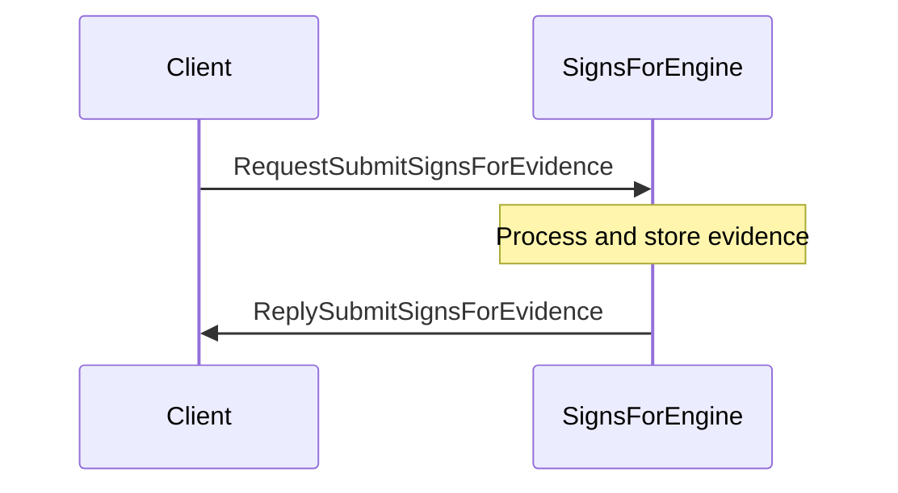
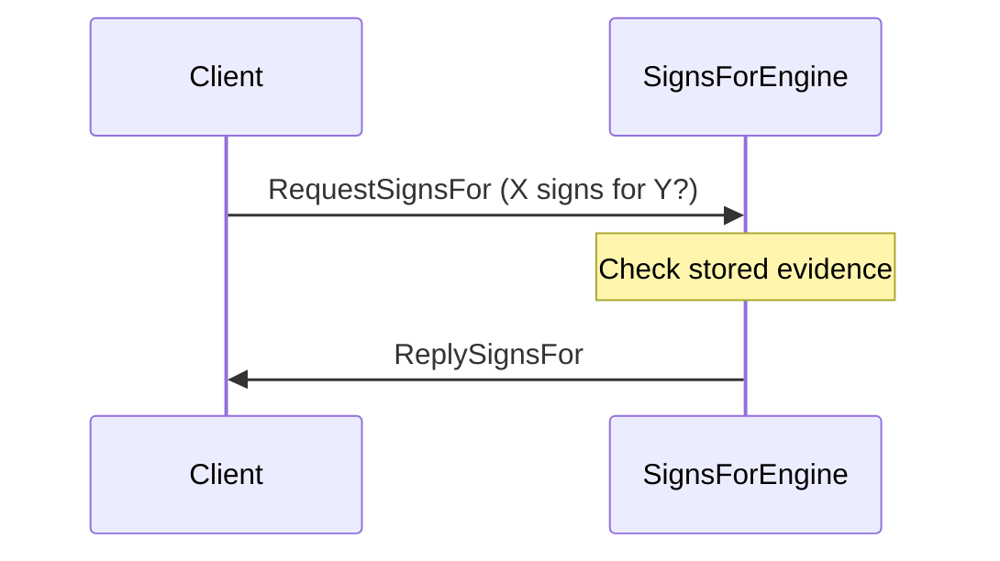
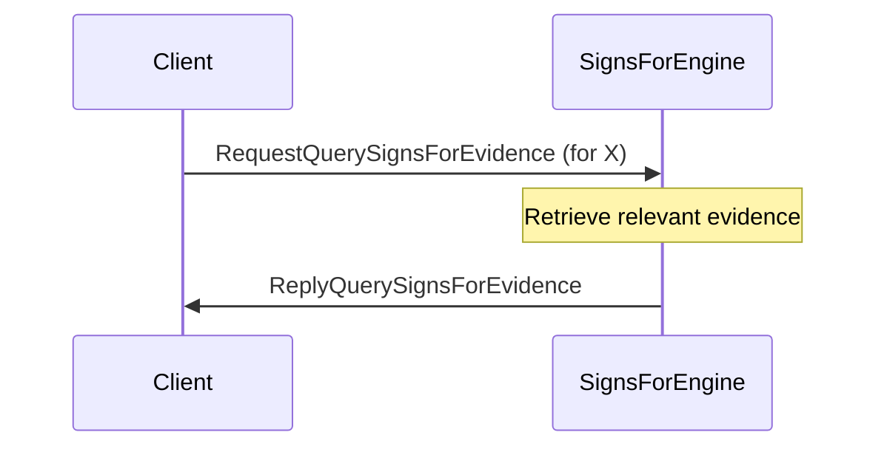

??? quote "Juvix imports"

    ```juvix
    module arch.node.engines.signs_for_messages;
    import prelude open;
    import arch.node.types.identities open;
    ```

# SignsFor Messages

## Message interface

--8<-- "./signs_for_messages.juvix.md:SignsForMsg"

## Message sequence diagrams

---

### Submitting `signs_for` evidence

<!-- --8<-- [start:message-sequence-diagram-submit] -->
<figure markdown="span">



<figcaption markdown="span">
Submitting evidence of a signs_for relationship
</figcaption>
</figure>
<!-- --8<-- [end:message-sequence-diagram-submit] -->

---

### Querying `signs_for` relationship

<!-- --8<-- [start:message-sequence-diagram-query-relation] -->
<figure markdown="span">



<figcaption markdown="span">
Querying whether a specific signs_for relationship exists
</figcaption>
</figure>
<!-- --8<-- [end:message-sequence-diagram-query-relation] -->

---

### Retrieving `signs_for` evidence

<!-- --8<-- [start:message-sequence-diagram-query-evidence] -->
<figure markdown="span">



<figcaption markdown="span">
Retrieving all signs_for evidence related to a particular identity
</figcaption>
</figure>
<!-- --8<-- [end:message-sequence-diagram-query-evidence] -->

---

## Message types

---

### `RequestSignsFor`

```juvix
type RequestSignsFor := mkRequestSignsFor {
  externalIdentityA : ExternalIdentity;
  externalIdentityB : ExternalIdentity
};
```

A `RequestSignsFor` queries whether `externalIdentityA` can sign on behalf of
`externalIdentityB`.

???+ quote "Arguments"

    `externalIdentityA`:
    : The identity attempting to sign.

    `externalIdentityB`:
    : The identity on whose behalf the signature is made.

---

### `MsgSignsForReply ReplySignsFor`

```juvix
type ReplySignsFor := mkReplySignsFor {
  signsFor : Bool;
  err : Option String
};
```

A `ReplySignsFor` indicates whether the `signs_for` relationship exists.

???+ quote "Arguments"

    `signsFor`:
    : True if `externalIdentityA` can sign for `externalIdentityB`, False otherwise.

    `err`:
    : An error message if the query failed.

---

### `RequestSubmitSignsForEvidence`

```juvix
type RequestSubmitSignsForEvidence := mkRequestSubmitSignsForEvidence {
  evidence : SignsForEvidence
};
```

A `RequestSubmitSignsForEvidence` submits evidence of a `signs_for` relationship.

???+ quote "Arguments"

    `evidence`:
    : The evidence supporting the `signs_for` relationship.

---

### `ReplySubmitSignsForEvidence`

```juvix
type ReplySubmitSignsForEvidence := mkReplySubmitSignsForEvidence {
  err : Option String
};
```

A `ReplySubmitSignsForEvidence` acknowledges the submission of evidence.

???+ quote "Arguments"

    `err`:
    : An error message if the submission failed.

---

### `RequestQuerySignsForEvidence`

```juvix
type RequestQuerySignsForEvidence := mkRequestQuerySignsForEvidence {
  externalIdentity : ExternalIdentity
};
```

A `RequestQuerySignsForEvidence` queries all `signs_for` evidence related to an identity.

???+ quote "Arguments"

    `externalIdentity`:
    : The identity for which to retrieve evidence.

---

### `ReplyQuerySignsForEvidence`

```juvix
type ReplyQuerySignsForEvidence := mkReplyQuerySignsForEvidence {
  externalIdentity : ExternalIdentity;
  evidence : Set SignsForEvidence;
  err : Option String
};
```

A `ReplyQuerySignsForEvidence` provides the requested evidence.

???+ quote "Arguments"

    `externalIdentity`:
    : The identity for which to retrieve evidence.

    `evidence`:
    : A set of `SignsForEvidence` related to the identity.

    `err`:
    : An error message if the query failed.

---

### `SignsForMsg`

<!-- --8<-- [start:SignsForMsg] -->
```juvix
type SignsForMsg :=
  | MsgSignsForRequest RequestSignsFor
  | MsgSignsForReply ReplySignsFor
  | MsgSubmitSignsForEvidenceRequest RequestSubmitSignsForEvidence
  | MsgSubmitSignsForEvidenceReply ReplySubmitSignsForEvidence
  | MsgQuerySignsForEvidenceRequest RequestQuerySignsForEvidence
  | MsgQuerySignsForEvidenceReply ReplyQuerySignsForEvidence
  ;
```
<!-- --8<-- [end:SignsForMsg] -->

---

## Engine components

- [[SignsFor Configuration]]
- [[SignsFor Environment]]
- [[SignsFor Behaviour]]
