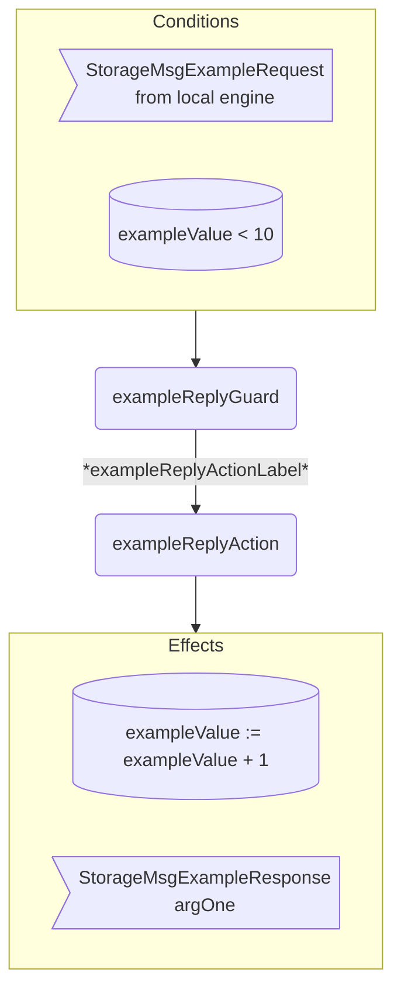

??? quote "Juvix imports"

    ```juvix
    module arch.node.engines.storage_behaviour;

    import arch.node.engines.storage_messages open;
    import arch.node.engines.storage_config open;
    import arch.node.engines.storage_environment open;

    import arch.node.types.basics open;
    import arch.node.types.identities open;
    import arch.node.types.messages open;
    import arch.node.types.engine open;
    import arch.node.types.anoma as Anoma open;
    ```

# Storage Behaviour

## Overview

A *Storage* engine acts in the ways described on this page.
The action labels correspond to the actions that can be performed by the engine.
Using the action labels, we describe the effects of the actions.

## Storage Action Flowchart

### `exampleReply` Flowchart

<figure markdown>



<figcaption markdown="span">

`exampleReply` flowchart

</figcaption>
</figure>


## Action arguments

The action arguments are set by a guard
and passed to the action function as part of the `GuardOutput`.

### `StorageActionArguments`

<!-- --8<-- [start:StorageActionArguments] -->
```juvix
StorageActionArguments : Type := Unit;
```
<!-- --8<-- [end:StorageActionArguments] -->

## Actions

??? quote "Auxiliary Juvix code"

    ### `StorageAction`

    <!-- --8<-- [start:StorageAction] -->
    ```juvix
    StorageAction : Type :=
      Action
        StorageLocalCfg
        StorageLocalState
        StorageMailboxState
        StorageTimerHandle
        StorageActionArguments
        Anoma.Msg
        Anoma.Cfg
        Anoma.Env;
    ```
    <!-- --8<-- [end:StorageAction] -->

    ### `StorageActionInput`

    <!-- --8<-- [start:StorageActionInput] -->
    ```juvix
    StorageActionInput : Type :=
      ActionInput
        StorageLocalCfg
        StorageLocalState
        StorageMailboxState
        StorageTimerHandle
        StorageActionArguments
        Anoma.Msg;
    ```
    <!-- --8<-- [end:StorageActionInput] -->

    ### `StorageActionEffect`

    <!-- --8<-- [start:StorageActionEffect] -->
    ```juvix
    StorageActionEffect : Type :=
      ActionEffect
        StorageLocalState
        StorageMailboxState
        StorageTimerHandle
        Anoma.Msg
        Anoma.Cfg
        Anoma.Env;
    ```
    <!-- --8<-- [end:StorageActionEffect] -->

    ### `StorageActionExec`

    <!-- --8<-- [start:StorageActionExec] -->
    ```juvix
    StorageActionExec : Type :=
      ActionExec
        StorageLocalCfg
        StorageLocalState
        StorageMailboxState
        StorageTimerHandle
        StorageActionArguments
        Anoma.Msg
        Anoma.Cfg
        Anoma.Env;
    ```
    <!-- --8<-- [end:StorageActionExec] -->

#### `exampleReplyAction`

Respond with a `StorageMsgExampleReply`.

State update
: The state remains unchanged.

Messages to be sent
: A `StorageMsgExampleReply` message with the data set by `exampleReplyGuard`.

Engines to be spawned
: No engine is created by this action.

Timer updates
: No timers are set or cancelled.

<!-- --8<-- [start:exampleReplyAction] -->
```juvix
exampleReplyAction
  (input : StorageActionInput)
  : Option StorageActionEffect :=
  TODO {-
  let
    cfg := ActionInput.cfg input;
    env := ActionInput.env input;
    trigger := ActionInput.trigger input;
    args := ActionInput.args input;
  in
    case getEngineMsgFromTimestampedTrigger trigger of {
    | some mkEngineMsg@{
        msg := Anoma.MsgStorage (StorageMsgExampleRequest req);
        sender := sender;
        target := target;
        mailbox := mailbox;
      } :=
      some mkActionEffect@{
        env := env;
        msgs := [
          mkEngineMsg@{
            sender := getEngineIDFromEngineCfg cfg;
            target := sender;
            mailbox := some 0;
            msg :=
              Anoma.MsgStorage
                (StorageMsgExampleReply
                  (ok mkExampleReplyOk@{
                    argOne := ExampleRequest.argOne req;
                  }));
          }
        ];
        timers := [];
        engines := [];
      }
  | _ := none
  -};
```
<!-- --8<-- [end:exampleReplyAction] -->

## Action Labels

### `exampleReplyActionLabel`

```juvix
exampleReplyActionLabel : StorageActionExec := Seq [ exampleReplyAction ];
```

## Guards

??? quote "Auxiliary Juvix code"

    ### `StorageGuard`

    <!-- --8<-- [start:StorageGuard] -->
    ```juvix
    StorageGuard : Type :=
      Guard
        StorageLocalCfg
        StorageLocalState
        StorageMailboxState
        StorageTimerHandle
        StorageActionArguments
        Anoma.Msg
        Anoma.Cfg
        Anoma.Env;
    ```
    <!-- --8<-- [end:StorageGuard] -->

    ### `StorageGuardOutput`

    <!-- --8<-- [start:StorageGuardOutput] -->
    ```juvix
    StorageGuardOutput : Type :=
      GuardOutput
        StorageLocalCfg
        StorageLocalState
        StorageMailboxState
        StorageTimerHandle
        StorageActionArguments
        Anoma.Msg
        Anoma.Cfg
        Anoma.Env;
    ```
    <!-- --8<-- [end:StorageGuardOutput] -->

    ### `StorageGuardEval`

    <!-- --8<-- [start:StorageGuardEval] -->
    ```juvix
    StorageGuardEval : Type :=
      GuardEval
        StorageLocalCfg
        StorageLocalState
        StorageMailboxState
        StorageTimerHandle
        StorageActionArguments
        Anoma.Msg
        Anoma.Cfg
        Anoma.Env;
    ```
    <!-- --8<-- [end:StorageGuardEval] -->

### `exampleReplyGuard`

Guard description (optional).

Condition
: Message type is `StorageMsgExampleRequest`.

<!-- --8<-- [start:exampleReplyGuard] -->
```juvix
exampleReplyGuard
  (trigger : StorageTimestampedTrigger)
  (cfg : StorageCfg)
  (env : StorageEnv)
  : Option StorageGuardOutput :=
  TODO {-
  case getEngineMsgFromTimestampedTrigger trigger of {
    | some mkEngineMsg@{
        msg := Anoma.MsgStorage (StorageMsgExampleRequest req);
        sender := mkPair none _; -- from local engines only (NodeID is none)
      } := some mkGuardOutput@{
        action := exampleReplyActionLabel;
        args := [];
      }
    | _ := none
    -};
```
<!-- --8<-- [end:exampleReplyGuard] -->

## Engine behaviour

### `StorageBehaviour`

<!-- --8<-- [start:StorageBehaviour] -->
```juvix
StorageBehaviour : Type :=
  EngineBehaviour
    StorageLocalCfg
    StorageLocalState
    StorageMailboxState
    StorageTimerHandle
    StorageActionArguments
    Anoma.Msg
    Anoma.Cfg
    Anoma.Env;
```
<!-- --8<-- [end:StorageBehaviour] -->

#### Instantiation

<!-- --8<-- [start:exStorageBehaviour] -->
```juvix
module storage_behaviour_example;

exStorageBehaviour : StorageBehaviour :=
  mkEngineBehaviour@{
    guards :=
      First [
        exampleReplyGuard;
      ];
  };

end;
```
<!-- --8<-- [end:exStorageBehaviour] -->
