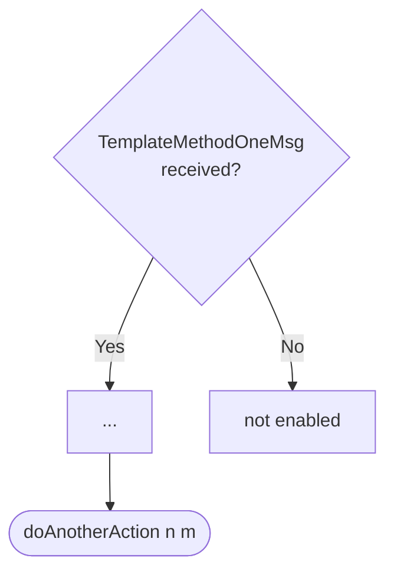

??? note "Juvix preamble"

    ```juvix
    module arch.node.engines.template_behaviour;

    import arch.node.engines.template_messages open;
    import arch.node.engines.template_environment open;

    import Stdlib.Data.String open;
    import prelude open;
    import arch.node.types.basics open;
    import arch.node.types.engine open;
    ```

# Template Behaviour

A template engine acts in the ways described on this page. The action labels
correspond to the actions that can be performed by the engine. Using the action
labels, we describe the effects of the actions.

## Action labels

??? quote "Auxiliary Juvix code"

    <!-- --8<-- [start:SomeActionLabel] -->
    ```juvix
    type SomeActionLabel :=
      | DoThis String
    ;
    ```
    <!-- --8<-- [end:SomeActionLabel] -->

    <!-- --8<-- [start:AnotherActionLabel] -->
    ```juvix
    type AnotherActionLabel :=
      | DoThat String
    ;
    ```
    <!-- --8<-- [end:AnotherActionLabel] -->

### DoAlternative 

<!-- --8<-- [start:DoAlternative] -->
```juvix
DoAlternative : Type := Either SomeActionLabel AnotherActionLabel;
```
<!-- --8<-- [end:DoAlternative] -->

This action label corresponds to performing the `doAlternative` action.

??? quote "`DoAlternative` action effect"

    #### `Either.left`

    This alternative does the following.

    | Aspect | Description |
    |--------|-------------|
    | State update          | The state is unchanged as the timer will have all information necessary. |
    | Messages to be sent   | No messages are added to the send queue. |
    | Engines to be spawned | No engine is created by this action. |
    | Timer updates         | No timers are set or cancelled. |
    | Acquaintance updates  | None |

    #### `Either.right`

    This alternative does the following.

    | Aspect | Description |
    |--------|-------------|
    | State update          | The state is unchanged as the timer will have all information necessary. |
    | Messages to be sent   | No messages are added to the send queue. |
    | Engines to be spawned | No engine is created by this action. |
    | Timer updates         | No timers are set or cancelled. |
    | Spawned engines       | No engines are spawned by this action. |


### DoBoth

<!-- --8<-- [start:DoBoth] -->
```juvix
DoBoth : Type := Pair SomeActionLabel AnotherActionLabel;
```
<!-- --8<-- [end:DoBoth] -->

This action label corresponds to performing both the `SomeActionLabel` and the
`AnotherActionLabel`.

??? quote "`DoBoth` action effect"

    This action consists of two components.

    #### `Pair.fst`

    This alternative does the following.

    | Aspect | Description |
    |--------|-------------|
    | State update          | The state is unchanged as the timer will have all information necessary. |
    | Messages to be sent   | No messages are added to the send queue. |
    | Engines to be spawned | No engine is created by this action. |
    | Timer updates         | No timers are set or cancelled. |

    #### `Pair.snd`

    This alternative does the following.

    | Aspect | Description |
    |--------|-------------|
    | State update          | The state is unchanged as the timer will have all information necessary. |
    | Messages to be sent   | No messages are added to the send queue. |
    | Engines to be spawned | No engine is created by this action. |
    | Timer updates         | No timers are set or cancelled. |

<!-- --8<-- [start:TemplateActionLabel] -->
```juvix
type TemplateActionLabel :=
  | TemplateActionLabelDoAlternative DoAlternative
  | TemplateActionLabelDoBoth DoBoth
;
```
<!-- --8<-- [end:TemplateActionLabel] -->

### Examples

<!-- --8<-- [start:do-alternative-example] -->
```juvix extract-module-statements
module do_alternative_example;
  example : TemplateActionLabel :=
    TemplateActionLabelDoAlternative (left (DoThis "do it!"));
end;
```
<!-- --8<-- [end:do-alternative-example] -->

## Matchable arguments

The matchable arguments correspond to the arguments that can be matched on in
guards. The data matched on is passed to the action function.

??? quote "Auxiliary Juvix code"

    <!-- --8<-- [start:Val] -->
    ```juvix
    syntax alias Val := Nat;
    ```
    <!-- --8<-- [end:Val] -->

### FirstOptionMatchableArgument

<!-- --8<-- [start:FirstOptionMatchableArgument] -->
```juvix
type FirstOptionMatchableArgument := mkFirstOptionMatchableArgument {
  data : Val;
};
```
<!-- --8<-- [end:FirstOptionMatchableArgument] -->
  
### SecondOptionMatchableArgument

<!-- --8<-- [start:SecondOptionMatchableArgument] -->
```juvix
type SecondOptionMatchableArgument := mkSecondOptionMatchableArgument {
  data : String;
};
```
<!-- --8<-- [end:SecondOptionMatchableArgument] -->


<!-- --8<-- [start:template-matchable-argument] -->
```juvix
type TemplateMatchableArgument :=
  | TemplateMatchableArgumentFirstOption FirstOptionMatchableArgument
  | TemplateMatchableArgumentSecondOption SecondOptionMatchableArgument
  ;
```
<!-- --8<-- [end:template-matchable-argument] -->

### Examples

Lorem ipsum dolor sit amet, consectetur adipiscing elit.

    <!-- --8<-- [start:message_one_example] -->
    ```juvix extract-module-statements
    module message_one_example;
      one : TemplateMatchableArgument := 
        TemplateMatchableArgumentFirstOption 
          (mkFirstOptionMatchableArgument@{data := 1});
    end;
    ```
    <!-- --8<-- [end:message_one_example] -->

    <!-- --8<-- [start:some_thing_from_a_mailbox] -->
    ```juvix extract-module-statements
    module some_thing_from_a_mailbox;
      someThingFromAMailboxExample : TemplateMatchableArgument :=
        TemplateMatchableArgumentSecondOption 
          (mkSecondOptionMatchableArgument@{data := "Hello World!"});
    end;
    ```
    <!-- --8<-- [end:some_thing_from_a_mailbox] -->

## Precomputation results

??? quote "Auxiliary Juvix code"

    <!-- --8<-- [start:pseudo-example-auxiliary-code] -->
    ```juvix
    syntax alias SomeMessageType := Nat;
    ```
    <!-- --8<-- [end:pseudo-example-auxiliary-code] -->
    
Precomputation results are the results of the precomputation phase.

### DeleteMessage

<!-- --8<-- [start:DeleteMessage] -->
```juvix
type DeleteMessage := mkDeleteMessage {
  messageType : SomeMessageType;
  messageId : Nat;
};
```
<!-- --8<-- [end:DeleteMessage] -->

We delete the given message from the mailbox with the mailbox ID.

`messageType`:
: is the type of the message to delete.

`messageId`:
: is the ID of the message to delete.


### CloseMailbox

<!-- --8<-- [start:CloseMailbox] -->
```juvix
type CloseMailbox := mkCloseMailbox {
  mailboxId : Nat;
};
```
<!-- --8<-- [end:CloseMailbox] -->

We close the mailbox with the given mailbox ID.

`mailboxId`:
: is the ID of the mailbox to close.

### TemplatePrecomputationEntry

<!-- --8<-- [start:template-precomputation-entry] -->
```juvix
type TemplatePrecomputationEntry :=
  | TemplatePrecomputationEntryDeleteMessage DeleteMessage
  | TemplatePrecomputationEntryCloseMailbox CloseMailbox
  ;
```
<!-- --8<-- [end:template-precomputation-entry] -->

### TemplatePrecomputation
<!-- --8<-- [start:TemplatePrecomputation] -->
```juvix
TemplatePrecomputation : Type := List TemplatePrecomputationEntry;
```
<!-- --8<-- [end:TemplatePrecomputation] -->

The precomputation results consist of a list of `TemplatePrecomputationEntry`
terms. Each entry can be either:

1. A `DeleteMessage` entry indicating a message should be deleted from a mailbox
2. A `CloseMailbox` entry indicating a mailbox should be closed

These entries are used by guards to specify mailbox operations that need to be
performed as part of processing a message.

## Guards

### TemplateGuard

<!-- --8<-- [start:TemplateGuard] -->
```juvix
TemplateGuard : Type := 
  Guard
    TemplateLocalState
    TemplateMailboxState
    TemplateTimerHandle
    TemplateMatchableArgument
    TemplateActionLabel
    TemplatePrecomputation;
```
<!-- --8<-- [end:TemplateGuard] -->

### TemplateMethodOneMsgGuard

<figure markdown>



<figcaption>TemplateMethodOneMsgGuard flowchart</figcaption>
</figure>

For TemplateMethodOneMsg-messages, we do the other action, passing the String
representation of the second and third argument.

<!-- --8<-- [start:message-one-guard] -->
```juvix
messageOneGuard : TemplateGuard
  | _ _ :=  some (
    mkGuardOutput@{
      args := [
        (TemplateMatchableArgumentSecondOption 
          (mkSecondOptionMatchableArgument@{data := "Hello World!"}))
      ];
      label := TemplateActionLabelDoAlternative (left (DoThis "paramneter 2"));
      other := [
        TemplatePrecomputationEntryCloseMailbox (
          mkCloseMailbox@{mailboxId := 1}
        );
        TemplatePrecomputationEntryDeleteMessage (
          mkDeleteMessage@{messageType := 1337; messageId := 0}
        )
      ]
    });
```
<!-- --8<-- [end:message-one-guard] -->

## Action function

The action function amounts to one single case statement.

??? quote "Auxiliary Juvix code"

    Type alias for the action function.

    ```juvix
    TemplateActionFunction : Type :=
      ActionFunction
          TemplateLocalState
          TemplateMailboxState
          TemplateTimerHandle
          TemplateMatchableArgument
          TemplateActionLabel
          TemplatePrecomputation;
    ```


<!-- --8<-- [start:action-function] -->
```juvix
templateAction : TemplateActionFunction
  | mkActionInput@{
      guardOutput := out;
      env := env } := case GuardOutput.label out of {
    | TemplateActionLabelDoAlternative (left _) :=
          mkActionEffect@{
            newEnv := env;
            producedMessages := [];
            timers := [];
            spawnedEngines := [];
        }
    | _ := undef
};
```
<!-- --8<-- [end:action-function] -->

## Conflict solver

The conflict solver is responsible for resolving conflicts between multiple
guards that match simultaneously. When multiple guards match the same input, the
conflict solver determines which combinations of guards can execute together.

In this template example, the conflict solver is very simple. It always returns
an empty list, meaning no guards can execute simultaneously. This effectively
serializes guard execution, allowing only one guard to execute at a time.

<!-- TODO: ask Tobias if he agrees with this description. So far, we have not
used the conflict solver in any of our examples. -->


```juvix
templateConflictSolver : Set TemplateMatchableArgument -> List (Set TemplateMatchableArgument)
  | _ := [];
```

## TemplateBehaviour

<!-- --8<-- [start:TemplateBehaviour] -->
```juvix
TemplateBehaviour : Type :=
  EngineBehaviour
    TemplateLocalState
    TemplateMailboxState
    TemplateTimerHandle
    TemplateMatchableArgument
    TemplateActionLabel
    TemplatePrecomputation;
```
<!-- --8<-- [end:TemplateBehaviour] -->

## TemplateBehaviour instance

<!-- --8<-- [start:TemplateBehaviour-instance] -->
```juvix
templateBehaviour : TemplateBehaviour :=
  mkEngineBehaviour@{
    guards := [messageOneGuard];
    action := templateAction;
    conflictSolver := templateConflictSolver;
  }
  ;
```
<!-- --8<-- [end:TemplateBehaviour-instance] -->
