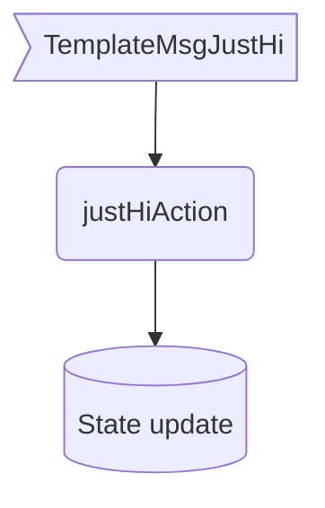
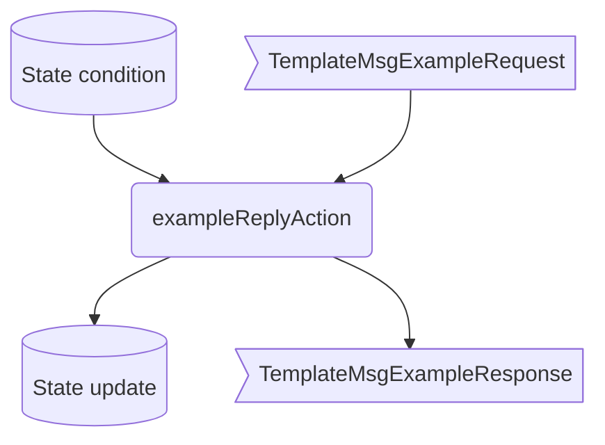

??? quote "Juvix imports"

    ```juvix
    module arch.node.engines.template_behaviour;

    import arch.node.engines.template_messages open;
    import arch.node.engines.template_environment open;

    import prelude open;
    import arch.node.types.basics open;
    import arch.node.types.identities open;
    import arch.node.types.messages open;
    import arch.node.types.engine open;
    import arch.node.types.anoma_message open;
    ```

# Template Behaviour

## Overview

A template engine acts in the ways described on this page.
The action labels correspond to the actions that can be performed by the engine.
Using the action labels, we describe the effects of the actions.

## Action arguments

The action arguments are set by a guard
and passed to the action function as part of the `GuardOutput`.

??? quote "Auxiliary Juvix code"

    <!-- --8<-- [start:Val] -->
    ```juvix
    syntax alias Val := Nat;
    ```
    <!-- --8<-- [end:Val] -->

### `TemplateActionArgumentOne FirstArgument`

<!-- --8<-- [start:FirstArgument] -->
```juvix
type FirstArgument := mkFirstArgument {
  data : Val;
};
```
<!-- --8<-- [end:FirstArgument] -->

???+ quote "Arguments"

    `data`:
    : is the value of the action argument.

### `TemplateActionArgumentTwo SecondArgument`

<!-- --8<-- [start:SecondArgument] -->
```juvix
type SecondArgument := mkSecondArgument {
  data : String;
};
```
<!-- --8<-- [end:SecondArgument] -->

???+ quote "Arguments"

    `data`:
    : is the value of the action argument.

### `TemplateActionArgument`

<!-- --8<-- [start:template-action-argument] -->
```juvix
type TemplateActionArgument :=
  | TemplateActionArgumentOne FirstArgument
  | TemplateActionArgumentTwo SecondArgument
  ;
```
<!-- --8<-- [end:template-action-argument] -->

### `TemplateActionArguments`

<!-- --8<-- [start:template-action-arguments] -->
```juvix
TemplateActionArguments : Type := List TemplateActionArgument;
```
<!-- --8<-- [end:template-action-arguments] -->

## Guarded actions

??? quote "Auxiliary Juvix code"

    ### `TemplateGuard`

    <!-- --8<-- [start:TemplateGuard] -->
    ```juvix
    TemplateGuard : Type :=
      Guard
        TemplateLocalState
        TemplateMailboxState
        TemplateTimerHandle
        TemplateActionArguments;
    ```
    <!-- --8<-- [end:TemplateGuard] -->

    ### `TemplateGuardOutput`

    <!-- --8<-- [start:TemplateGuardOutput] -->
    ```juvix
    TemplateGuardOutput : Type :=
      GuardOutput
        TemplateActionArguments;
    ```
    <!-- --8<-- [end:TemplateGuardOutput] -->

    ### `TemplateAction`

    <!-- --8<-- [start:TemplateAction] -->
    ```juvix
    TemplateAction : Type :=
      Action
          TemplateLocalState
          TemplateMailboxState
          TemplateTimerHandle
          TemplateActionArguments;
    ```
    <!-- --8<-- [end:TemplateActionFunction] -->

    ### `TemplateActionEffect`

    <!-- --8<-- [start:TemplateActionEffect] -->
    ```juvix
    TemplateActionEffect : Type :=
      ActionEffect
        TemplateLocalState
        TemplateMailboxState
        TemplateTimerHandle
        TemplateActionArguments;
    ```
    <!-- --8<-- [end:TemplateActionEffect] -->

### `justHi`

<figure markdown>



<figcaption>`justHi` flowchart</figcaption>
</figure>

#### `justHiGuard`

Guard description.

Condition
: Message type is `MsgTemplateJustHi`

<!-- --8<-- [start:justHiGuard] -->
```juvix
justHiGuard
  (tt : TemplateTimestampedTrigger)
  (env : TemplateEnvironment)
  : Option TemplateGuardOutput :=
  let
    emsg := getEngineMsgFromTimestampedTrigger tt;
  in
    case emsg of {
    | some mkEngineMsg@{
        msg := MsgTemplate MsgTemplateJustHi;
      } :=
      some mkGuardOutput@{
        args := [
          (TemplateActionArgumentTwo
            mkSecondArgument@{
              data := "Hello World!"
            })
        ];
      }
    | _ := none
    };
```
<!-- --8<-- [end:justHiGuard] -->

#### `justHiAction`

Action description.

State update
: Update state with the data set by `justHiGuard`.

Messages to be sent
: No messages are added to the send queue.

Engines to be spawned
: No engine is created by this action.

Timer updates
: No timers are set or cancelled.

Acquaintance updates
: None.

```juvix
justHiAction
  (args : List TemplateActionArgument)
  (tt : TemplateTimestampedTrigger)
  (env : TemplateEnvironment)
  : Option TemplateActionEffect :=
  case args of {
  | TemplateActionArgumentTwo (mkSecondArgument@{
      data := data;
    }) :: _ :=
    some mkActionEffect@{
      env := env@EngineEnv{
        localState := mkTemplateLocalState@{
          taskQueue := mkCustomData@{
            word := data
          }
        }
      };
      msgs := [];
      timers := [];
      engines := [];
    }
  | _ := none
  }
```

### `exampleReply`

<figure markdown>



<figcaption>`exampleReply` flowchart</figcaption>
</figure>

#### `exampleReplyGuard`

Condition
: Message type is `MsgTemplateExampleRequest`.

<!-- --8<-- [start:exampleRequestGuard] -->
```juvix
exampleReplyGuard
  (tt : TemplateTimestampedTrigger)
  (env : TemplateEnvironment)
  : Option TemplateGuardOutput :=
  let
    emsg := getEngineMsgFromTimestampedTrigger tt;
  in
    case emsg of {
    | some mkEngineMsg@{
        msg := MsgTemplate (MsgTemplateExampleRequest req);
        sender := mkPair none _; -- from local engines only (NodeID is none)
        target := target;
        mailbox := mailbox;
      } :=
      some mkGuardOutput@{
        args := [];
      }
    | _ := none
    };
```
<!-- --8<-- [end:exampleRequestGuard] -->

#### `exampleReplyAction`

Respond with a `TemplateMsgExampleResponse`.

State update
: The state remains unchanged.

Messages to be sent
: A `MsgTemplateExampleReply` message with `argOne` from the received `MsgTemplateExampleRequest`.

Engines to be spawned
: No engine is created by this action.

Timer updates
: No timers are set or cancelled.

```juvix
exampleReplyAction
  (args : List TemplateActionArgument)
  (tt : TemplateTimestampedTrigger)
  (env : TemplateEnvironment)
  : Option TemplateActionEffect :=
  let
    emsg := getEngineMsgFromTimestampedTrigger tt;
  in
    case emsg of {
    | some mkEngineMsg@{
        msg := MsgTemplate (MsgTemplateExampleRequest req);
        sender := sender;
        target := target;
        mailbox := mailbox;
      } :=
      some mkActionEffect@{
        env := env;
        msgs := [
        mkEngineMsg@{
          sender := mkPair (some (EngineEnv.node env)) (some (EngineEnv.name env));
          target := sender;
            mailbox := some 0;
            msg :=
              MsgTemplate
                (MsgTemplateExampleReply
                  (ok mkExampleReplyOk@{
                    argOne := ExampleRequest.argOne req;
                  }));
          }
        ];
        timers := [];
        engines := [];
      }
  | _ := none
  };
```

## The Template behaviour

### `TemplateBehaviour`

<!-- --8<-- [start:TemplateBehaviour] -->
```juvix
TemplateBehaviour : Type :=
  EngineBehaviour
    TemplateLocalState
    TemplateMailboxState
    TemplateTimerHandle
    TemplateActionArguments;
```
<!-- --8<-- [end:TemplateBehaviour] -->

#### Instantiation

<!-- --8<-- [start:templateBehaviour] -->
```juvix
templateBehaviour : TemplateBehaviour :=
  mkEngineBehaviour@{
    exec :=
      Seq (mkPair justHiGuard justHiAction)
      (Seq (mkPair exampleReplyGuard exampleReplyAction)
       End);
  };
```
<!-- --8<-- [end:templateBehaviour] -->
