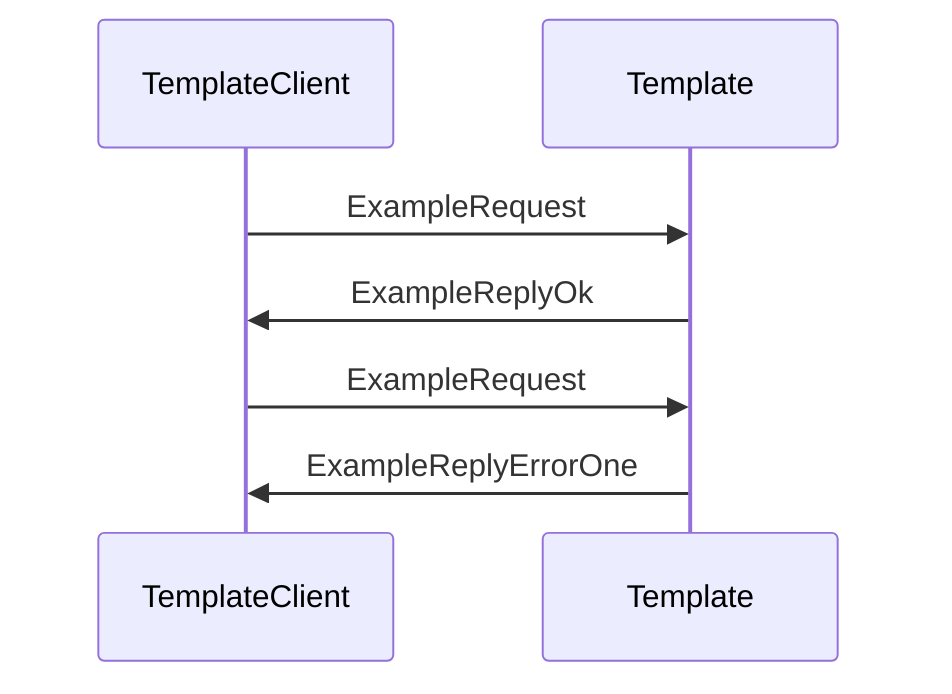

??? note "Juvix imports"

    ```juvix
    module arch.node.engines.template_messages;
    import prelude open;
    ```

# Template Messages

These are the messages that the Template engine can receive/respond to.

## Message interface

### `TemplateMsgJustHi`

Lorem ipsum dolor sit amet, consectetur adipiscing elit.

### `TemplateMsgExampleRequest ExampleRequest`

Example request.

<!-- --8<-- [start:ExampleRequest] -->
```juvix
type ExampleRequest : Type :=
  mkExampleRequest {
    argOne : Nat;
    argTwo : Nat;
  }
```
<!-- --8<-- [end:ExampleRequest] -->

???+ quote "Arguments"

    `argOne`
    : Lorem ipsum dolor sit amet, consectetur adipiscing elit.

    `argTwo`
    : Lorem ipsum dolor sit amet, consectetur adipiscing elit.

### `TemplateMsgExampleReply ExampleReply`

Reply to an `ExampleRequest`.

#### `ExampleReplyOk`

Example OK reply.

<!-- --8<-- [start:ExampleReplyOk] -->
```juvix
type ExampleReplyOk : Type :=
  mkExampleReplyOk {
    argOne : Nat;
  }
```
<!-- --8<-- [end:ExampleReplyOk] -->

???+ quote "Arguments"

    `argOne`
    : Lorem ipsum dolor sit amet, consectetur adipiscing elit.

#### `ExampleReplyError`

Example error reply.

<!-- --8<-- [start:ExampleReplyError] -->
```juvix
type ExampleReplyError : Type :=
  | ExampleErrorOne
  | ExampleErrorTwo
  ;
```
<!-- --8<-- [end:ExampleReplyError] -->

???+ quote "Error types"

    `ExampleErrorOne`
    : Lorem ipsum dolor sit amet, consectetur adipiscing elit.

    `ExampleErrorTwo`
    : Lorem ipsum dolor sit amet, consectetur adipiscing elit.

#### `ExampleReply`

<!-- --8<-- [start:ExampleReply] -->
```juvix
ExampleReply : Type := Result ExampleReplyError ExampleReplyOk;
```
<!-- --8<-- [end:ExampleReply] -->

### `TemplateMsg`

<!-- --8<-- [start:TemplateMsg] -->
```juvix
type TemplateMsg :=
  | TemplateMsgJustHi
  | TemplateMsgExampleRequest ExampleRequest
  | TemplateMsgExampleReply ExampleReply
  ;
```
<!-- --8<-- [end:TemplateMsg] -->

## Sequence Diagrams

### `ExampleRequest` & `ExampleReply`

Lorem ipsum dolor sit amet, consectetur adipiscing elit.
Sed ut purus eget sapien. Nulla facilisi.

<!-- --8<-- [start:message-sequence-diagram-ExampleRequest] -->
<figure markdown="span">



<figcaption markdown="span">
Sequence Diagram: `ExampleRequest` & `ExampleReply`
</figcaption>
</figure>
<!-- --8<-- [end:message-sequence-diagram-ExampleRequest] -->

