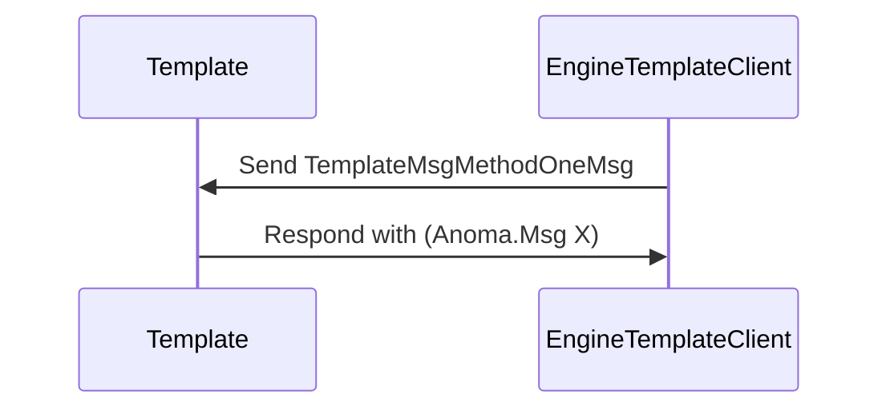

??? quote "Juvix imports"

    ```juvix
    module arch.node.engines.template_messages;
    import prelude open;
    ```

# Template Messages

These are the messages that the Template engine can receive/respond to.

## Message interface

??? quote "Auxiliary Juvix code"

    ```juvix
    syntax alias MethodOneArgOne := Nat;
    syntax alias MethodOneArgTwo := Nat;
    syntax alias MethodOneArgThree := Nat;
    syntax alias MethodTwoArgOne := Nat;
    ```

### TemplateMsg message constructors

??? quote "TemplateMsgMethodZero"

    Lorem ipsum dolor sit amet, consectetur adipiscing elit.

??? quote "TemplateMsgMethodOne MethodOneMsg"

    Lorem ipsum dolor sit amet, consectetur adipiscing elit.
    The following is an example of a `MethodOneMsg`-message:

    <!-- --8<-- [start:MethodOneMsg] -->
    ```juvix
    type MethodOneMsg := mkMethodOneMsg {
      argOne : MethodOneArgOne;
      argTwo : MethodOneArgTwo;
      argThree : MethodOneArgThree;
    };
    ```
    <!-- --8<-- [end:MethodOneMsg] -->

    `argOne`
    : Lorem ipsum dolor sit amet, consectetur adipiscing elit.

    `argTwo`
    : Lorem ipsum dolor sit amet, consectetur adipiscing elit.

    `argThree`
    : This is the last argument and here we actually
      can describe more detail about the property about `argOne`
      and `argThree` mentioned above.

??? quote "TemplateMsgMethodTwo MethodTwoMsg"

    Lorem ipsum dolor sit amet, consectetur adipiscing elit.
    The following is an example of a `MethodTwoMsg` message:

    <!-- --8<-- [start:MethodTwoMsg] -->
    ```juvix
    type MethodTwoMsg := mkMethodTwoMsg {
      argOne : MethodTwoArgOne;
    };
    ```
    <!-- --8<-- [end:MethodTwoMsg] -->

    `argOne`
    : Lorem ipsum dolor sit amet, consectetur adipiscing elit.

### TemplateMsg

<!-- --8<-- [start:TemplateMsg] -->
```juvix
type TemplateMsg :=
  | TemplateMsgMethodZero
  | TemplateMsgMethodOne MethodOneMsg
  | TemplateMsgMethodTwo MethodTwoMsg
  ;
```
<!-- --8<-- [end:TemplateMsg] -->

??? quote "Example of TemplateMsg-messages"

    #### Example message without arguments

    <!-- --8<-- [start:example-message-zero] -->
    ```juvix extract-module-statements
    module example-message-zero;
      example_message_zero : TemplateMsg := TemplateMsgMethodZero;
    end;
    ```
    <!-- --8<-- [end:example-message-zero] -->

    #### Example message one

    <!-- --8<-- [start:example-message-one] -->
    ```juvix extract-module-statements
    module example-message-one;
      example_message_one : TemplateMsg :=
        TemplateMsgMethodOne
          (mkMethodOneMsg@{
            argOne := 1;
            argTwo := 2;
            argThree := 3;
          });
    end;
    ```
    <!-- --8<-- [end:example-message-one] -->

    #### Example message two
    <!-- --8<-- [start:message_two_example] -->
    ```juvix extract-module-statements
    module message_two_example;
      example_message_two : TemplateMsg :=
        TemplateMsgMethodTwo (mkMethodTwoMsg@{
        argOne := 1;
      });
    end;
    ```
    <!-- --8<-- [end:message_two_example] -->


## TemplateMsg Sequence Diagrams

### Message Diagram 1

Lorem ipsum dolor sit amet, consectetur adipiscing elit. Sed ut purus eget
sapien. Nulla facilisi.

<!-- --8<-- [start:message-sequence-diagram-2] -->
<figure markdown="span">



<figcaption markdown="span">
Lorem ipsum dolor sit amet, consectetur adipiscing elit.
</figcaption>
</figure>
<!-- --8<-- [end:message-sequence-diagram-2] -->

