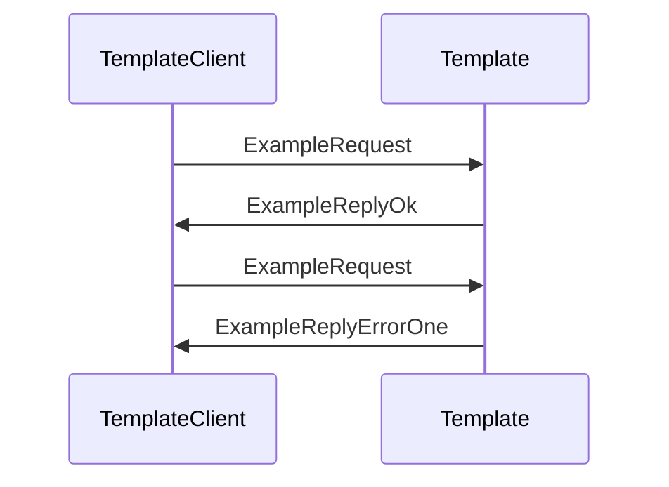

??? quote "Juvix imports"

    === "Juvix"
    ```juvix
    module arch.node.engines.template_messages;
    import prelude open;
    ```

# Template Messages

These are the messages that the Template engine can receive/respond to.

## Message interface

??? quote "Auxiliary Juvix code"

    === "Juvix"
    ```juvix
    syntax alias MethodOneArgOne := Nat;
    syntax alias MethodOneArgTwo := Nat;
    syntax alias MethodOneArgThree := Nat;
    syntax alias MethodTwoArgOne := Nat;
    ```

### `MsgTemplateMethodZero`

Lorem ipsum dolor sit amet, consectetur adipiscing elit.

### `MsgTemplateMethodOne MethodOneMsg`

Lorem ipsum dolor sit amet, consectetur adipiscing elit.
The following is an example of a `MethodOneMsg`-message:

<!-- --8<-- [start:MethodOneMsg] -->
=== "Juvix"
```juvix
type MethodOneMsg := mkMethodOneMsg {
  argOne : MethodOneArgOne;
  argTwo : MethodOneArgTwo;
  argThree : MethodOneArgThree;
};
```
<!-- --8<-- [end:MethodOneMsg] -->

??? quote "Arguments"

    `argOne`
    : Lorem ipsum dolor sit amet, consectetur adipiscing elit.

    `argTwo`
    : Lorem ipsum dolor sit amet, consectetur adipiscing elit.

    `argThree`
    : This is the last argument and here we actually
      can describe more detail about the property about `argOne`
      and `argThree` mentioned above.

### `MsgTemplateMethodTwo MethodTwoMsg`

Lorem ipsum dolor sit amet, consectetur adipiscing elit.
The following is an example of a `MethodTwoMsg` message:

<!-- --8<-- [start:MethodTwoMsg] -->
=== "Juvix"
```juvix
type MethodTwoMsg := mkMethodTwoMsg {
  argOne : MethodTwoArgOne;
};
```
<!-- --8<-- [end:MethodTwoMsg] -->

??? quote "Arguments"

    `argOne`
    : Lorem ipsum dolor sit amet, consectetur adipiscing elit.

### `MsgTemplateExampleRequest ExampleRequest`

Example request.

<!-- --8<-- [start:ExampleRequest] -->
=== "Juvix"
```juvix
type ExampleRequest : Type :=
  mkExampleRequest {
    argOne : Nat;
    argTwo : Nat;
  }
```
<!-- --8<-- [end:ExampleRequest] -->

??? quote "Arguments"

    `argOne`
    : Lorem ipsum dolor sit amet, consectetur adipiscing elit.

    `argTwo`
    : Lorem ipsum dolor sit amet, consectetur adipiscing elit.

### `MsgTemplateExampleReply ExampleReply`

Reply to an `ExampleRequest`.

#### `ExampleReplyOk`

Example OK reply.

<!-- --8<-- [start:ExampleReplyOk] -->
=== "Juvix"
```juvix
type ExampleReplyOk : Type :=
  mkExampleReplyOk {
    argOne : Nat;
  }
```
<!-- --8<-- [end:ExampleReplyOk] -->

??? quote "Arguments"

    `argOne`
    : Lorem ipsum dolor sit amet, consectetur adipiscing elit.

#### `ExampleReplyError`

Example error reply.

<!-- --8<-- [start:ExampleReplyError] -->
=== "Juvix"
```juvix
type ExampleReplyError : Type :=
  | ExampleErrorOne
  | ExampleErrorTwo
  ;
```
<!-- --8<-- [end:ExampleReplyError] -->

??? quote "Error types"

    `ExampleErrorOne`
    : Lorem ipsum dolor sit amet, consectetur adipiscing elit.

    `ExampleErrorTwo`
    : Lorem ipsum dolor sit amet, consectetur adipiscing elit.

#### `ExampleReply`

<!-- --8<-- [start:ExampleReply] -->
=== "Juvix"
```juvix
ExampleReply : Type := Result ExampleReplyOk ExampleReplyError;
```
<!-- --8<-- [end:ExampleReply] -->

### `TemplateMsg`

<!-- --8<-- [start:TemplateMsg] -->
=== "Juvix"
```juvix
type TemplateMsg :=
  | MsgTemplateMethodZero
  | MsgTemplateMethodOne MethodOneMsg
  | MsgTemplateMethodTwo MethodTwoMsg
  | MsgTemplateExampleRequest ExampleRequest
  | MsgTemplateExampleReply ExampleReply
  ;
```
<!-- --8<-- [end:TemplateMsg] -->

## Sequence Diagrams

### `ExampleRequest` & `ExampleReply`

Lorem ipsum dolor sit amet, consectetur adipiscing elit.
Sed ut purus eget sapien. Nulla facilisi.

<!-- --8<-- [start:message-sequence-diagram-ExampleRequest] -->
<figure markdown="span">



<figcaption markdown="span">
Sequence Diagram: `ExampleRequest` & `ExampleReply`
</figcaption>
</figure>
<!-- --8<-- [end:message-sequence-diagram-ExampleRequest] -->

