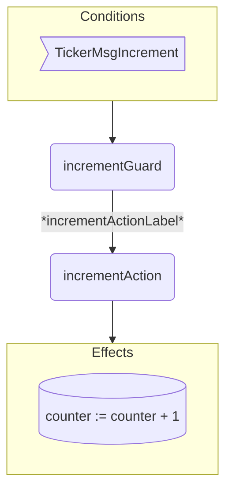
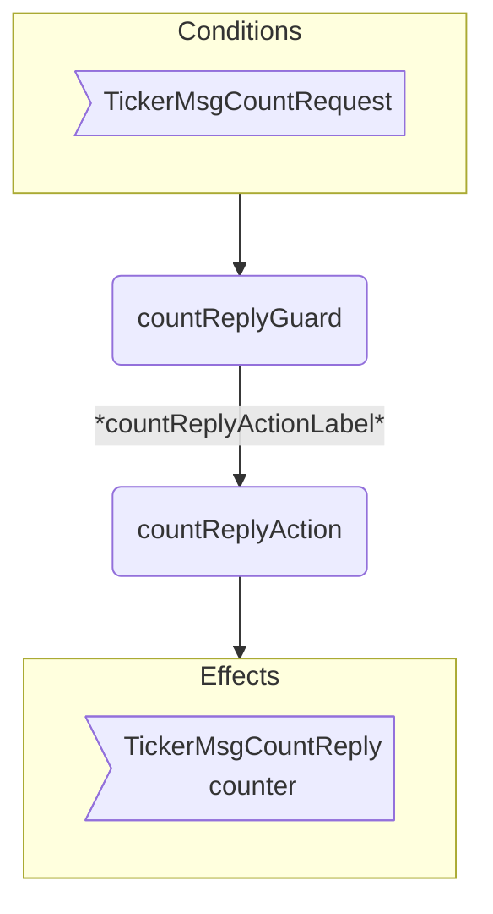

??? code "Juvix imports"

    ```juvix
    module arch.node.engines.ticker_behaviour;

    import arch.node.engines.ticker_messages open;
    import arch.node.engines.ticker_config open;
    import arch.node.engines.ticker_environment open;

    import prelude open;
    import arch.node.utils open;
    import arch.node.types.basics open;
    import arch.node.types.identities open;
    import arch.node.types.messages open;
    import arch.node.types.engine open;
    import arch.node.types.anoma as Anoma open;
    ```

# Ticker Behaviour

## Overview

The Ticker engine maintains a counter as local state and allows two actions:
incrementing the counter and sending the current counter value.

## Action arguments

### `TickerActionArgumentReplyTo ReplyTo`

```juvix
type ReplyTo := mkReplyTo@{
  whoAsked : Option EngineID;
  mailbox : Option MailboxID;
};
```

This action argument contains the address and mailbox ID of where the
response message should be sent.

???+ code "Arguments"

    `whoAsked`:
    : is the address of the engine that sent the message.

    `mailbox`:
    : is the mailbox ID where the response message should be sent.

### `TickerActionArgument`

<!-- --8<-- [start:TickerActionArgument] -->
```juvix
type TickerActionArgument :=
  | TickerActionArgumentReplyTo ReplyTo
  ;
```
<!-- --8<-- [end:TickerActionArgument] -->

### `TickerActionArguments`

<!-- --8<-- [start:ticker-action-arguments] -->
```juvix
TickerActionArguments : Type := List TickerActionArgument;
```
<!-- --8<-- [end:ticker-action-arguments] -->

## Actions

??? code "Auxiliary Juvix code"

    ## `TickerAction`

    ```juvix
    TickerAction : Type :=
      Action
        TickerLocalCfg
        TickerLocalState
        TickerMailboxState
        TickerTimerHandle
        TickerActionArguments
        Anoma.Msg
        Anoma.Cfg
        Anoma.Env;
    ```

    ## `TickerActionInput`

    ```juvix
    TickerActionInput : Type :=
      ActionInput
        TickerLocalCfg
        TickerLocalState
        TickerMailboxState
        TickerTimerHandle
        TickerActionArguments
        Anoma.Msg;
    ```

    ### `TickerActionEffect`

    ```juvix
    TickerActionEffect : Type :=
      ActionEffect
        TickerLocalState
        TickerMailboxState
        TickerTimerHandle
        Anoma.Msg
        Anoma.Cfg
        Anoma.Env;
    ```

    ### `TickerActionExec`

    ```juvix
    TickerActionExec : Type :=
      ActionExec
        TickerLocalCfg
        TickerLocalState
        TickerMailboxState
        TickerTimerHandle
        TickerActionArguments
        Anoma.Msg
        Anoma.Cfg
        Anoma.Env;
    ```


#### `incrementAction`

Increment the counter.

State update
: The counter value is increased by one.

Messages to be sent
: No messages are added to the send queue.

Engines to be spawned
: No engine is created by this action.

Timer updates
: No timers are set or cancelled.

```juvix
incrementAction
  (input : TickerActionInput)
  : Option TickerActionEffect :=
  let
    env := ActionInput.env input;
    counterValue := TickerLocalState.counter (EngineEnv.localState env)
  in some mkActionEffect@{
      env := env@EngineEnv{
        localState := mkTickerLocalState@{
          counter := counterValue + 1
        }
      };
      msgs := [];
      timers := [];
      engines := [];
    }
```


#### `countReplyAction`

Respond with the counter value.

State update
: The state remains unchanged.

Messages to be sent
: A message with the current counter value is sent to the requester.

Engines to be spawned
: No engine is created by this action.

Timer updates
: No timers are set or cancelled.

<!-- --8<-- [start:countReplyAction] -->
```juvix
countReplyAction
  (input : TickerActionInput)
  : Option TickerActionEffect :=
  let
    cfg := ActionInput.cfg input;
    env := ActionInput.env input;
    trigger := ActionInput.trigger input;
    counterValue := TickerLocalState.counter (EngineEnv.localState env)
  in
    case getEngineMsgFromTimestampedTrigger trigger of {
    | some emsg :=
      let responseMsg := Anoma.MsgTicker (TickerMsgCountReply mkCountReply@{
        counter := counterValue;
      })
      in some (defaultReplyActionEffect env cfg (EngineMsg.sender emsg) responseMsg)
    | _ := none
    };
```
<!-- --8<-- [end:countReplyAction] -->
---

## Action Labels

### `incrementActionLabel`

```juvix
incrementActionLabel : TickerActionExec :=  Seq [ incrementAction ];
```

### `countReplyActionLabel`

```juvix
countReplyActionLabel : TickerActionExec := Seq [ countReplyAction ];
```

## Guards

??? code "Auxiliary Juvix code"

    ### `TickerGuard`

    <!-- --8<-- [start:TickerGuard] -->
    ```juvix
    TickerGuard : Type :=
      Guard
        TickerLocalCfg
        TickerLocalState
        TickerMailboxState
        TickerTimerHandle
        TickerActionArguments
        Anoma.Msg
        Anoma.Cfg
        Anoma.Env;
    ```
    <!-- --8<-- [end:TickerGuard] -->

    ### `TickerGuardOutput`

    <!-- --8<-- [start:TickerGuardOutput] -->
    ```juvix
    TickerGuardOutput : Type :=
      GuardOutput
        TickerLocalCfg
        TickerLocalState
        TickerMailboxState
        TickerTimerHandle
        TickerActionArguments
        Anoma.Msg
        Anoma.Cfg
        Anoma.Env;
    ```
    <!-- --8<-- [end:TickerGuardOutput] -->

    ### `TickerGuardEval`

    <!-- --8<-- [start:TickerGuardEval] -->
    ```juvix
    TickerGuardEval : Type :=
      GuardEval
        TickerLocalCfg
        TickerLocalState
        TickerMailboxState
        TickerTimerHandle
        TickerActionArguments
        Anoma.Msg
        Anoma.Cfg
        Anoma.Env;
    ```
    <!-- --8<-- [end:TickerGuardEval] -->


#### `incrementGuard`

Condition
: Message type is `TickerMsgIncrement`.

<!-- --8<-- [start:incrementGuard] -->
```juvix
incrementGuard
  (trigger : TimestampedTrigger TickerTimerHandle Anoma.Msg)
  (cfg : TickerCfg)
  (env : TickerEnv)
  : Option TickerGuardOutput :=
  let
    emsg := getEngineMsgFromTimestampedTrigger trigger;
  in
    case emsg of {
    | some mkEngineMsg@{
        msg := (Anoma.MsgTicker TickerMsgIncrement);
      } :=
      some mkGuardOutput@{
        action := incrementActionLabel;
        args := [];
      }
  | _ := none
  };
```
<!-- --8<-- [end:incrementGuard] -->

#### `countReplyGuard`

Condition
: Message type is `TickerMsgCountRequest`.

<!-- --8<-- [start:countReplyGuard] -->
```juvix
countReplyGuard
  (trigger : TimestampedTrigger TickerTimerHandle Anoma.Msg)
  (cfg : TickerCfg)
  (env : TickerEnv)
  : Option TickerGuardOutput :=
  case getEngineMsgFromTimestampedTrigger trigger of {
    | some mkEngineMsg@{
        msg := Anoma.MsgTicker TickerMsgCountRequest;
      } := some mkGuardOutput@{
        action := countReplyActionLabel;
        args := [];
      }
    | _ := none
    };
```
<!-- --8<-- [end:countReplyGuard] -->

## The Ticker behaviour

### `TickerBehaviour`

<!-- --8<-- [start:TickerBehaviour] -->
```juvix
TickerBehaviour : Type :=
  EngineBehaviour
    TickerLocalCfg
    TickerLocalState
    TickerMailboxState
    TickerTimerHandle
    TickerActionArguments
    Anoma.Msg
    Anoma.Cfg
    Anoma.Env;
```
<!-- --8<-- [end:TickerBehaviour] -->

#### Instantiation

<!-- --8<-- [start:tickerBehaviour] -->
```juvix
tickerBehaviour : TickerBehaviour :=
  mkEngineBehaviour@{
    guards :=
      First [
        incrementGuard;
        countReplyGuard
      ];
  };
```
<!-- --8<-- [end:tickerBehaviour] -->

## Ticker Action Flowchart

### `incrementAction` flowchart


<figure markdown>



<figcaption markdown="span">

`incrementAction` flowchart

</figcaption>
</figure>


### `countReplyAction` flowchart

<figure markdown>



<figcaption markdown="span">

`countReplyAction` flowchart

</figcaption>
</figure>
