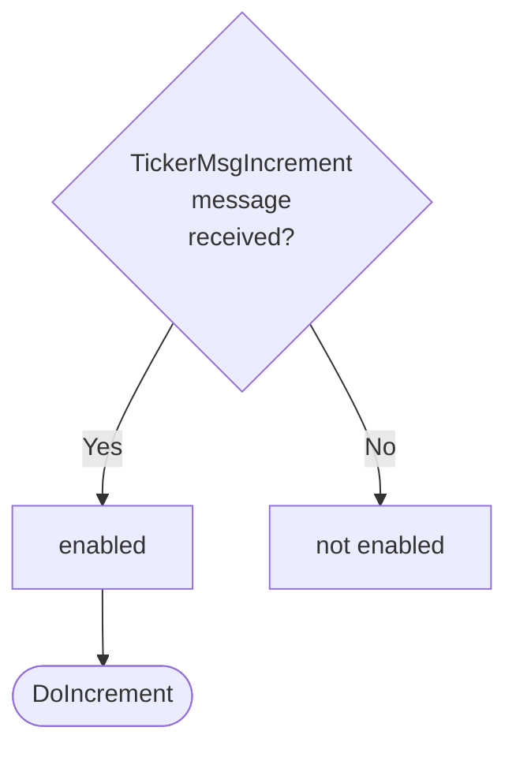

??? quote "Juvix preamble"

    ```juvix
    module arch.node.engines.ticker_behaviour;

    import arch.node.engines.ticker_messages open;
    import arch.node.engines.ticker_environment open;

    import prelude open;
    import arch.node.types.basics open;
    import arch.node.types.identities open;
    import arch.node.types.messages open;
    import arch.node.types.engine open;
    import arch.node.types.anoma_message open using {MsgTicker};
    ```

# Ticker Behaviour

## Overview

The Ticker engine maintains a counter as local state and allows two actions:
incrementing the counter and sending the current counter value.

## Action labels

### TickerActionLabelDoIncrement

This action label corresponds to incrementing the counter and is
relevant for the `TickerMsgIncrement` message.

??? quote "`TickerActionLabelDoIncrement` action effect"

    This action does the following:

    | Aspect | Description |
    |--------|-------------|
    | State update          | The counter value is increased by one. |
    | Messages to be sent   | No messages are added to the send queue. |
    | Engines to be spawned | No engine is created by this action. |
    | Timer updates         | No timers are set or cancelled. |

### TickerActionLabelDoRespond

This action label corresponds to responding with the current counter value and
is relevant for the `TickerMsgCount` message.

??? quote "`TickerActionLabelDoRespond` action effect"

    This action does the following:

    | Aspect | Description |
    |--------|-------------|
    | State update          | The state remains unchanged. |
    | Messages to be sent   | A message with the current counter value is sent to the requester. |
    | Engines to be spawned | No engine is created by this action. |
    | Timer updates         | No timers are set or cancelled. |

### TickerActionLabel

<!-- --8<-- [start:TickerActionLabel] -->
```juvix
type TickerActionLabel :=
  | TickerActionLabelDoIncrement
  | TickerActionLabelDoRespond
  ;
```
<!-- --8<-- [end:TickerActionLabel] -->

## Matchable arguments

### ReplyTo

```juvix
type ReplyTo := mkReplyTo {
  whoAsked : Option EngineID;
  mailbox : Option MailboxID;
};
```

This matchable argument contains the address and mailbox ID of where the
response message should be sent.

`whoAsked`:
: is the address of the engine that sent the message.

`mailbox`:
: is the mailbox ID where the response message should be sent.

### TickerMatchableArgument

<!-- --8<-- [start:TickerMatchableArgument] -->
```juvix
type TickerMatchableArgument :=
  | TickerMatchableArgumentReplyTo ReplyTo
  ;
```
<!-- --8<-- [end:TickerMatchableArgument] -->

## Precomputation results

The Ticker engine does not require any non-trivial pre-computations.

### TickerPrecomputationEntry

<!-- --8<-- [start:TickerPrecomputationEntry] -->
```juvix
syntax alias TickerPrecomputationEntry := Unit;
```
<!-- --8<-- [end:TickerPrecomputationEntry] -->

### TickerPrecomputation

<!-- --8<-- [start:TickerPrecomputation] -->
```juvix
TickerPrecomputation : Type := List TickerPrecomputationEntry;
```
<!-- --8<-- [end:TickerPrecomputation] -->

## Guards

??? quote "Auxiliary Juvix code"

    ### TickerGuard

    <!-- --8<-- [start:TickerGuard] -->
    ```juvix
    TickerGuard : Type :=
      Guard
        TickerLocalState
        TickerTimerHandle
        TickerMailboxState
        TickerMatchableArgument
        TickerActionLabel
        TickerPrecomputation;
    ```
    <!-- --8<-- [end:TickerGuard] -->

    ### TickerGuardOutput

    <!-- --8<-- [start:TickerGuardOutput] -->
    ```juvix
    TickerGuardOutput : Type :=
      GuardOutput
        TickerMatchableArgument
        TickerActionLabel
        TickerPrecomputation;
    ```
    <!-- --8<-- [end:TickerGuardOutput] -->

### incrementGuard

<figure markdown>



<figcaption>incrementGuard flowchart</figcaption>
</figure>

<!-- --8<-- [start:incrementGuard] -->
```TODO
incrementGuard
  (t : TimestampedTrigger TickerTimerHandle )
  (env : TickerEnvironment) : Option TickerGuardOutput
  := case getMessageFromTimestampedTrigger t of {
  | some (MsgTicker Increment) := some (
    mkGuardOutput@{
      matchedArgs := [];
      actionLabel := TickerActionLabelDoIncrement;
      precomputationTasks := unit
    })
  | _ := none
  };
```
<!-- --8<-- [end:incrementGuard] -->

### countGuard

<figure markdown>


<figcaption>countGuard flowchart</figcaption>
</figure>

<!-- --8<-- [start:countGuard] -->
```
countGuard
  (t : TimestampedTrigger TickerTimerHandle)
  (env : TickerEnvironment) : Option TickerGuardOutput
  := case getMessageFromTimestampedTrigger t of {
  | some (MsgTicker Count) := do {
    sender <- getSenderFromTimestampedTrigger t;
    pure (mkGuardOutput@{
      matchedArgs := [TickerMatchableArgumentReplyTo (mkReplyTo@{
        whoAsked := some sender;
        mailbox := none
        })];
      actionLabel := TickerActionLabelDoRespond;
      precomputationTasks := unit
      });
  }
  | _ := none
  };
```
<!-- --8<-- [end:countGuard] -->

## Action function

??? quote "Auxiliary Juvix code"

    ### TickerActionInput

    ```
    TickerActionInput : Type :=
      ActionInput
        TickerLocalState
        TickerMailboxState
        TickerTimerHandle
        TickerMatchableArgument
        TickerActionLabel
        TickerPrecomputation;
    ```

    ### TickerActionEffect

    ```
    TickerActionEffect : Type :=
      ActionEffect
        TickerLocalState
        TickerMailboxState
        TickerTimerHandle
        TickerMatchableArgument
        TickerActionLabel
        TickerPrecomputation;
    ```

<!-- --8<-- [start:action-function] -->
```
tickerAction (input : TickerActionInput) : TickerActionEffect
  := let env := ActionInput.env input;
         out := ActionInput.guardOutput input;
  in
  case GuardOutput.actionLabel out of {
  | TickerActionLabelDoIncrement :=
    let counterValue := TickerLocalState.counter (EngineEnvironment.localState env)
    in mkActionEffect@{
      newEnv := env@EngineEnvironment{
        localState := mkTickerLocalState@{
          counter := counterValue + 1
        }
      };
    producedMessages := [];
    timers := [];
    spawnedEngines := [];
    }
  | TickerActionLabelDoRespond :=
    let counterValue := TickerLocalState.counter (EngineEnvironment.localState env)
    in case GuardOutput.matchedArgs out of {
      | TickerMatchableArgumentReplyTo (mkReplyTo@{
          whoAsked := some whoAsked;
          mailbox := mailbox
          }) :: _ :=
        mkActionEffect@{
          newEnv := env;
          producedMessages := [
              mkEngineMessage@{
                sender := getSenderFromActionInput input;
                target := whoAsked;
                mailbox := some 0;
                msg := MsgTicker (TickerMsgCount unit)
              }
            ];
            timers := [];
            spawnedEngines := []
          }
      | _ := mkActionEffect@{
          newEnv := env;
          producedMessages := [];
          timers := [];
          spawnedEngines := []
        }
    }
    };
```
<!-- --8<-- [end:action-function] -->


### Conflict solver

```
tickerConflictSolver : Set TickerMatchableArgument -> List (Set TickerMatchableArgument) := \{ _ := [] }
```

## TickerBehaviour type

<!-- --8<-- [start:TickerBehaviour] -->
```
TickerBehaviour : Type :=
  EngineBehaviour
    TickerLocalState
    TickerMailboxState
    TickerTimerHandle
    TickerMatchableArgument
    TickerActionLabel
    TickerPrecomputation;
```
<!-- --8<-- [end:TickerBehaviour] -->

## TickerBehaviour instance

<!-- --8<-- [start:TickerBehaviour-instance] -->
```
tickerBehaviour : TickerBehaviour :=
  mkEngineBehaviour@{
    guards := [incrementGuard ; countGuard];
    action := tickerAction;
    conflictSolver := tickerConflictSolver;
  }
  ;
```
<!-- --8<-- [end:TickerBehaviour-instance] -->
