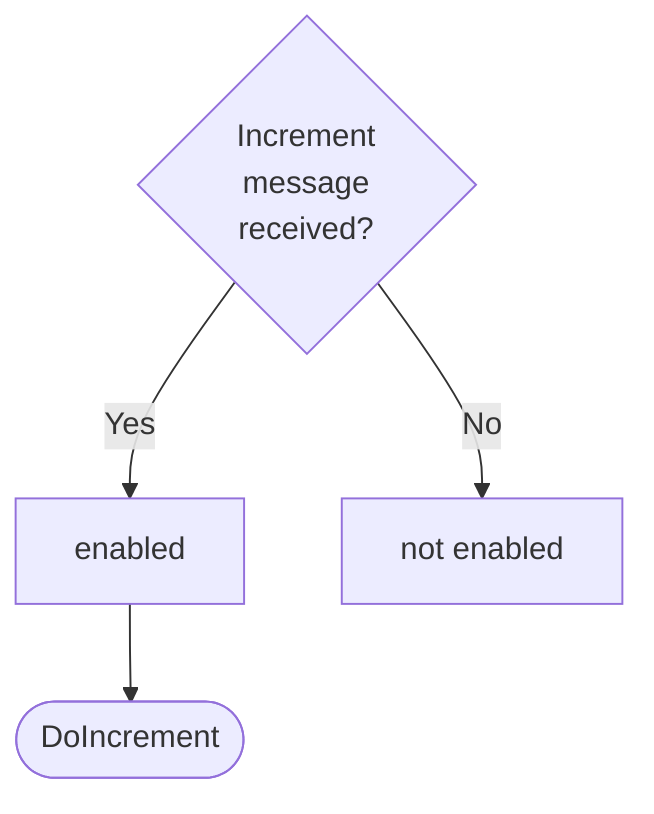

??? note "Juvix preamble"

    ```juvix
    module arch.node.engines.ticker_behaviour;

    import arch.node.engines.ticker_messages open;
    import arch.node.engines.ticker_environment open;

    import prelude open;
    import arch.node.basics open;
    import arch.node.identity_types open;
    import arch.node.types.messages open;
    import arch.node.types.engine open;
    import arch.node.types.anoma_message open using {MsgTicker};
    ```

# Ticker Behaviour

## Overview

The Ticker engine maintains a counter as local state and allows two actions:
incrementing the counter and sending the current counter value.

## Action labels

<!-- --8<-- [start:ticker-action-label] -->
```juvix
type TickerActionLabel :=
  | -- --8<-- [start:DoIncrement]
    DoIncrement
    -- --8<-- [end:DoIncrement]
  | -- --8<-- [start:DoRespond]
    DoRespond
    -- --8<-- [end:DoRespond]
;
```
<!-- --8<-- [end:ticker-action-label] -->

### `DoIncrement`

!!! quote ""

    --8<-- "./docs/arch/node/engines/ticker_behaviour.juvix.md:DoIncrement"

This action label corresponds to incrementing the counter and is relevant for the `Increment` message.

??? quote "`DoIncrement` action effect"

    This action does the following:

    | Aspect | Description |
    |--------|-------------|
    | State update          | The counter value is increased by one. |
    | Messages to be sent   | No messages are added to the send queue. |
    | Engines to be spawned | No engine is created by this action. |
    | Timer updates         | No timers are set or cancelled. |

### `DoRespond`

!!! quote ""

    --8<-- "./ticker_behaviour.juvix.md:DoRespond"

This action label corresponds to responding with the current counter value and
is relevant for the `Count` message.

??? quote "`DoRespond` action effect"

    This action does the following:

    | Aspect | Description |
    |--------|-------------|
    | State update          | The state remains unchanged. |
    | Messages to be sent   | A message with the current counter value is sent to the requester. |
    | Engines to be spawned | No engine is created by this action. |
    | Timer updates         | No timers are set or cancelled. |

## Matchable arguments

<!-- --8<-- [start:ticker-matchable-argument] -->

```juvix
type TickerMatchableArgument :=
  | -- --8<-- [start:ReplyTo]
  ReplyTo (Option EngineID) (Option MailboxID)
  -- --8<-- [end:ReplyTo]
;
```
<!-- --8<-- [end:ticker-matchable-argument] -->

### `ReplyTo`

!!! quote ""

    ```
    --8<-- "./docs/arch/node/engines/ticker_behaviour.juvix.md:ReplyTo"
    ```

This matchable argument contains the address and mailbox ID of where the response message should be sent.

## Precomputation results

The Ticker engine does not require any non-trivial pre-computations.

<!-- --8<-- [start:ticker-precomputation-entry] -->
```juvix
syntax alias TickerPrecomputation := Unit;
```
<!-- --8<-- [end:ticker-precomputation-entry] -->

## Guards

??? quote "Auxiliary Juvix code"

    Type alias for the guard.

    ```juvix
    -- --8<-- [start:ticker-guard]
    TickerGuard : Type :=
      Guard
        TickerLocalState
        TickerTimerHandle
        TickerMailboxState
        TickerMatchableArgument
        TickerActionLabel
        TickerPrecomputation;
    -- --8<-- [end:ticker-guard]

    -- --8<-- [start:ticker-guard-output]
    TickerGuardOutput : Type :=
      GuardOutput TickerMatchableArgument TickerActionLabel TickerPrecomputation;
    -- --8<-- [end:ticker-guard-output]
    ```


### `incrementGuard`

<figure markdown>


<figcaption>incrementGuard flowchart</figcaption>
</figure>

<!-- --8<-- [start:increment-guard] -->
```juvix
incrementGuard
  (t : TimestampedTrigger TickerTimerHandle )
  (env : TickerEnvironment) : Option TickerGuardOutput
  :=
  case getMessageFromTimestampedTrigger t of {
  | some (MsgTicker Increment) := some (
    mkGuardOutput@{
      args := [];
      label := DoIncrement;
      other := unit
    })
  | _ := none
  };
```
<!-- --8<-- [end:increment-guard] -->

### `countGuard`

<figure markdown>


<figcaption>countGuard flowchart</figcaption>
</figure>

<!-- --8<-- [start:count-guard] -->
```juvix
countGuard
  (t : TimestampedTrigger TickerTimerHandle)
  (env : TickerEnvironment) : Option TickerGuardOutput
  := case getMessageFromTimestampedTrigger t of {
  | some (MsgTicker Count) := do {
    sender <- getSenderFromTimestampedTrigger t;
    pure (mkGuardOutput@{
              args := [ReplyTo (some sender) none] ;
              label := DoRespond;
              other := unit
            });
  }
  | _ := none
  };
```
<!-- --8<-- [end:count-guard] -->

## Action function

??? quote "Auxiliary Juvix code"

    Type alias for the action function.

    ```juvix
    TickerActionInput : Type :=
      ActionInput
        TickerLocalState
        TickerMailboxState
        TickerTimerHandle
        TickerMatchableArgument
        TickerActionLabel
        TickerPrecomputation;

    TickerActionEffect : Type :=
      ActionEffect
        TickerLocalState
        TickerMailboxState
        TickerTimerHandle
        TickerMatchableArgument
        TickerActionLabel
        TickerPrecomputation;
    ```

<!-- --8<-- [start:action-function] -->
```juvix
tickerAction (input : TickerActionInput) : TickerActionEffect
  := let env := ActionInput.env input;
         out := ActionInput.guardOutput input;
  in
  case GuardOutput.label out of {
  | DoIncrement :=
    let counterValue := TickerLocalState.counter (EngineEnvironment.localState env)
    in mkActionEffect@{
      newEnv := env@EngineEnvironment{
        localState := mkTickerLocalState@{
          counter := counterValue + 1
        }
      };
    producedMessages := [];
    timers := [];
    spawnedEngines := [];
    }
  | DoRespond :=
    let counterValue := TickerLocalState.counter (EngineEnvironment.localState env)
    in case GuardOutput.args out of {
      | (ReplyTo (some whoAsked) mailbox) :: _ :=
        mkActionEffect@{
          newEnv := env;
          producedMessages := [
              mkEngineMessage@{
                sender := getSenderFromActionInput input;
                target := whoAsked;
                mailbox := some 0;
                msg := MsgTicker Count
              }
            ];
            timers := [];
            spawnedEngines := []
          }
      | _ := mkActionEffect@{
          newEnv := env;
          producedMessages := [];
          timers := [];
          spawnedEngines := []
        }
    }
    };
```
<!-- --8<-- [end:action-function] -->


## Conflict solver

```juvix
tickerConflictSolver : Set TickerMatchableArgument -> List (Set TickerMatchableArgument) := \{ _ := [] }
```

<<<<<<< HEAD:docs/arch/node/engines/ticker_behaviour.juvix.md
### `TickerBehaviour`

```
--8<-- "./docs/arch/node/engines/ticker.juvix.md:TickerBehaviour"
=======
## Engine behaviour

### `TickerBehaviour`

```
--8<-- "./docs/node_architecture/engines/ticker.juvix.md:TickerBehaviour"
>>>>>>> v2:docs/node_architecture/engines/ticker_behaviour.juvix.md
```
