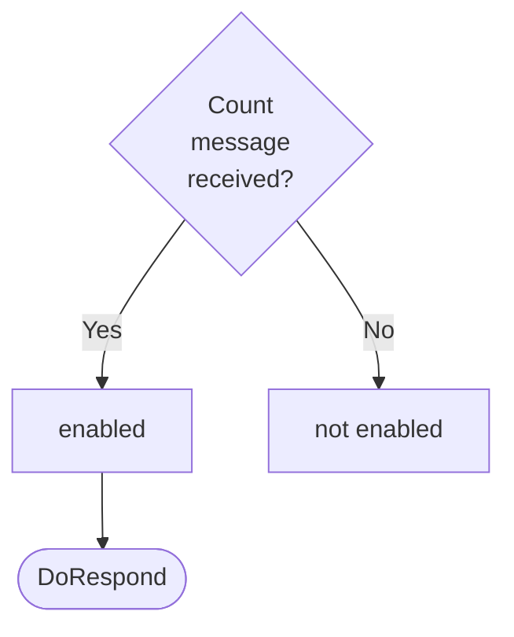

??? quote "Juvix imports"

    ```juvix
    module arch.node.engines.ticker_behaviour;

    import arch.node.engines.ticker_messages open;
    import arch.node.engines.ticker_environment open;

    import prelude open;
    import arch.node.types.basics open;
    import arch.node.types.identities open;
    import arch.node.types.messages open;
    import arch.node.types.engine open;
    import arch.node.types.anoma_message open using {MsgTicker};
    ```

# Ticker Behaviour

## Overview

The Ticker engine maintains a counter as local state and allows two actions:
incrementing the counter and sending the current counter value.

## Action labels

### `TickerActionLabelIncrement`

This action label corresponds to incrementing the counter
by the `incrementAction`
upon reception of the `TickerMsgIncrement` message.

### `TickerActionLabelRespond`

This action label corresponds to responding with the current counter value
by the `respondAction`
upon reception of the `TickerMsgCount` message.

### `TickerActionLabel`

<!-- --8<-- [start:TickerActionLabel] -->
```juvix
type TickerActionLabel :=
  | TickerActionLabelIncrement
  | TickerActionLabelRespond
  ;
```
<!-- --8<-- [end:TickerActionLabel] -->

## Matchable arguments

### `TickerMatchableArgumentReplyTo ReplyTo`

```juvix
type ReplyTo := mkReplyTo {
  whoAsked : Option EngineID;
  mailbox : Option MailboxID;
};
```

This matchable argument contains the address and mailbox ID of where the
response message should be sent.

`whoAsked`:
: is the address of the engine that sent the message.

`mailbox`:
: is the mailbox ID where the response message should be sent.

### `TickerMatchableArgument`

<!-- --8<-- [start:TickerMatchableArgument] -->
```juvix
type TickerMatchableArgument :=
  | TickerMatchableArgumentReplyTo ReplyTo
  ;
```
<!-- --8<-- [end:TickerMatchableArgument] -->

## Precomputation tasks results

The Ticker engine does not require any non-trivial pre-computations.

### `TickerPrecomputationEntry`

```juvix
syntax alias TickerPrecomputationEntry := Unit;
```

### `TickerPrecomputation`

<!-- --8<-- [start:TickerPrecomputation] -->
```juvix
TickerPrecomputationList : Type := List TickerPrecomputationEntry;
```
<!-- --8<-- [end:TickerPrecomputation] -->

## Guards

??? quote "Auxiliary Juvix code"

    ### TickerGuard

    <!-- --8<-- [start:TickerGuard] -->
    ```juvix
    TickerGuard : Type :=
      Guard
        TickerLocalState
        TickerTimerHandle
        TickerMailboxState
        TickerMatchableArgument
        TickerActionLabel
        TickerPrecomputationList;
    ```
    <!-- --8<-- [end:TickerGuard] -->

    ### TickerGuardOutput

    <!-- --8<-- [start:TickerGuardOutput] -->
    ```juvix
    TickerGuardOutput : Type :=
      GuardOutput
        TickerMatchableArgument
        TickerActionLabel
        TickerPrecomputationList;
    ```
    <!-- --8<-- [end:TickerGuardOutput] -->

### `incrementGuard`

<figure markdown>


<figcaption>incrementGuard flowchart</figcaption>
</figure>

<!-- --8<-- [start:incrementGuard] -->
```juvix
incrementGuard
  (t : TimestampedTrigger TickerTimerHandle )
  (env : TickerEnvironment) : Option TickerGuardOutput
  := case getMessageFromTimestampedTrigger t of {
  | some (MsgTicker Increment) := some (
    mkGuardOutput@{
      matchedArgs := [];
      actionLabel := TickerActionLabelIncrement;
      precomputationTasks := []
    })
  | _ := none
  };
```
<!-- --8<-- [end:incrementGuard] -->

### `countGuard`

<figure markdown>



<figcaption>countGuard flowchart</figcaption>
</figure>

<!-- --8<-- [start:countGuard] -->
```juvix
countGuard
  (t : TimestampedTrigger TickerTimerHandle)
  (env : TickerEnvironment) : Option TickerGuardOutput
  := case getMessageFromTimestampedTrigger t of {
  | some (MsgTicker Count) := do {
    sender <- getSenderFromTimestampedTrigger t;
    pure (mkGuardOutput@{
      matchedArgs := [
        TickerMatchableArgumentReplyTo (
          mkReplyTo@{
            whoAsked := some sender;
            mailbox := none
        })
      ];
      actionLabel := TickerActionLabelRespond;
      precomputationTasks := []
      });
  }
  | _ := none
  };
```
<!-- --8<-- [end:countGuard] -->

## Action functions

??? quote "Auxiliary Juvix code"

    ### TickerActionInput

    ```juvix
    TickerActionInput : Type :=
      ActionInput
        TickerLocalState
        TickerMailboxState
        TickerTimerHandle
        TickerMatchableArgument
        TickerActionLabel
        TickerPrecomputationList;
    ```

    ### TickerActionEffect

    ```juvix
    TickerActionEffect : Type :=
      ActionEffect
        TickerLocalState
        TickerMailboxState
        TickerTimerHandle
        TickerMatchableArgument
        TickerActionLabel
        TickerPrecomputationList;
    ```

    ### TickerActionFunction

    ```juvix
    TickerActionFunction : Type :=
      ActionFunction
        TickerLocalState
        TickerMailboxState
        TickerTimerHandle
        TickerMatchableArgument
        TickerActionLabel
        TickerPrecomputationList;
    ```

### `incrementAction`

Increments the counter if the `TickerMsgIncrement` message is received,
actioned by the `TickerActionLabelIncrement` label.

State update
: The counter value is increased by one.

Messages to be sent
: No messages are added to the send queue.

Engines to be spawned
: No engine is created by this action.

Timer updates
: No timers are set or cancelled.

```juvix
incrementAction (input : TickerActionInput) : TickerActionEffect :=
  let
    env := ActionInput.env input;
    out := ActionInput.guardOutput input;
  in
    let counterValue := TickerLocalState.counter (EngineEnvironment.localState env)
    in mkActionEffect@{
      newEnv := env@EngineEnvironment{
        localState := mkTickerLocalState@{
          counter := counterValue + 1
        }
      };
      producedMessages := [];
      timers := [];
      spawnedEngines := [];
    }
```

### `respondAction`

Responds with the current counter value if the `TickerMsgCount` message is received,
actioned by the `TickerActionLabelRespond` label.

State update
: The state remains unchanged.

Messages to be sent
: A message with the current counter value is sent to the requester.

Engines to be spawned
: No engine is created by this action.

Timer updates
: No timers are set or cancelled.

```juvix
respondAction (input : TickerActionInput) : TickerActionEffect :=
  let
    env := ActionInput.env input;
    out := ActionInput.guardOutput input;
    counterValue := TickerLocalState.counter (EngineEnvironment.localState env)
  in
    case GuardOutput.matchedArgs out of {
      | TickerMatchableArgumentReplyTo (mkReplyTo@{
          whoAsked := some whoAsked;
          mailbox := mailbox
        }) :: _ :=
        mkActionEffect@{
          newEnv := env;
          producedMessages := [
            mkEngineMsg@{
              sender := getSenderFromActionInput input;
              target := whoAsked;
              mailbox := some 0;
              msg := MsgTicker TickerMsgCount
            }
          ];
          timers := [];
          spawnedEngines := []
        }
      | _ := mkActionEffect@{
          newEnv := env;
          producedMessages := [];
          timers := [];
          spawnedEngines := []
        }
    }
```

### `tickerAction`

Calls the action function corresponding to the action label set by the guard.

<!-- --8<-- [start:tickerAction] -->
```juvix
tickerAction (input : TickerActionInput) : TickerActionEffect :=
  case GuardOutput.actionLabel (ActionInput.guardOutput input) of {
  | TickerActionLabelIncrement := incrementAction input
  | TickerActionLabelRespond := respondAction input
  };
```
<!-- --8<-- [end:tickerAction] -->


## Conflict solver

### `tickerConflictSolver`

```juvix
tickerConflictSolver : Set TickerMatchableArgument -> List (Set TickerMatchableArgument) := \{ _ := [] }
```

## The Ticker behaviour

### `TickerBehaviour`

<!-- --8<-- [start:TickerBehaviour] -->
```juvix
TickerBehaviour : Type :=
  EngineBehaviour
    TickerLocalState
    TickerMailboxState
    TickerTimerHandle
    TickerMatchableArgument
    TickerActionLabel
    TickerPrecomputationList;
```
<!-- --8<-- [end:TickerBehaviour] -->

#### Instantiation

<!-- --8<-- [start:TickerBehaviour-instance] -->
```juvix
tickerBehaviour : TickerBehaviour :=
  mkEngineBehaviour@{
    guards := [incrementGuard ; countGuard];
    action := tickerAction;
    conflictSolver := tickerConflictSolver;
  }
  ;
```
<!-- --8<-- [end:TickerBehaviour-instance] -->
