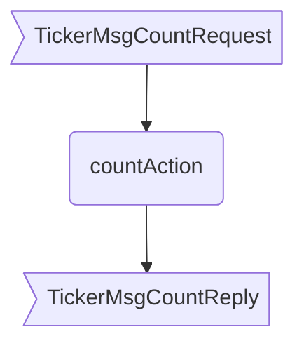

??? quote "Juvix imports"

    ```juvix
    module arch.node.engines.ticker_behaviour;

    import arch.node.engines.ticker_messages open;
    import arch.node.engines.ticker_config open;
    import arch.node.engines.ticker_environment open;

    import prelude open;
    import arch.node.types.basics open;
    import arch.node.types.identities open;
    import arch.node.types.messages open;
    import arch.node.types.engine open;
    import arch.node.types.anoma as Anoma open;
    ```

# Ticker Behaviour

## Overview

The Ticker engine maintains a counter as local state and allows two actions:
incrementing the counter and sending the current counter value.

## Action arguments

### `TickerActionArgumentReplyTo ReplyTo`

```juvix
type ReplyTo := mkReplyTo {
  whoAsked : Option EngineID;
  mailbox : Option MailboxID;
};
```

This action argument contains the address and mailbox ID of where the
response message should be sent.

`whoAsked`:
: is the address of the engine that sent the message.

`mailbox`:
: is the mailbox ID where the response message should be sent.

### `TickerActionArgument`

<!-- --8<-- [start:TickerActionArgument] -->
```juvix
type TickerActionArgument :=
  | TickerActionArgumentReplyTo ReplyTo
  ;
```
<!-- --8<-- [end:TickerActionArgument] -->

### `TickerActionArguments`

<!-- --8<-- [start:ticker-action-arguments] -->
```juvix
TickerActionArguments : Type := List TickerActionArgument;
```
<!-- --8<-- [end:ticker-action-arguments] -->

## Guarded actions

??? quote "Auxiliary Juvix code"

    ### TickerGuard

    <!-- --8<-- [start:TickerGuard] -->
    ```juvix
    TickerGuard : Type :=
      Guard
        TickerCfg
        TickerLocalState
        TickerMailboxState
        TickerTimerHandle
        Anoma.Msg
        TickerActionLabel
        TickerActionArguments;
    ```
    <!-- --8<-- [end:TickerGuard] -->

    ### TickerGuardOutput

    <!-- --8<-- [start:TickerGuardOutput] -->
    ```juvix
    TickerGuardOutput : Type :=
      GuardOutput
        TickerActionLabel
        TickerActionArguments;
    ```
    <!-- --8<-- [end:TickerGuardOutput] -->

    ### `TickerAction`

    ```juvix
    TickerAction : Type :=
      Action
        TickerActionLabel
        TickerActionArguments
        TickerLocalState
        TickerMailboxState
        TickerTimerHandle
        TickerCfg
        Anoma.Msg
        Anoma.Cfg
        Anoma.Env;
    ```

    ### `TickerActionEffect`

    ```juvix
    TickerActionEffect : Type :=
      ActionEffect
        TickerLocalState
        TickerMailboxState
        TickerTimerHandle
        Anoma.Msg
        Anoma.Cfg
        Anoma.Env;
    ```

### `increment`

<figure markdown>


<figcaption>increment flowchart</figcaption>
</figure>

#### `incrementGuard`

Condition
: Message type is `TickerMsgIncrement`.

<!-- --8<-- [start:incrementGuard] -->
```juvix
incrementGuard
  (tt : TimestampedTrigger TickerTimerHandle )
  (cfg : EngineCfg TickerCfg)
  (env : TickerEnv)
  : Option TickerGuardOutput :=
  let
    emsg := getEngineMsgFromTimestampedTrigger tt;
  in
    case emsg of {
    | some mkEngineMsg@{
        msg := (Anoma.MsgTicker TickerMsgIncrement);
      } :=
    some mkGuardOutput@{
      label := TickerActionLabelIncrement;
      args := [];
    }
  | _ := none
  };
```
<!-- --8<-- [end:incrementGuard] -->

#### `incrementAction`

Increment the counter.

State update
: The counter value is increased by one.

Messages to be sent
: No messages are added to the send queue.

Engines to be spawned
: No engine is created by this action.

Timer updates
: No timers are set or cancelled.

```juvix
incrementAction
  (label : TickerActionLabel)
  (args : List TickerActionArgument)
  (tt : TickerTimestampedTrigger)
  (cfg : EngineCfg TickerCfg)
  (env : TickerEnv)
  : Option TickerActionEffect :=
  let
    counterValue := TickerLocalState.counter (EngineEnv.localState env)
  in
    some mkActionEffect@{
      env := env@EngineEnv{
        localState := mkTickerLocalState@{
          counter := counterValue + 1
        }
      };
      msgs := [];
      timers := [];
      engines := [];
    }
```

### `countReply`

<figure markdown>



<figcaption>`countReply` flowchart</figcaption>
</figure>

#### `countReplyGuard`

Condition
: Message type is `TickerMsgCountRequest`.

<!-- --8<-- [start:countGuard] -->
```juvix
countReplyGuard
  (tt : TimestampedTrigger TickerTimerHandle)
  (cfg : EngineCfg TickerCfg)
  (env : TickerEnv)
  : Option TickerGuardOutput :=
  let
    emsg := getEngineMsgFromTimestampedTrigger tt;
  in
    case emsg of {
    | some mkEngineMsg@{
        msg := Anoma.MsgTicker TickerMsgCountRequest;
      } :=
      some mkGuardOutput@{
        label := TickerActionLabelCountReply;
        args := [];
      }
    | _ := none
    };
```
<!-- --8<-- [end:countGuard] -->

#### `countReplyAction`

Respond with the counter value.

State update
: The state remains unchanged.

Messages to be sent
: A message with the current counter value is sent to the requester.

Engines to be spawned
: No engine is created by this action.

Timer updates
: No timers are set or cancelled.

```juvix
countReplyAction
  (label : TickerActionLabel)
  (args : List TickerActionArgument)
  (tt : TickerTimestampedTrigger)
  (cfg : EngineCfg TickerCfg)
  (env : TickerEnv)
  : Option TickerActionEffect :=
  let
    em := getEngineMsgFromTimestampedTrigger tt;
    counterValue := TickerLocalState.counter (EngineEnv.localState env)
  in
    case em of {
    | some emsg :=
      some mkActionEffect@{
        env := env;
        msgs := [
          mkEngineMsg@{
            sender := getEngineIDFromEngineCfg cfg;
            target := EngineMsg.sender emsg;
            mailbox := some 0;
            msg :=
              Anoma.MsgTicker
                (TickerMsgCountReply
                  mkCountReply@{
                    counter := counterValue;
                  })
          }
        ];
        timers := [];
        engines := [];
      }
    | _ := none
    };
```

## Action labels

### `TemplateActionLabel`

```juvix
type TickerActionLabel :=
  | TickerActionLabelIncrement [ incrementAction ]
  | TickerActionLabelCountReply [ countReplyAction ]
```

## The Ticker behaviour

### `TickerBehaviour`

<!-- --8<-- [start:TickerBehaviour] -->
```juvix
TickerBehaviour : Type :=
  EngineBehaviour
    TickerLocalState
    TickerMailboxState
    TickerTimerHandle
    TickerActionArguments;
```
<!-- --8<-- [end:TickerBehaviour] -->

#### Instantiation

<!-- --8<-- [start:TickerBehaviour-instance] -->
```juvix
tickerBehaviour : TickerBehaviour :=
  mkEngineBehaviour@{
    guards := [ incrementGuard; countReplyGuard ];
  };
```
<!-- --8<-- [end:TickerBehaviour-instance] -->
