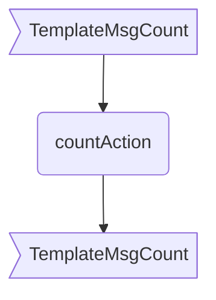

??? quote "Juvix imports"

    ```juvix
    module arch.node.engines.ticker_behaviour;

    import arch.node.engines.ticker_messages open;
    import arch.node.engines.ticker_environment open;

    import prelude open;
    import arch.node.types.basics open;
    import arch.node.types.identities open;
    import arch.node.types.messages open;
    import arch.node.types.engine open;
    import arch.node.types.anoma_message open;
    ```

# Ticker Behaviour

## Overview

The Ticker engine maintains a counter as local state and allows two actions:
incrementing the counter and sending the current counter value.

## Action arguments

### `TickerActionArgumentReplyTo ReplyTo`

```juvix
type ReplyTo := mkReplyTo {
  whoAsked : Option EngineID;
  mailbox : Option MailboxID;
};
```

This action argument contains the address and mailbox ID of where the
response message should be sent.

`whoAsked`:
: is the address of the engine that sent the message.

`mailbox`:
: is the mailbox ID where the response message should be sent.

### `TickerActionArgument`

<!-- --8<-- [start:TickerActionArgument] -->
```juvix
type TickerActionArgument :=
  | TickerActionArgumentReplyTo ReplyTo
  ;
```
<!-- --8<-- [end:TickerActionArgument] -->

### `TickerActionArguments`

<!-- --8<-- [start:ticker-action-arguments] -->
```juvix
TickerActionArguments : Type := List TickerActionArgument;
```
<!-- --8<-- [end:ticker-action-arguments] -->

## Guarded actions

??? quote "Auxiliary Juvix code"

    ### TickerGuard

    <!-- --8<-- [start:TickerGuard] -->
    ```juvix
    TickerGuard : Type :=
      Guard
        TickerLocalState
        TickerTimerHandle
        TickerMailboxState
        TickerActionArguments;
    ```
    <!-- --8<-- [end:TickerGuard] -->

    ### TickerGuardOutput

    <!-- --8<-- [start:TickerGuardOutput] -->
    ```juvix
    TickerGuardOutput : Type :=
      GuardOutput
        TickerActionArguments;
    ```
    <!-- --8<-- [end:TickerGuardOutput] -->

    ### `TickerAction`

    ```juvix
    TickerAction : Type :=
      Action
        TickerLocalState
        TickerMailboxState
        TickerTimerHandle
        TickerActionArguments;
    ```

    ### `TickerActionEffect`

    ```juvix
    TickerActionEffect : Type :=
      ActionEffect
        TickerLocalState
        TickerMailboxState
        TickerTimerHandle
        TickerActionArguments;
    ```

### `increment`

<figure markdown>


<figcaption>increment flowchart</figcaption>
</figure>

#### `incrementGuard`

<!-- --8<-- [start:incrementGuard] -->
```juvix
incrementGuard
  (tt : TimestampedTrigger TickerTimerHandle )
  (env : TickerEnvironment)
  : Option TickerGuardOutput :=
  case getMessageFromTimestampedTrigger tt of {
  | some (MsgTicker TickerMsgIncrement) :=
    some mkGuardOutput@{
      args := [];
    }
  | _ := none
  };
```
<!-- --8<-- [end:incrementGuard] -->

#### `incrementAction`

Increments the counter if the `TickerMsgIncrement` message is received,
actioned by the `TickerActionLabelIncrement` label.

State update
: The counter value is increased by one.

Messages to be sent
: No messages are added to the send queue.

Engines to be spawned
: No engine is created by this action.

Timer updates
: No timers are set or cancelled.

```juvix
incrementAction
  (args : List TickerActionArgument)
  (tt : TickerTimestampedTrigger)
  (env : TickerEnvironment)
  : Option TickerActionEffect :=
  let
    counterValue := TickerLocalState.counter (EngineEnvironment.localState env)
  in
    some mkActionEffect@{
      env := env@EngineEnvironment{
        localState := mkTickerLocalState@{
          counter := counterValue + 1
        }
      };
      msgs := [];
      timers := [];
      engines := [];
    }
```

### `count`

Responds with the current counter value if the `TickerMsgCount` message is received.

#### `countGuard`

<figure markdown>



<figcaption>countGuard flowchart</figcaption>
</figure>

<!-- --8<-- [start:countGuard] -->
```juvix
countGuard
  (tt : TimestampedTrigger TickerTimerHandle)
  (env : TickerEnvironment)
  : Option TickerGuardOutput :=
  case getMessageFromTimestampedTrigger tt of {
  | some (MsgTicker TickerMsgCount) := do {
    pure (mkGuardOutput@{
      args := [
        TickerActionArgumentReplyTo (
          mkReplyTo@{
            whoAsked := none;
            mailbox := none
        })
      ];
    });
  }
  | _ := none
  };
```
<!-- --8<-- [end:countGuard] -->

#### `countAction`

State update
: The state remains unchanged.

Messages to be sent
: A message with the current counter value is sent to the requester.

Engines to be spawned
: No engine is created by this action.

Timer updates
: No timers are set or cancelled.

```juvix
countAction
  (args : List TickerActionArgument)
  (tt : TickerTimestampedTrigger)
  (env : TickerEnvironment)
  : Option TickerActionEffect :=
  let
    em := getEngineMsgFromTimestampedTrigger tt;
    counterValue := TickerLocalState.counter (EngineEnvironment.localState env)
  in
    case em of {
    | some emsg :=
      some mkActionEffect@{
        env := env;
        msgs := [
          mkEngineMsg@{
            sender := EngineMsg.target emsg;
            target := EngineMsg.sender emsg;
            mailbox := some 0;
            msg := MsgTicker TickerMsgCount
          }
        ];
        timers := [];
        engines := [];
      }
    | _ := none
    };
```

## The Ticker behaviour

### `TickerBehaviour`

<!-- --8<-- [start:TickerBehaviour] -->
```juvix
TickerBehaviour : Type :=
  EngineBehaviour
    TickerLocalState
    TickerMailboxState
    TickerTimerHandle
    TickerActionArguments;
```
<!-- --8<-- [end:TickerBehaviour] -->

#### Instantiation

<!-- --8<-- [start:TickerBehaviour-instance] -->
```juvix
tickerBehaviour : TickerBehaviour :=
  mkEngineBehaviour@{
    exec := End; -- TODO
  };
```
<!-- --8<-- [end:TickerBehaviour-instance] -->
