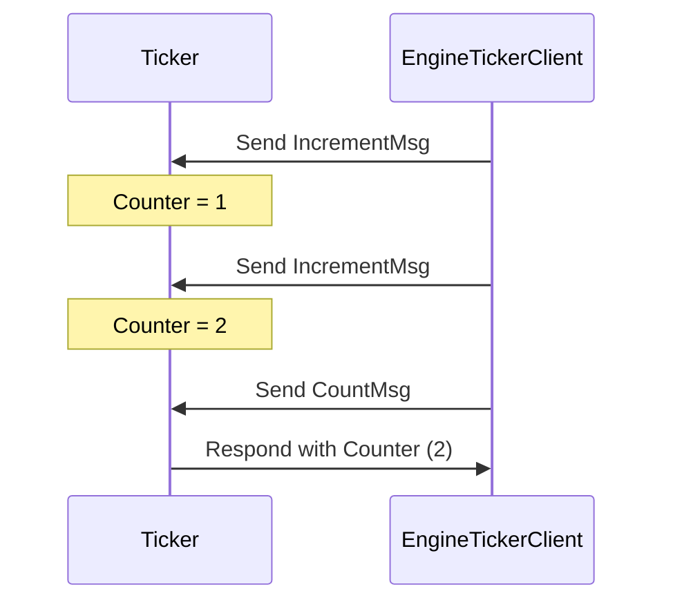

??? quote "Juvix imports"

    ```juvix
    module arch.node.engines.ticker_messages;
    import prelude open;
    ```

# Ticker Messages

## Message interface

### Increment

```juvix
syntax alias IncrementMsg := Unit;
```

An `IncrementMsg` message instructs the engine to increase the counter. This
message doesn't require any arguments.

### Count

```juvix
syntax alias CountMsg := Unit;
```

A `CountMsg` message requests the engine to send the current counter value back to
the requester. This message doesn't require any arguments.


### TickerMsg

<!-- --8<-- [start:TickerMsg] -->
```juvix
type TickerMsg :=
    | TickerMsgIncrement IncrementMsg
    | TickerMsgCount CountMsg
```
<!-- --8<-- [end:TickerMsg] -->


There are only two message tags: `IncrementMsg`, which increases the counter
state of the ticker, and `CountMsg`, which the ticker responds to with the current
counter state.

## Ticker Interaction Diagram

This diagram represents a simple interaction between a `Ticker` engine instance
and another entity sending increment requests and count requests.

<!-- --8<-- [start:message-sequence-diagram] -->
<figure markdown="span">



<figcaption markdown="span">
A client interacts with the `Ticker` engine, which increments and responds with the counter value.
</figcaption>
</figure>
