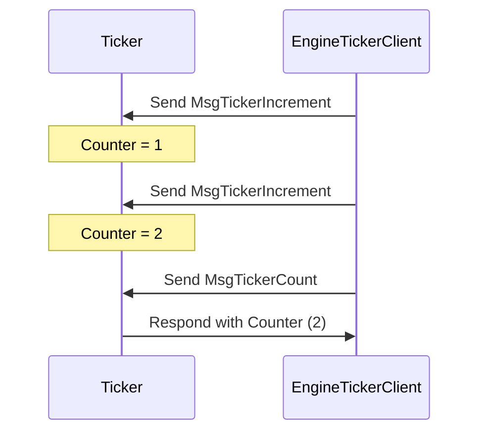

??? quote "Juvix imports"

    ```juvix
    module arch.node.engines.ticker_messages;
    import prelude open;
    ```

# Ticker messages

## Message Interface


### `MsgTickerIncrement`

    A `MsgTickerIncrement` message instructs the engine to increase the counter.
    This message doesn't require any arguments.

### `MsgTickerCount`

    A `MsgTickerCount` message requests the engine to send the current counter value back to
    the requester. This message doesn't require any arguments.

### `MsgTicker`

<!-- --8<-- [start:TickerMsg] -->
```juvix
type TickerMsg :=
  | MsgTickerIncrement
  | MsgTickerCount
```
<!-- --8<-- [end:TickerMsg] -->

There are only two message tags: `MsgTickerIncrement`, which increases the counter
state of the ticker, and `MsgTickerCount`, which the ticker responds to with the current
counter state.

## Ticker Interaction Diagram

This diagram represents a simple interaction between a `Ticker` engine instance
and another entity sending increment requests and count requests.

<!-- --8<-- [start:message-sequence-diagram] -->
<figure markdown="span">



<figcaption markdown="span">
A client interacts with the `Ticker` engine, which increments and responds with the counter value.
</figcaption>
</figure>
