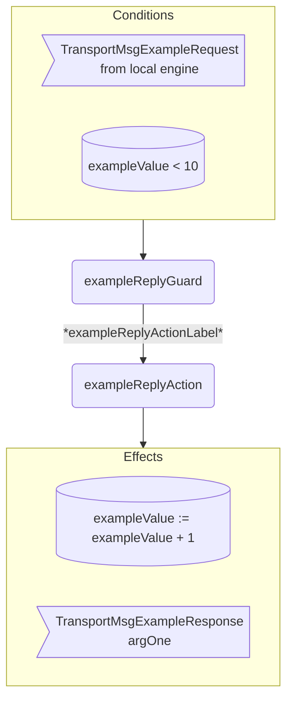

??? code "Juvix imports"

    ```juvix
    module arch.node.engines.transport_behaviour;

    import arch.node.engines.transport_messages open;
    import arch.node.engines.transport_config open;
    import arch.node.engines.transport_environment open;

    import arch.node.types.basics open;
    import arch.node.types.identities open;
    import arch.node.types.messages open;
    import arch.node.types.engine open;
    import arch.node.types.anoma as Anoma open;
    ```

# Transport Behaviour

## Overview

A transport engine acts in the ways described on this page.
The action labels correspond to the actions that can be performed by the engine.
Using the action labels, we describe the effects of the actions.

## Transport Action Flowchart

### `exampleReply` Flowchart

<figure markdown>



<figcaption markdown="span">

`exampleReply` flowchart

</figcaption>
</figure>


## Action arguments

The action arguments are set by a guard
and passed to the action function as part of the `GuardOutput`.

### `TransportActionArguments`

<!-- --8<-- [start:TransportActionArguments] -->
```juvix
TransportActionArguments : Type := Unit;
```
<!-- --8<-- [end:TransportActionArguments] -->

## Actions

??? code "Auxiliary Juvix code"

    ### `TransportAction`

    <!-- --8<-- [start:TransportAction] -->
    ```juvix
    TransportAction : Type :=
      Action
        TransportLocalCfg
        TransportLocalState
        TransportMailboxState
        TransportTimerHandle
        TransportActionArguments
        Anoma.Msg
        Anoma.Cfg
        Anoma.Env;
    ```
    <!-- --8<-- [end:TransportAction] -->

    ### `TransportActionInput`

    <!-- --8<-- [start:TransportActionInput] -->
    ```juvix
    TransportActionInput : Type :=
      ActionInput
        TransportLocalCfg
        TransportLocalState
        TransportMailboxState
        TransportTimerHandle
        TransportActionArguments
        Anoma.Msg;
    ```
    <!-- --8<-- [end:TransportActionInput] -->

    ### `TransportActionEffect`

    <!-- --8<-- [start:TransportActionEffect] -->
    ```juvix
    TransportActionEffect : Type :=
      ActionEffect
        TransportLocalState
        TransportMailboxState
        TransportTimerHandle
        Anoma.Msg
        Anoma.Cfg
        Anoma.Env;
    ```
    <!-- --8<-- [end:TransportActionEffect] -->

    ### `TransportActionExec`

    <!-- --8<-- [start:TransportActionExec] -->
    ```juvix
    TransportActionExec : Type :=
      ActionExec
        TransportLocalCfg
        TransportLocalState
        TransportMailboxState
        TransportTimerHandle
        TransportActionArguments
        Anoma.Msg
        Anoma.Cfg
        Anoma.Env;
    ```
    <!-- --8<-- [end:TransportActionExec] -->

#### `exampleReplyAction`

Respond with a `TransportMsgExampleReply`.

State update
: The state remains unchanged.

Messages to be sent
: A `TransportMsgExampleReply` message with the data set by `exampleReplyGuard`.

Engines to be spawned
: No engine is created by this action.

Timer updates
: No timers are set or cancelled.

<!-- --8<-- [start:exampleReplyAction] -->
```juvix
exampleReplyAction
  (input : TransportActionInput)
  : Option TransportActionEffect :=
  TODO {-
  let
    cfg := ActionInput.cfg input;
    env := ActionInput.env input;
    trigger := ActionInput.trigger input;
    args := ActionInput.args input;
  in
    case getEngineMsgFromTimestampedTrigger trigger of {
    | some EngineMsg.mk@{
        msg := Anoma.Msg.MsgTransport (TransportMsgExampleRequest req);
        sender := sender;
        target := target;
        mailbox := mailbox;
      } :=
      some ActionEffect.mk@{
        env := env;
        msgs := [
          EngineMsg.mk@{
            sender := getEngineIDFromEngineCfg cfg;
            target := sender;
            mailbox := some 0;
            msg :=
              Anoma.Msg.MsgTransport
                (TransportMsgExampleReply
                  (ok mkExampleReplyOk@{
                    argOne := ExampleRequest.argOne req;
                  }));
          }
        ];
        timers := [];
        eng ines := [];
      }
  | _ := none
  -};
```
<!-- --8<-- [end:exampleReplyAction] -->

## Action Labels

### `exampleReplyActionLabel`

```juvix
exampleReplyActionLabel : TransportActionExec := ActionExec.Seq [ exampleReplyAction ];
```

## Guards

??? code "Auxiliary Juvix code"

    ### `TransportGuard`

    <!-- --8<-- [start:TransportGuard] -->
    ```juvix
    TransportGuard : Type :=
      Guard
        TransportLocalCfg
        TransportLocalState
        TransportMailboxState
        TransportTimerHandle
        TransportActionArguments
        Anoma.Msg
        Anoma.Cfg
        Anoma.Env;
    ```
    <!-- --8<-- [end:TransportGuard] -->

    ### `TransportGuardOutput`

    <!-- --8<-- [start:TransportGuardOutput] -->
    ```juvix
    TransportGuardOutput : Type :=
      GuardOutput
        TransportLocalCfg
        TransportLocalState
        TransportMailboxState
        TransportTimerHandle
        TransportActionArguments
        Anoma.Msg
        Anoma.Cfg
        Anoma.Env;
    ```
    <!-- --8<-- [end:TransportGuardOutput] -->

    ### `TransportGuardEval`

    <!-- --8<-- [start:TransportGuardEval] -->
    ```juvix
    TransportGuardEval : Type :=
      GuardEval
        TransportLocalCfg
        TransportLocalState
        TransportMailboxState
        TransportTimerHandle
        TransportActionArguments
        Anoma.Msg
        Anoma.Cfg
        Anoma.Env;
    ```
    <!-- --8<-- [end:TransportGuardEval] -->

### `exampleReplyGuard`

Guard description (optional).

Condition
: Message type is `TransportMsgExampleRequest`.

<!-- --8<-- [start:exampleReplyGuard] -->
```juvix
exampleReplyGuard
  (trigger : TransportTimestampedTrigger)
  (cfg : TransportCfg)
  (env : TransportEnv)
  : Option TransportGuardOutput :=
  TODO {-
  case getEngineMsgFromTimestampedTrigger trigger of {
    | some EngineMsg.mk@{
        msg := Anoma.Msg.MsgTransport (TransportMsgExampleRequest req);
        sender := mkPair none _; -- from local engines only (NodeID is none)
      } := some GuardOutput.mk@{
        action := exampleReplyActionLabel;
        args := [];
      }
    | _ := none
  -};
```
<!-- --8<-- [end:exampleReplyGuard] -->

## The Transport behaviour

### `TransportBehaviour`

<!-- --8<-- [start:TransportBehaviour] -->
```juvix
TransportBehaviour : Type :=
  EngineBehaviour
    TransportLocalCfg
    TransportLocalState
    TransportMailboxState
    TransportTimerHandle
    TransportActionArguments
    Anoma.Msg
    Anoma.Cfg
    Anoma.Env;
```
<!-- --8<-- [end:TransportBehaviour] -->

#### Instantiation

<!-- --8<-- [start:transportBehaviour] -->
```juvix
transportBehaviour : TransportBehaviour :=
  EngineBehaviour.mk@{
    guards :=
      GuardEval.First [
        exampleReplyGuard;
      ];
  };
```
<!-- --8<-- [end:transportBehaviour] -->
