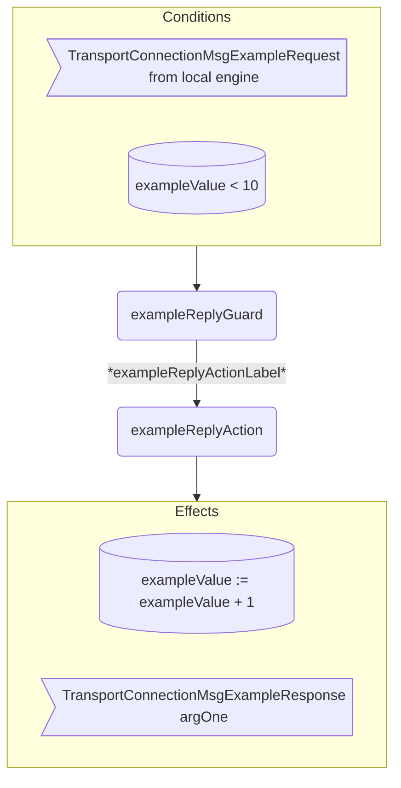

??? quote "Juvix imports"

    ```juvix
    module arch.node.engines.transport_connection_behaviour;

    import arch.node.engines.transport_connection_messages open;
    import arch.node.engines.transport_connection_config open;
    import arch.node.engines.transport_connection_environment open;

    import arch.node.types.basics open;
    import arch.node.types.identities open;
    import arch.node.types.messages open;
    import arch.node.types.engine open;
    import arch.node.types.anoma as Anoma open;
    ```

# Transport Connection Behaviour

## Overview

A *Transport Connection* engine acts in the ways described on this page.
The action labels correspond to the actions that can be performed by the engine.
Using the action labels, we describe the effects of the actions.

## Transport Connection Action Flowchart


### `exampleReply` Flowchart

<figure markdown>



<figcaption markdown="span">

`exampleReply` flowchart

</figcaption>
</figure>


## Action arguments

The action arguments are set by a guard
and passed to the action function as part of the `GuardOutput`.

### `TransportConnectionActionArguments`

<!-- --8<-- [start:TransportConnectionActionArguments] -->
```juvix
TransportConnectionActionArguments : Type := Unit;
```
<!-- --8<-- [end:TransportConnectionActionArguments] -->

## Actions

??? quote "Auxiliary Juvix code"

    ### `TransportConnectionAction`

    <!-- --8<-- [start:TransportConnectionAction] -->
    ```juvix
    TransportConnectionAction : Type :=
      Action
        TransportConnectionLocalCfg
        TransportConnectionLocalState
        TransportConnectionMailboxState
        TransportConnectionTimerHandle
        TransportConnectionActionArguments
        Anoma.Msg
        Anoma.Cfg
        Anoma.Env;
    ```
    <!-- --8<-- [end:TransportConnectionAction] -->

    ### `TransportConnectionActionInput`

    <!-- --8<-- [start:TransportConnectionActionInput] -->
    ```juvix
    TransportConnectionActionInput : Type :=
      ActionInput
        TransportConnectionLocalCfg
        TransportConnectionLocalState
        TransportConnectionMailboxState
        TransportConnectionTimerHandle
        TransportConnectionActionArguments
        Anoma.Msg;
    ```
    <!-- --8<-- [end:TransportConnectionActionInput] -->

    ### `TransportConnectionActionEffect`

    <!-- --8<-- [start:TransportConnectionActionEffect] -->
    ```juvix
    TransportConnectionActionEffect : Type :=
      ActionEffect
        TransportConnectionLocalState
        TransportConnectionMailboxState
        TransportConnectionTimerHandle
        Anoma.Msg
        Anoma.Cfg
        Anoma.Env;
    ```
    <!-- --8<-- [end:TransportConnectionActionEffect] -->

    ### `TransportConnectionActionExec`

    <!-- --8<-- [start:TransportConnectionActionExec] -->
    ```juvix
    TransportConnectionActionExec : Type :=
      ActionExec
        TransportConnectionLocalCfg
        TransportConnectionLocalState
        TransportConnectionMailboxState
        TransportConnectionTimerHandle
        TransportConnectionActionArguments
        Anoma.Msg
        Anoma.Cfg
        Anoma.Env;
    ```
    <!-- --8<-- [end:TransportConnectionActionExec] -->

#### `exampleReplyAction`

Respond with a `TransportConnectionMsgExampleResponse`.

State update
: The state remains unchanged.

Messages to be sent
: A `TransportConnectionMsgExampleReply` message with the data set by `exampleReplyGuard`.

Engines to be spawned
: No engine is created by this action.

Timer updates
: No timers are set or cancelled.

<!-- --8<-- [start:exampleReplyAction] -->
```juvix
exampleReplyAction
  (input : TransportConnectionActionInput)
  : Option TransportConnectionActionEffect :=
  TODO {-
  let
    cfg := ActionInput.cfg input;
    env := ActionInput.env input;
    trigger := ActionInput.trigger input;
    args := ActionInput.args input;
  in
    case getEngineMsgFromTimestampedTrigger trigger of {
    | some mkEngineMsg@{
        msg := Anoma.MsgTransportConnection (TransportConnectionMsgExampleRequest req);
        sender := sender;
        target := target;
        mailbox := mailbox;
      } :=
      some mkActionEffect@{
        env := env;
        msgs := [
          mkEngineMsg@{
            sender := getEngineIDFromEngineCfg cfg;
            target := sender;
            mailbox := some 0;
            msg :=
              Anoma.MsgTransportConnection
                (TransportConnectionMsgExampleReply
                  (ok mkExampleReplyOk@{
                    argOne := ExampleRequest.argOne req;
                  }));
          }
        ];
        timers := [];
        engines := [];
      }
  | _ := none
  -};
```
<!-- --8<-- [end:exampleReplyAction] -->

## Action Labels

### `exampleReplyActionLabel`

```juvix
exampleReplyActionLabel : TransportConnectionActionExec := Seq [ exampleReplyAction ];
```

## Guards

??? quote "Auxiliary Juvix code"

    ### `TransportConnectionGuard`

    <!-- --8<-- [start:TransportConnectionGuard] -->
    ```juvix
    TransportConnectionGuard : Type :=
      Guard
        TransportConnectionLocalCfg
        TransportConnectionLocalState
        TransportConnectionMailboxState
        TransportConnectionTimerHandle
        TransportConnectionActionArguments
        Anoma.Msg
        Anoma.Cfg
        Anoma.Env;
    ```
    <!-- --8<-- [end:TransportConnectionGuard] -->

    ### `TransportConnectionGuardOutput`

    <!-- --8<-- [start:TransportConnectionGuardOutput] -->
    ```juvix
    TransportConnectionGuardOutput : Type :=
      GuardOutput
        TransportConnectionLocalCfg
        TransportConnectionLocalState
        TransportConnectionMailboxState
        TransportConnectionTimerHandle
        TransportConnectionActionArguments
        Anoma.Msg
        Anoma.Cfg
        Anoma.Env;
    ```
    <!-- --8<-- [end:TransportConnectionGuardOutput] -->

    ### `TransportConnectionGuardEval`

    <!-- --8<-- [start:TransportConnectionGuardEval] -->
    ```juvix
    TransportConnectionGuardEval : Type :=
      GuardEval
        TransportConnectionLocalCfg
        TransportConnectionLocalState
        TransportConnectionMailboxState
        TransportConnectionTimerHandle
        TransportConnectionActionArguments
        Anoma.Msg
        Anoma.Cfg
        Anoma.Env;
    ```
    <!-- --8<-- [end:TransportConnectionGuardEval] -->

### `exampleReplyGuard`

Guard description (optional).

Condition
: Message type is `TransportConnectionMsgExampleRequest`.

<!-- --8<-- [start:exampleReplyGuard] -->
```juvix
exampleReplyGuard
  (trigger : TransportConnectionTimestampedTrigger)
  (cfg : TransportConnectionCfg)
  (env : TransportConnectionEnv)
  : Option TransportConnectionGuardOutput :=
  TODO {-
  case getEngineMsgFromTimestampedTrigger trigger of {
    | some mkEngineMsg@{
        msg := Anoma.MsgTransportConnection (TransportConnectionMsgExampleRequest req);
        sender := mkPair none _; -- from local engines only (NodeID is none)
      } := some mkGuardOutput@{
        action := exampleReplyActionLabel;
        args := [];
      }
    | _ := none
  -};
```
<!-- --8<-- [end:exampleReplyGuard] -->

## The Transport Connection behaviour

### `TransportConnectionBehaviour`

<!-- --8<-- [start:TransportConnectionBehaviour] -->
```juvix
TransportConnectionBehaviour : Type :=
  EngineBehaviour
    TransportConnectionLocalCfg
    TransportConnectionLocalState
    TransportConnectionMailboxState
    TransportConnectionTimerHandle
    TransportConnectionActionArguments
    Anoma.Msg
    Anoma.Cfg
    Anoma.Env;
```
<!-- --8<-- [end:TransportConnectionBehaviour] -->

#### Instantiation

<!-- --8<-- [start:exTransportConnectionBehaviour] -->
```juvix
module transport_connection_behaviour_example;

exTransportConnectionBehaviour : TransportConnectionBehaviour :=
  mkEngineBehaviour@{
    guards :=
      First [
        exampleReplyGuard;
      ];
  };

end;
```
<!-- --8<-- [end:exTransportConnectionBehaviour] -->
