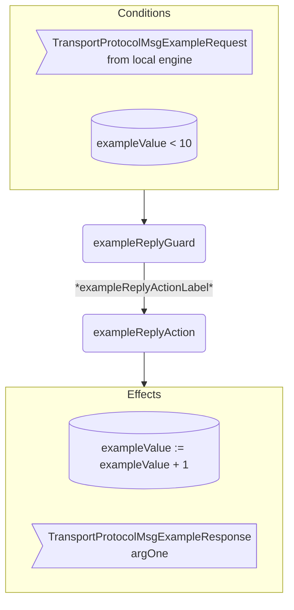

??? code "Juvix imports"

    ```juvix
    module arch.node.engines.transport_protocol_behaviour;

    import arch.node.engines.transport_protocol_messages open;
    import arch.node.engines.transport_protocol_config open;
    import arch.node.engines.transport_protocol_environment open;

    import arch.node.types.basics open;
    import arch.node.types.identities open;
    import arch.node.types.messages open;
    import arch.node.types.engine open;
    import arch.node.types.anoma as Anoma open;
    ```

---

# Transport Protocol Behaviour

## Overview

A *Transport Protocol* engine acts in the ways described on this page.
The action labels correspond to the actions that can be performed by the engine.
Using the action labels, we describe the effects of the actions.

## Transport Protocol Action Flowchart

### `exampleReply` Flowchart

<figure markdown>



<figcaption markdown="span">

`exampleReply` flowchart

</figcaption>
</figure>

## Action arguments

The action arguments are set by a guard
and passed to the action function as part of the `GuardOutput`.

### `TransportProtocolActionArguments`

<!-- --8<-- [start:TransportProtocolActionArguments] -->
```juvix
TransportProtocolActionArguments : Type := Unit;
```
<!-- --8<-- [end:TransportProtocolActionArguments] -->

## Actions

??? code "Auxiliary Juvix code"

    ### `TransportProtocolAction`

    <!-- --8<-- [start:TransportProtocolAction] -->
    ```juvix
    TransportProtocolAction : Type :=
      Action
        TransportProtocolLocalCfg
        TransportProtocolLocalState
        TransportProtocolMailboxState
        TransportProtocolTimerHandle
        TransportProtocolActionArguments
        Anoma.Msg
        Anoma.Cfg
        Anoma.Env;
    ```
    <!-- --8<-- [end:TransportProtocolAction] -->

    ### `TransportProtocolActionInput`

    <!-- --8<-- [start:TransportProtocolActionInput] -->
    ```juvix
    TransportProtocolActionInput : Type :=
      ActionInput
        TransportProtocolLocalCfg
        TransportProtocolLocalState
        TransportProtocolMailboxState
        TransportProtocolTimerHandle
        TransportProtocolActionArguments
        Anoma.Msg;
    ```
    <!-- --8<-- [end:TransportProtocolActionInput] -->

    ### `TransportProtocolActionEffect`

    <!-- --8<-- [start:TransportProtocolActionEffect] -->
    ```juvix
    TransportProtocolActionEffect : Type :=
      ActionEffect
        TransportProtocolLocalState
        TransportProtocolMailboxState
        TransportProtocolTimerHandle
        Anoma.Msg
        Anoma.Cfg
        Anoma.Env;
    ```
    <!-- --8<-- [end:TransportProtocolActionEffect] -->

    ### `TransportProtocolActionExec`

    <!-- --8<-- [start:TransportProtocolActionExec] -->
    ```juvix
    TransportProtocolActionExec : Type :=
      ActionExec
        TransportProtocolLocalCfg
        TransportProtocolLocalState
        TransportProtocolMailboxState
        TransportProtocolTimerHandle
        TransportProtocolActionArguments
        Anoma.Msg
        Anoma.Cfg
        Anoma.Env;
    ```
    <!-- --8<-- [end:TransportProtocolActionExec] -->

#### `exampleReplyAction`

Respond with a `TransportProtocolMsgExampleReply`.

State update
: The state remains unchanged.

Messages to be sent
: A `TransportProtocolMsgExampleReply` message with the data set by `exampleReplyGuard`.

Engines to be spawned
: No engine is created by this action.

Timer updates
: No timers are set or cancelled.

<!-- --8<-- [start:exampleReplyAction] -->
```juvix
exampleReplyAction
  (input : TransportProtocolActionInput)
  : Option TransportProtocolActionEffect :=
  TODO {-
  let
    cfg := ActionInput.cfg input;
    env := ActionInput.env input;
    trigger := ActionInput.trigger input;
    args := ActionInput.args input;
  in
    case getEngineMsgFromTimestampedTrigger trigger of {
    | some EngineMsg.mk@{
        msg := Anoma.Msg.MsgTransportProtocol (TransportProtocolMsgExampleRequest req);
        sender := sender;
        target := target;
        mailbox := mailbox;
      } :=
      some ActionEffect.mk@{
        env := env;
        msgs := [
          EngineMsg.mk@{
            sender := getEngineIDFromEngineCfg cfg;
            target := sender;
            mailbox := some 0;
            msg :=
              Anoma.Msg.MsgTransportProtocol
                (TransportProtocolMsgExampleReply
                  (ok mkExampleReplyOk@{
                    argOne := ExampleRequest.argOne req;
                  }));
          }
        ];
        timers := [];
        engines := [];
      }
  | _ := none
  -};
```
<!-- --8<-- [end:exampleReplyAction] -->

## Action Labels

### `exampleReplyActionLabel`

```juvix
exampleReplyActionLabel : TransportProtocolActionExec := ActionExec.Seq [ exampleReplyAction ];
```

## Guards

??? code "Auxiliary Juvix code"

    ### `TransportProtocolGuard`

    <!-- --8<-- [start:TransportProtocolGuard] -->
    ```juvix
    TransportProtocolGuard : Type :=
      Guard
        TransportProtocolLocalCfg
        TransportProtocolLocalState
        TransportProtocolMailboxState
        TransportProtocolTimerHandle
        TransportProtocolActionArguments
        Anoma.Msg
        Anoma.Cfg
        Anoma.Env;
    ```
    <!-- --8<-- [end:TransportProtocolGuard] -->

    ### `TransportProtocolGuardOutput`

    <!-- --8<-- [start:TransportProtocolGuardOutput] -->
    ```juvix
    TransportProtocolGuardOutput : Type :=
      GuardOutput
        TransportProtocolLocalCfg
        TransportProtocolLocalState
        TransportProtocolMailboxState
        TransportProtocolTimerHandle
        TransportProtocolActionArguments
        Anoma.Msg
        Anoma.Cfg
        Anoma.Env;
    ```
    <!-- --8<-- [end:TransportProtocolGuardOutput] -->

    ### `TransportProtocolGuardEval`

    <!-- --8<-- [start:TransportProtocolGuardEval] -->
    ```juvix
    TransportProtocolGuardEval : Type :=
      GuardEval
        TransportProtocolLocalCfg
        TransportProtocolLocalState
        TransportProtocolMailboxState
        TransportProtocolTimerHandle
        TransportProtocolActionArguments
        Anoma.Msg
        Anoma.Cfg
        Anoma.Env;
    ```
    <!-- --8<-- [end:TransportProtocolGuardEval] -->

### `exampleReplyGuard`

Guard description (optional).

Condition
: Message type is `TransportProtocolMsgExampleRequest`.

<!-- --8<-- [start:exampleReplyGuard] -->
```juvix
exampleReplyGuard
  (trigger : TransportProtocolTimestampedTrigger)
  (cfg : TransportProtocolCfg)
  (env : TransportProtocolEnv)
  : Option TransportProtocolGuardOutput :=
  TODO {-
  case getEngineMsgFromTimestampedTrigger trigger of {
    | some EngineMsg.mk@{
        msg := Anoma.Msg.MsgTransportProtocol (TransportProtocolMsgExampleRequest req);
        sender := mkPair none _; -- from local engines only (NodeID is none)
      } := some GuardOutput.mk@{
        action := exampleReplyActionLabel;
        args := [];
      }
    | _ := none
  -};
```
<!-- --8<-- [end:exampleReplyGuard] -->

## The Transport Protocol behaviour

### `TransportProtocolBehaviour`

<!-- --8<-- [start:TransportProtocolBehaviour] -->
```juvix
TransportProtocolBehaviour : Type :=
  EngineBehaviour
    TransportProtocolLocalCfg
    TransportProtocolLocalState
    TransportProtocolMailboxState
    TransportProtocolTimerHandle
    TransportProtocolActionArguments
    Anoma.Msg
    Anoma.Cfg
    Anoma.Env;
```
<!-- --8<-- [end:TransportProtocolBehaviour] -->

#### Instantiation

<!-- --8<-- [start:exTransportProtocolBehaviour] -->
```juvix
module transport_protocol_behaviour_example;

exTransportProtocolBehaviour : TransportProtocolBehaviour :=
  EngineBehaviour.mk@{
    guards :=
      GuardEval.First [
        exampleReplyGuard;
      ];
  };

end;
```
<!-- --8<-- [end:exTransportProtocolBehaviour] -->
