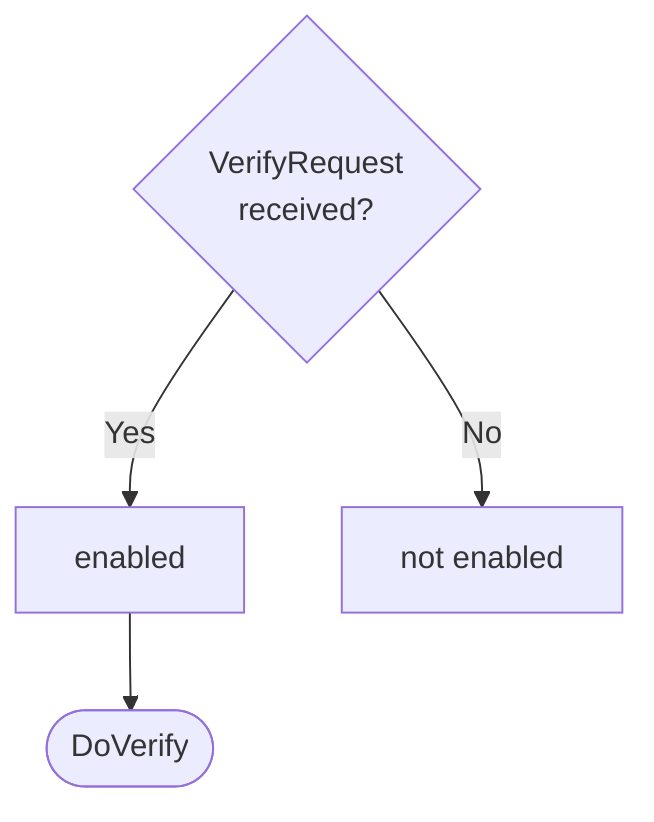

??? quote "Juvix imports"

    ```juvix
    module arch.node.engines.verification_behaviour;

    import prelude open;
    import arch.node.types.messages open;
    import arch.system.identity.identity open hiding {ExternalIdentity};
    import arch.node.types.engine_behaviour open;
    import arch.node.types.engine_environment open;
    import arch.node.engines.verification_environment open;
    import arch.node.engines.verification_messages open;
    import arch.node.engines.signs_for_messages open;
    import arch.node.types.crypto open;
    import arch.node.types.identities open;
    import arch.node.types.anoma_message open;
    ```

# `Verification` Dynamics

## Overview

The behavior of the Verification Engine define how it processes incoming verification requests and produces the corresponding responses.

## Action labels

<!-- --8<-- [start:verification-action-label] -->
```juvix
type VerificationActionLabel :=
  | -- --8<-- [start:DoVerify]
    DoVerify {
      data : Signable;
      commitment : Commitment;
      externalIdentity : ExternalIdentity;
      useSignsFor : Bool
    }
    -- --8<-- [end:DoVerify]
  | -- --8<-- [start:DoHandleSignsForResponse]
    DoHandleSignsForResponse {
      externalIdentity : ExternalIdentity;
      signsForEvidence : Set SignsForEvidence
    };
    -- --8<-- [end:DoHandleSignsForResponse]
;
```
<!-- --8<-- [end:verification-action-label] -->

### `DoVerify`

!!! quote ""

    --8<-- "./verification_behaviour.juvix.md:DoVerify"

This action label corresponds to verifying a commitment.

??? quote "`DoVerify` action effect"

    This action does the following:

    | Aspect | Description |
    |--------|-------------|
    | State update          | If `useSignsFor` is true, the state is updated to store pending requests. Otherwise, the state remains unchanged. |
    | Messages to be sent   | If `useSignsFor` is false, a `VerifyResponse` message is sent back to the requester. If `useSignsFor` is true and it's the first request for this identity, a `QuerySignsForEvidenceRequest` is sent to the SignsFor Engine. |
    | Engines to be spawned | No engines are created by this action. |
    | Timer updates         | No timers are set or cancelled. |

### `DoHandleSignsForResponse`

!!! quote ""

    --8<-- "./verification_behaviour.juvix.md:DoHandleSignsForResponse"

This action label corresponds to receiving signs for evidence and using it to address relevant pending requests.

??? quote "`DoHandleSignsForResponse` action effect"

    This action does the following:

    | Aspect | Description |
    |--------|-------------|
    | State update          | The state is updated to remove the processed pending requests for the given external identity. |
    | Messages to be sent   | `VerifyResponse` messages are sent to all requesters who were waiting for this SignsFor evidence. |
    | Engines to be spawned | No engines are created by this action. |
    | Timer updates         | No timers are set or cancelled. |

## Matchable arguments

<!-- --8<-- [start:verification-matchable-argument] -->

```juvix
type VerificationMatchableArgument :=
  | -- --8<-- [start:ReplyTo]
  ReplyTo (Option EngineID) (Option MailboxID)
  -- --8<-- [end:ReplyTo]
;
```
<!-- --8<-- [end:verification-matchable-argument] -->

### `ReplyTo`

!!! quote ""

    ```
    --8<-- "./verification_behaviour.juvix.md:ReplyTo"
    ```

This matchable argument contains the address and mailbox ID of where the response message should be sent.

## Precomputation results

The Verification Engine does not require any non-trivial pre-computations.

<!-- --8<-- [start:verification-precomputation-entry] -->
```juvix
syntax alias VerificationPrecomputation := Unit;
```
<!-- --8<-- [end:verification-precomputation-entry] -->

## Guards

??? quote "Auxiliary Juvix code"

    Type alias for the guard.

    ```juvix
    -- --8<-- [start:verification-guard]
    VerificationGuard : Type :=
      Guard
        VerificationLocalState
        VerificationMailboxState
        VerificationTimerHandle
        VerificationMatchableArgument
        VerificationActionLabel
        VerificationPrecomputation;
    -- --8<-- [end:verification-guard]

    -- --8<-- [start:verification-guard-output]
    VerificationGuardOutput : Type :=
      GuardOutput VerificationMatchableArgument VerificationActionLabel VerificationPrecomputation;
    -- --8<-- [end:verification-guard-output]
    ```

### `verifyGuard`

<figure markdown>

<figcaption>verifyGuard flowchart</figcaption>
</figure>

<!-- --8<-- [start:verify-guard] -->
```juvix
verifyGuard
  (t : TimestampedTrigger VerificationTimerHandle)
  (env : VerificationEnvironment) : Option VerificationGuardOutput
  := case getMessageFromTimestampedTrigger t of {
      | some (MsgVerification (VerifyRequest x y z w)) := do {
        sender <- getSenderFromTimestampedTrigger t;
        pure (mkGuardOutput@{
                matchedArgs := [ReplyTo (some sender) none] ;
                actionLabel := DoVerify x y z w;
                precomputationTasks := unit
                });
        }
      | _ := none
  };
```
<!-- --8<-- [end:verify-guard] -->

### `signsForResponseGuard`

<!-- --8<-- [start:signs-for-response-guard] -->
```juvix
signsForResponseGuard
  (t : TimestampedTrigger VerificationTimerHandle)
  (env : VerificationEnvironment) : Option VerificationGuardOutput
  := case getMessageFromTimestampedTrigger t of {
      | some (MsgSignsFor (QuerySignsForEvidenceResponse externalIdentity evidence err)) :=
          case getSenderFromTimestampedTrigger t of {
            | some sender :=
                case isEqual (Ord.cmp sender (VerificationLocalState.signsForEngineAddress (EngineEnvironment.localState env))) of {
                  | true := some (mkGuardOutput@{
                      matchedArgs := [];
                      actionLabel := DoHandleSignsForResponse externalIdentity evidence;
                      precomputationTasks := unit
                    })
                  | false := none
                }
            | none := none
          }
      | _ := none
  };
```
<!-- --8<-- [end:signs-for-response-guard] -->

## Action function

??? quote "Auxiliary Juvix code"

    Type alias for the action function.

    ```juvix
    VerificationActionInput : Type :=
      ActionInput
        VerificationLocalState
        VerificationMailboxState
        VerificationTimerHandle
        VerificationMatchableArgument
        VerificationActionLabel
        VerificationPrecomputation;

    VerificationActionEffect : Type :=
      ActionEffect
        VerificationLocalState
        VerificationMailboxState
        VerificationTimerHandle
        VerificationMatchableArgument
        VerificationActionLabel
        VerificationPrecomputation;
    ```

<!-- --8<-- [start:action-function] -->
```juvix
verifyResponse (externalIdentity : ExternalIdentity) (env : VerificationEnvironment) (evidence : Set SignsForEvidence) (req : Pair EngineID (Pair Signable Commitment)) : EngineMsg :=
  let localState := EngineEnvironment.localState env;
      whoAsked := fst req;
      input := snd req;
      data := fst input;
      commitment := snd input;
      result' :=
        Verifier.verify
          (VerificationLocalState.verifier localState evidence externalIdentity)
          (VerificationLocalState.backend localState)
          data commitment;
      responseMsg := VerifyResponse@{
        result := result';
        err := none
      };
      envelope := mkEngineMsg@{
        sender := mkPair none (some (EngineEnvironment.name env));
        target := whoAsked;
        mailbox := some 0;
        msg := MsgVerification responseMsg
      };
      in envelope;

verificationAction (input : VerificationActionInput) : VerificationActionEffect :=
  let env := ActionInput.env input;
      out := ActionInput.guardOutput input;
      localState := EngineEnvironment.localState env;
  in
  case GuardOutput.actionLabel out of {
    | DoVerify data commitment externalIdentity' useSignsFor :=
        case GuardOutput.matchedArgs out of {
          | (ReplyTo (some whoAsked) _) :: _ :=
              case useSignsFor of {
                | false :=
                    let envelope := verifyResponse externalIdentity' env Set.empty (mkPair whoAsked (mkPair data commitment))
                    in mkActionEffect@{
                      newEnv := env; -- No state change
                      producedMessages := [envelope];
                      timers := [];
                      spawnedEngines := []
                    }
                | true :=
                    -- Need to request SignsForEvidence from SignsFor Engine
                    let existingRequests := Map.lookup externalIdentity' (VerificationLocalState.pendingRequests localState);
                        newPendingList := case existingRequests of {
                          | some reqs := reqs ++ [mkPair whoAsked (mkPair data commitment)]
                          | none := [mkPair whoAsked (mkPair data commitment)]
                        };
                        newPendingRequests := Map.insert externalIdentity' newPendingList (VerificationLocalState.pendingRequests localState);
                        newLocalState := localState@VerificationLocalState{
                          pendingRequests := newPendingRequests
                        };
                        newEnv' := env@EngineEnvironment{
                          localState := newLocalState
                        };
                        -- Only send request to SignsFor Engine if this is the first pending request for this identity
                        messagesToSend := case existingRequests of {
                          | some _ := [] -- Request already sent, do none
                          | none := let requestMsg := QuerySignsForEvidenceRequest@{
                                              externalIdentity := externalIdentity'
                                            };
                                            envelope := mkEngineMsg@{
                                              sender := mkPair none (some (EngineEnvironment.name env));
                                              target := VerificationLocalState.signsForEngineAddress localState;
                                              mailbox := some 0;
                                              msg := MsgSignsFor requestMsg
                                            };
                                        in [envelope]
                        };
                    in mkActionEffect@{
                      newEnv := newEnv';
                      producedMessages := messagesToSend;
                      timers := [];
                      spawnedEngines := []
                    }
              }
          | _ := mkActionEffect@{newEnv := env; producedMessages := []; timers := []; spawnedEngines := []}
      }
    | DoHandleSignsForResponse externalIdentity evidence :=
        -- Retrieve pending requests
        case Map.lookup externalIdentity (VerificationLocalState.pendingRequests localState) of {
          | some reqs :=
              let messages := map (verifyResponse externalIdentity env evidence) reqs;
                  newPendingRequests := Map.delete externalIdentity (VerificationLocalState.pendingRequests localState);
                  newLocalState := localState@VerificationLocalState{
                    pendingRequests := newPendingRequests
                  };
                  newEnv' := env@EngineEnvironment{
                    localState := newLocalState
                  };
              in mkActionEffect@{
                newEnv := newEnv';
                producedMessages := messages;
                timers := [];
                spawnedEngines := []
              }
          | none :=
              -- No pending requests, do none
              mkActionEffect@{
                newEnv := env;
                producedMessages := [];
                timers := [];
                spawnedEngines := []
              }
        }
  };
```
<!-- --8<-- [end:action-function] -->

## Conflict solver

```juvix
verificationConflictSolver : Set VerificationMatchableArgument -> List (Set VerificationMatchableArgument)
  | _ := [];
```

## VerificationBehaviour type

<!-- --8<-- [start:VerificationBehaviour] -->
```juvix
VerificationBehaviour : Type :=
  EngineBehaviour
    VerificationLocalState
    VerificationMailboxState
    VerificationTimerHandle
    VerificationMatchableArgument
    VerificationActionLabel
    VerificationPrecomputation;
```
<!-- --8<-- [end:VerificationBehaviour] -->

## VerificationBehaviour instance

<!-- --8<-- [start:VerificationBehaviour-instance] -->
```juvix
verificationBehaviour : VerificationBehaviour :=
  mkEngineBehaviour@{
    guards := [verifyGuard; signsForResponseGuard];
    action := verificationAction;
    conflictSolver := verificationConflictSolver;
  }
```
<!-- --8<-- [end:VerificationBehaviour-instance] -->
