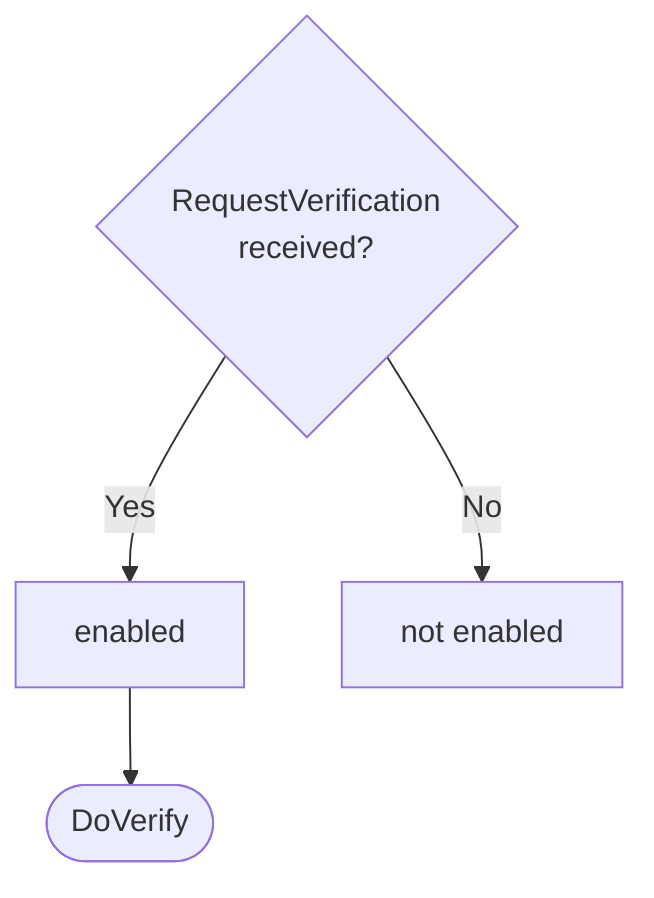

??? quote "Juvix imports"

    ```juvix
    module arch.node.engines.verification_behaviour;

    import prelude open;
    import arch.node.types.messages open;
    import arch.system.identity.identity open hiding {ExternalIdentity};
    import arch.node.types.engine_behaviour open;
    import arch.node.types.engine_environment open;
    import arch.node.engines.verification_environment open;
    import arch.node.engines.verification_messages open;
    import arch.node.engines.signs_for_messages open;
    import arch.node.types.crypto open;
    import arch.node.types.identities open;
    import arch.node.types.anoma_message open;
    ```

# Verification Behaviour

## Overview

The behavior of the Verification Engine defines how it processes incoming verification
requests and produces the corresponding responses.

## Action labels

### `DoVerify`

```juvix
type DoVerify := mkDoVerify {
  data : Signable;
  commitment : Commitment;
  externalIdentity : ExternalIdentity;
  useSignsFor : Bool
};
```

This action label corresponds to verifying a commitment.

???+ quote "Arguments"

    `data`:
    : The data to verify.

    `commitment`:
    : The commitment to verify against.

    `externalIdentity`:
    : The external identity to use for verification.

    `useSignsFor`:
    : Whether to use SignsFor evidence.

???+ quote "`DoVerify` action effect"

    This action does the following:

    | Aspect | Description |
    |--------|-------------|
    | State update          | If `useSignsFor` is true, the state is updated to store pending requests. Otherwise, the state remains unchanged. |
    | Messages to be sent   | If `useSignsFor` is false, a `ResponseVerification` message is sent back to the requester. If `useSignsFor` is true and it's the first request for this identity, a `QuerySignsForEvidenceRequest` is sent to the SignsFor Engine. |
    | Engines to be spawned | No engines are created by this action. |
    | Timer updates         | No timers are set or cancelled. |

### `DoHandleSignsForResponse`

```juvix
type DoHandleSignsForResponse := mkDoHandleSignsForResponse {
  externalIdentity : ExternalIdentity;
  signsForEvidence : Set SignsForEvidence
};
```

This action label corresponds to receiving signs for evidence and using it to address relevant pending requests.

???+ quote "Arguments"

    `externalIdentity`:
    : The external identity associated with the evidence.

    `signsForEvidence`:
    : The set of SignsFor evidence received.

???+ quote "`DoHandleSignsForResponse` action effect"

    This action does the following:

    | Aspect | Description |
    |--------|-------------|
    | State update          | The state is updated to remove the processed pending requests for the given external identity. |
    | Messages to be sent   | `ResponseVerification` messages are sent to all requesters who were waiting for this SignsFor evidence. |
    | Engines to be spawned | No engines are created by this action. |
    | Timer updates         | No timers are set or cancelled. |

### `VerificationActionLabel`

```juvix
type VerificationActionLabel :=
  | VerificationActionLabelDoVerify DoVerify
  | VerificationActionLabelDoHandleSignsForResponse DoHandleSignsForResponse
;
```

## Matchable arguments

### `ReplyTo`

```juvix
type ReplyTo := mkReplyTo {
  whoAsked : Option EngineID;
  mailbox : Option MailboxID
};
```

???+ quote "Arguments"

    `whoAsked`:
    : The engine ID of the requester.

    `mailbox`:
    : The mailbox ID where the response should be sent.

### `VerificationMatchableArgument`

```juvix
type VerificationMatchableArgument :=
  | VerificationMatchableArgumentReplyTo ReplyTo
;
```

## Precomputation results

The Verification Engine does not require any non-trivial pre-computations.

```juvix
syntax alias VerificationPrecomputation := Unit;
```

## Guards

??? quote "Auxiliary Juvix code"

    Type alias for the guard.

    ```juvix
    VerificationGuard : Type :=
      Guard
        VerificationLocalState
        VerificationMailboxState
        VerificationTimerHandle
        VerificationMatchableArgument
        VerificationActionLabel
        VerificationPrecomputation;

    VerificationGuardOutput : Type :=
      GuardOutput
        VerificationMatchableArgument
        VerificationActionLabel
        VerificationPrecomputation;
    ```

### `verifyGuard`

<figure markdown>

<figcaption>verifyGuard flowchart</figcaption>
</figure>

<!-- --8<-- [start:verifyGuard] -->
```juvix
verifyGuard
  (t : TimestampedTrigger VerificationTimerHandle)
  (env : VerificationEnvironment) : Option VerificationGuardOutput
  := case getMessageFromTimestampedTrigger t of {
      | some (MsgVerification (MsgVerificationRequest (mkRequestVerification x y z w))) := do {
        sender <- getSenderFromTimestampedTrigger t;
        pure (mkGuardOutput@{
                matchedArgs := [VerificationMatchableArgumentReplyTo (mkReplyTo (some sender) none)] ;
                actionLabel := VerificationActionLabelDoVerify (mkDoVerify x y z w);
                precomputationTasks := unit
                });
        }
      | _ := none
  };
```
<!-- --8<-- [end:verifyGuard] -->

### `signsForResponseGuard`

<!-- --8<-- [start:signsForResponseGuard] -->
```juvix
signsForResponseGuard
  (t : TimestampedTrigger VerificationTimerHandle)
  (env : VerificationEnvironment) : Option VerificationGuardOutput
  := case getMessageFromTimestampedTrigger t of {
      | some (MsgSignsFor (MsgQuerySignsForEvidenceResponse (mkResponseQuerySignsForEvidence externalIdentity evidence err))) :=
          case getSenderFromTimestampedTrigger t of {
            | some sender :=
                case isEqual (Ord.cmp sender (VerificationLocalState.signsForEngineAddress (EngineEnvironment.localState env))) of {
                  | true := some (mkGuardOutput@{
                      matchedArgs := [];
                      actionLabel := VerificationActionLabelDoHandleSignsForResponse (mkDoHandleSignsForResponse externalIdentity evidence);
                      precomputationTasks := unit
                    })
                  | false := none
                }
            | none := none
          }
      | _ := none
  };
```
<!-- --8<-- [end:signsForResponseGuard] -->

## Action function

??? quote "Auxiliary Juvix code"

    Type alias for the action function.

    ```juvix
    VerificationActionInput : Type :=
      ActionInput
        VerificationLocalState
        VerificationMailboxState
        VerificationTimerHandle
        VerificationMatchableArgument
        VerificationActionLabel
        VerificationPrecomputation;

    VerificationActionEffect : Type :=
      ActionEffect
        VerificationLocalState
        VerificationMailboxState
        VerificationTimerHandle
        VerificationMatchableArgument
        VerificationActionLabel
        VerificationPrecomputation;
    ```

### `responseVerification`

```juvix
responseVerification (externalIdentity : ExternalIdentity) (env : VerificationEnvironment) (evidence : Set SignsForEvidence) (req : Pair EngineID (Pair Signable Commitment)) : EngineMsg :=
  let localState := EngineEnvironment.localState env;
      whoAsked := fst req;
      input := snd req;
      data := fst input;
      commitment := snd input;
      result' :=
        Verifier.verify
          (VerificationLocalState.verifier localState evidence externalIdentity)
          (VerificationLocalState.backend localState)
          data commitment;
      responseMsg := mkResponseVerification@{
        result := result';
        err := none
      };
      envelope := mkEngineMsg@{
        sender := mkPair none (some (EngineEnvironment.name env));
        target := whoAsked;
        mailbox := some 0;
        msg := MsgVerification (MsgVerificationResponse responseMsg)
      };
      in envelope;
```

### `verificationAction`


<!-- --8<-- [start:verificationAction] -->
```juvix
verificationAction (input : VerificationActionInput) : VerificationActionEffect :=
  let env := ActionInput.env input;
      out := ActionInput.guardOutput input;
      localState := EngineEnvironment.localState env;
  in
  case GuardOutput.actionLabel out of {
    | VerificationActionLabelDoVerify (mkDoVerify data commitment externalIdentity' useSignsFor) :=
        case GuardOutput.matchedArgs out of {
          | VerificationMatchableArgumentReplyTo (mkReplyTo (some whoAsked) _) :: _ :=
              case useSignsFor of {
                | false :=
                    let envelope := responseVerification externalIdentity' env Set.empty (mkPair whoAsked (mkPair data commitment))
                    in mkActionEffect@{
                      newEnv := env; -- No state change
                      producedMessages := [envelope];
                      timers := [];
                      spawnedEngines := []
                    }
                | true :=
                    -- Need to request SignsForEvidence from SignsFor Engine
                    let existingRequests := Map.lookup externalIdentity' (VerificationLocalState.pendingRequests localState);
                        newPendingList := case existingRequests of {
                          | some reqs := reqs ++ [mkPair whoAsked (mkPair data commitment)]
                          | none := [mkPair whoAsked (mkPair data commitment)]
                        };
                        newPendingRequests := Map.insert externalIdentity' newPendingList (VerificationLocalState.pendingRequests localState);
                        newLocalState := localState@VerificationLocalState{
                          pendingRequests := newPendingRequests
                        };
                        newEnv' := env@EngineEnvironment{
                          localState := newLocalState
                        };
                        -- Only send request to SignsFor Engine if this is the first pending request for this identity
                        messagesToSend := case existingRequests of {
                          | some _ := [] -- Request already sent, do none
                          | none := let requestMsg := mkRequestQuerySignsForEvidence@{
                                              externalIdentity := externalIdentity'
                                            };
                                            envelope := mkEngineMsg@{
                                              sender := mkPair none (some (EngineEnvironment.name env));
                                              target := VerificationLocalState.signsForEngineAddress localState;
                                              mailbox := some 0;
                                              msg := MsgSignsFor (MsgQuerySignsForEvidenceRequest requestMsg)
                                            };
                                        in [envelope]
                        };
                    in mkActionEffect@{
                      newEnv := newEnv';
                      producedMessages := messagesToSend;
                      timers := [];
                      spawnedEngines := []
                    }
              }
          | _ := mkActionEffect@{newEnv := env; producedMessages := []; timers := []; spawnedEngines := []}
      }
    | VerificationActionLabelDoHandleSignsForResponse (mkDoHandleSignsForResponse externalIdentity evidence) :=
        -- Retrieve pending requests
        case Map.lookup externalIdentity (VerificationLocalState.pendingRequests localState) of {
          | some reqs :=
              let messages := map (responseVerification externalIdentity env evidence) reqs;
                  newPendingRequests := Map.delete externalIdentity (VerificationLocalState.pendingRequests localState);
                  newLocalState := localState@VerificationLocalState{
                    pendingRequests := newPendingRequests
                  };
                  newEnv' := env@EngineEnvironment{
                    localState := newLocalState
                  };
              in mkActionEffect@{
                newEnv := newEnv';
                producedMessages := messages;
                timers := [];
                spawnedEngines := []
              }
          | none :=
              -- No pending requests, do none
              mkActionEffect@{
                newEnv := env;
                producedMessages := [];
                timers := [];
                spawnedEngines := []
              }
        }
  };
```
<!-- --8<-- [end:verificationAction] -->

## Conflict solver

### `verificationConflictSolver`

```juvix
verificationConflictSolver : Set VerificationMatchableArgument -> List (Set VerificationMatchableArgument)
  | _ := [];
```

## The Verification Behaviour

### `VerificationBehaviour`

<!-- --8<-- [start:VerificationBehaviour] -->
```juvix
VerificationBehaviour : Type :=
  EngineBehaviour
    VerificationLocalState
    VerificationMailboxState
    VerificationTimerHandle
    VerificationMatchableArgument
    VerificationActionLabel
    VerificationPrecomputation;
```
<!-- --8<-- [end:VerificationBehaviour] -->

### Instantiation

<!-- --8<-- [start:verificationBehaviour] -->
```juvix
verificationBehaviour : VerificationBehaviour :=
  mkEngineBehaviour@{
    guards := [verifyGuard; signsForResponseGuard];
    action := verificationAction;
    conflictSolver := verificationConflictSolver;
  }
```
<!-- --8<-- [end:verificationBehaviour] -->