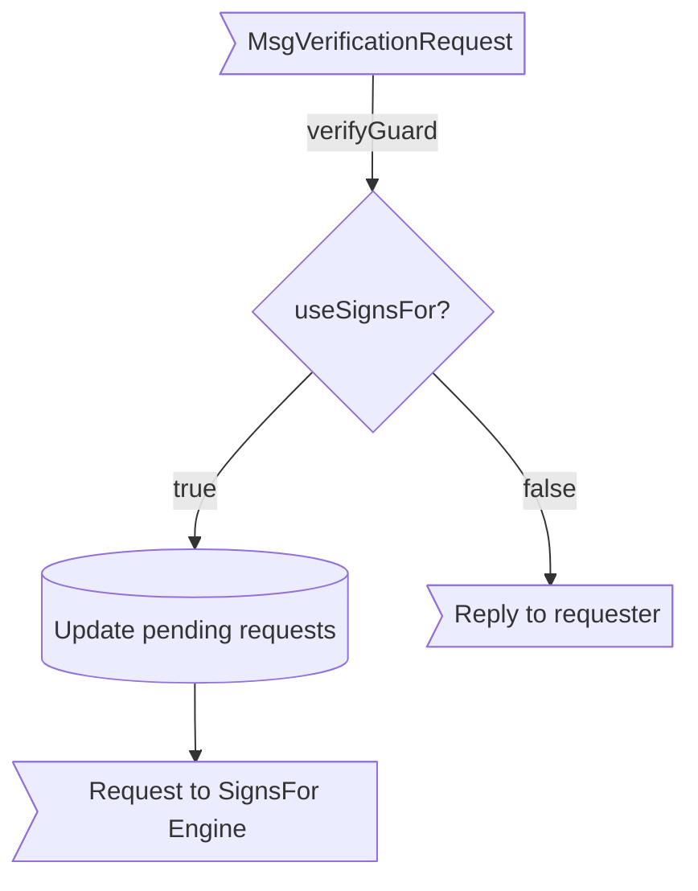
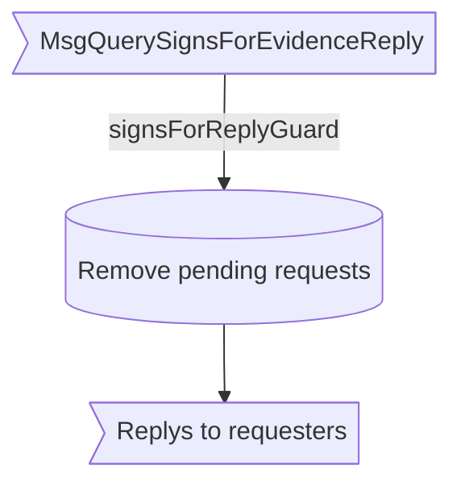

??? code "Juvix imports"

    ```juvix
    module arch.node.engines.verification_behaviour;

    import prelude open;
    import arch.node.types.messages open;
    import arch.system.identity.identity open hiding {ExternalIdentity};
    import arch.node.types.engine open;
    import arch.node.engines.verification_config open;
    import arch.node.engines.verification_environment open;
    import arch.node.engines.verification_messages open;
    import arch.node.engines.signs_for_messages open;
    import arch.node.types.crypto open;
    import arch.node.types.identities open;
    import arch.node.types.anoma as Anoma open;
    ```

# Verification Behaviour

---

## Overview

The behavior of the Verification Engine defines how it processes incoming verification
requests and produces the corresponding responses.

---

## Action arguments

---

### `ReplyTo`

```juvix
type ReplyTo := mkReplyTo@{
  whoAsked : Option EngineID;
  mailbox : Option MailboxID
};
```

This action argument contains the address and mailbox ID of where the
response message should be sent.

???+ code "Arguments"

    `whoAsked`:
    : The engine ID of the requester.

    `mailbox`:
    : The mailbox ID where the response should be sent.

---

### `VerificationActionArgument`

<!-- --8<-- [start:VerificationActionArgument] -->
```juvix
type VerificationActionArgument :=
  | VerificationActionArgumentReplyTo ReplyTo
;
```
<!-- --8<-- [end:VerificationActionArgument] -->

---

### `VerificationActionArguments`

<!-- --8<-- [start:verification-action-arguments] -->
```juvix
VerificationActionArguments : Type := List VerificationActionArgument;
```
<!-- --8<-- [end:verification-action-arguments] -->

---

## Actions

??? code "Auxiliary Juvix code"

    ### `VerificationAction`

    ```juvix
    VerificationAction : Type :=
      Action
        VerificationCfg
        VerificationLocalState
        VerificationMailboxState
        VerificationTimerHandle
        VerificationActionArguments
        Anoma.Msg
        Anoma.Cfg
        Anoma.Env;
    ```

    ### `VerificationActionInput`

    ```juvix
    VerificationActionInput : Type :=
      ActionInput
        VerificationCfg
        VerificationLocalState
        VerificationMailboxState
        VerificationTimerHandle
        VerificationActionArguments
        Anoma.Msg;
    ```

    ### `VerificationActionEffect`

    ```juvix
    VerificationActionEffect : Type :=
      ActionEffect
        VerificationLocalState
        VerificationMailboxState
        VerificationTimerHandle
        Anoma.Msg
        Anoma.Cfg
        Anoma.Env;
    ```

    ### `VerificationActionExec`

    ```juvix
    VerificationActionExec : Type :=
      ActionExec
        VerificationCfg
        VerificationLocalState
        VerificationMailboxState
        VerificationTimerHandle
        VerificationActionArguments
        Anoma.Msg
        Anoma.Cfg
        Anoma.Env;
    ```

---

#### `verifyAction`

Verify a commitment.

State update
: If `useSignsFor` is true, the state is updated to store pending requests. Otherwise, the state remains unchanged.

Messages to be sent
: If `useSignsFor` is false, a `ReplyVerification` message is sent back to the requester. If `useSignsFor` is true and it's the first request for this identity, a `QuerySignsForEvidenceRequest` is sent to the SignsFor Engine.

Engines to be spawned
: No engines are created by this action.

Timer updates
: No timers are set or cancelled.

```juvix
verifyAction
  (input : VerificationActionInput)
  : Option VerificationActionEffect :=
  let
    env := ActionInput.env input;
    cfg := ActionInput.cfg input;
    tt := ActionInput.trigger input;
    localState := EngineEnv.localState env
  in case getEngineMsgFromTimestampedTrigger tt of {
    | some emsg :=
      case emsg of {
        | mkEngineMsg@{msg := Anoma.MsgVerification (MsgVerificationRequest (mkRequestVerification data commitment externalIdentity useSignsFor))} :=
          case useSignsFor of {
            | false :=
              some mkActionEffect@{
                env := env;
                msgs := [
                  mkEngineMsg@{
                    sender := getEngineIDFromEngineCfg cfg;
                    target := EngineMsg.sender emsg;
                    mailbox := some 0;
                    msg := Anoma.MsgVerification (MsgVerificationReply (mkReplyVerification
                      (Verifier.verify
                        (VerificationCfg.verifier (EngineCfg.cfg cfg) Set.empty externalIdentity)
                        (VerificationCfg.backend (EngineCfg.cfg cfg))
                        data commitment)
                      none))
                  }
                ];
                timers := [];
                engines := []
              }
            | true :=
              let
                existingRequests := Map.lookup externalIdentity (VerificationLocalState.pendingRequests localState);
                newPendingList := case existingRequests of {
                  | some reqs := reqs ++ [mkPair (EngineMsg.sender emsg) (mkPair data commitment)]
                  | none := [mkPair (EngineMsg.sender emsg) (mkPair data commitment)]
                };
                newPendingRequests := Map.insert externalIdentity newPendingList (VerificationLocalState.pendingRequests localState);
                newLocalState := localState@VerificationLocalState{
                  pendingRequests := newPendingRequests
                };
                newEnv := env@EngineEnv{
                  localState := newLocalState
                }
              in some mkActionEffect@{
                env := newEnv;
                msgs := case existingRequests of {
                  | some _ := []
                  | none := [
                    mkEngineMsg@{
                      sender := getEngineIDFromEngineCfg cfg;
                      target := VerificationCfg.signsForEngineAddress (EngineCfg.cfg cfg);
                      mailbox := some 0;
                      msg := Anoma.MsgSignsFor (MsgQuerySignsForEvidenceRequest (mkRequestQuerySignsForEvidence externalIdentity))
                    }
                  ]
                };
                timers := [];
                engines := []
              }
          }
        | _ := none
      }
    | _ := none
  };
```

---

#### `handleSignsForReplyAction`

Process a signs-for response and handle pending requests.

State update
: The state is updated to remove the processed pending requests for the given external identity.

Messages to be sent
: `ReplyVerification` messages are sent to all requesters who were waiting for this SignsFor evidence.

Engines to be spawned
: No engines are created by this action.

Timer updates
: No timers are set or cancelled.

```juvix
handleSignsForReplyAction
  (input : VerificationActionInput)
  : Option VerificationActionEffect :=
  let
    env := ActionInput.env input;
    cfg := ActionInput.cfg input;
    tt := ActionInput.trigger input;
    localState := EngineEnv.localState env
  in case getEngineMsgFromTimestampedTrigger tt of {
    | some emsg :=
      case emsg of {
        | mkEngineMsg@{msg := Anoma.MsgSignsFor (MsgQuerySignsForEvidenceReply (mkReplyQuerySignsForEvidence externalIdentity evidence err))} :=
          case Map.lookup externalIdentity (VerificationLocalState.pendingRequests localState) of {
            | some reqs :=
              let
                newPendingRequests := Map.delete externalIdentity (VerificationLocalState.pendingRequests localState);
                newLocalState := localState@VerificationLocalState{
                  pendingRequests := newPendingRequests
                };
                newEnv := env@EngineEnv{
                  localState := newLocalState
                }
              in some mkActionEffect@{
                env := newEnv;
                msgs := map (\{req :=
                  let
                    whoAsked := fst req;
                    data := fst (snd req);
                    commitment := snd (snd req)
                  in mkEngineMsg@{
                    sender := getEngineIDFromEngineCfg cfg;
                    target := whoAsked;
                    mailbox := some 0;
                    msg := Anoma.MsgVerification (MsgVerificationReply (mkReplyVerification
                      (Verifier.verify
                        (VerificationCfg.verifier (EngineCfg.cfg cfg) evidence externalIdentity)
                        (VerificationCfg.backend (EngineCfg.cfg cfg))
                        data commitment)
                      none))
                  }}) reqs;
                timers := [];
                engines := []
              }
            | none := some mkActionEffect@{
              env := env;
              msgs := [];
              timers := [];
              engines := []
            }
          }
        | _ := none
      }
    | _ := none
  };
```

---

## Action Labels

---

### `verifyActionLabel`

```juvix
verifyActionLabel : VerificationActionExec := Seq [ verifyAction ];
```

---

### `handleSignsForReplyActionLabel`

```juvix
handleSignsForReplyActionLabel : VerificationActionExec := Seq [ handleSignsForReplyAction ];
```

---

## Guards

??? code "Auxiliary Juvix code"

    ### `VerificationGuard`

    <!-- --8<-- [start:VerificationGuard] -->
    ```juvix
    VerificationGuard : Type :=
      Guard
        VerificationCfg
        VerificationLocalState
        VerificationMailboxState
        VerificationTimerHandle
        VerificationActionArguments
        Anoma.Msg
        Anoma.Cfg
        Anoma.Env;
    ```
    <!-- --8<-- [end:VerificationGuard] -->

    ### `VerificationGuardOutput`

    <!-- --8<-- [start:VerificationGuardOutput] -->
    ```juvix
    VerificationGuardOutput : Type :=
      GuardOutput
        VerificationCfg
        VerificationLocalState
        VerificationMailboxState
        VerificationTimerHandle
        VerificationActionArguments
        Anoma.Msg
        Anoma.Cfg
        Anoma.Env;
    ```
    <!-- --8<-- [end:VerificationGuardOutput] -->

    ### `VerificationGuardEval`

    <!-- --8<-- [start:VerificationGuardEval] -->
    ```juvix
    VerificationGuardEval : Type :=
      GuardEval
        VerificationCfg
        VerificationLocalState
        VerificationMailboxState
        VerificationTimerHandle
        VerificationActionArguments
        Anoma.Msg
        Anoma.Cfg
        Anoma.Env;
    ```
    <!-- --8<-- [end:VerificationGuardEval] -->

---

#### `verifyGuard`

Condition
: Message type is `VerificationRequest`.

<!-- --8<-- [start:verifyGuard] -->
```juvix
verifyGuard
  (tt : TimestampedTrigger VerificationTimerHandle Anoma.Msg)
  (cfg : EngineCfg VerificationCfg)
  (env : VerificationEnv)
  : Option VerificationGuardOutput :=
  case getEngineMsgFromTimestampedTrigger tt of {
    | some mkEngineMsg@{
        msg := Anoma.MsgVerification (MsgVerificationRequest _);
      } :=
      some mkGuardOutput@{
        action := verifyActionLabel;
        args := []
      }
    | _ := none
  };
```
<!-- --8<-- [end:verifyGuard] -->

---

#### `signsForReplyGuard`

Condition
: Message is a signs-for response from the SignsFor engine.

<!-- --8<-- [start:signsForReplyGuard] -->
```juvix
signsForReplyGuard
  (tt : TimestampedTrigger VerificationTimerHandle Anoma.Msg)
  (cfg : EngineCfg VerificationCfg)
  (env : VerificationEnv)
  : Option VerificationGuardOutput :=
  case getEngineMsgFromTimestampedTrigger tt of {
    | some emsg :=
      case emsg of {
        | mkEngineMsg@{
            msg := Anoma.MsgSignsFor (MsgQuerySignsForEvidenceReply _);
            sender := sender
          } :=
          case isEqual (Ord.cmp sender (VerificationCfg.signsForEngineAddress (EngineCfg.cfg cfg))) of {
            | true := some mkGuardOutput@{
              action := handleSignsForReplyActionLabel;
              args := []
            }
            | false := none
          }
        | _ := none
      }
    | none := none
  };
```
<!-- --8<-- [end:signsForReplyGuard] -->

---

## The Verification Behaviour

---

### `VerificationBehaviour`

<!-- --8<-- [start:VerificationBehaviour] -->
```juvix
VerificationBehaviour : Type :=
  EngineBehaviour
    VerificationCfg
    VerificationLocalState
    VerificationMailboxState
    VerificationTimerHandle
    VerificationActionArguments
    Anoma.Msg
    Anoma.Cfg
    Anoma.Env;
```
<!-- --8<-- [end:VerificationBehaviour] -->

---

### Instantiation

<!-- --8<-- [start:verificationBehaviour] -->
```juvix
verificationBehaviour : VerificationBehaviour :=
  mkEngineBehaviour@{
    guards := First [
      verifyGuard;
      signsForReplyGuard
    ]
  };
```
<!-- --8<-- [end:verificationBehaviour] -->

---

## Verification Action Flowchart

---

### `verifyAction` flowchart

<figure markdown>



<figcaption markdown="span">
`verifyAction` flowchart
</figcaption>
</figure>

---

### `handleSignsForReplyAction` flowchart

<figure markdown>



<figcaption markdown="span">
`handleSignsForReplyAction` flowchart
</figcaption>
</figure>