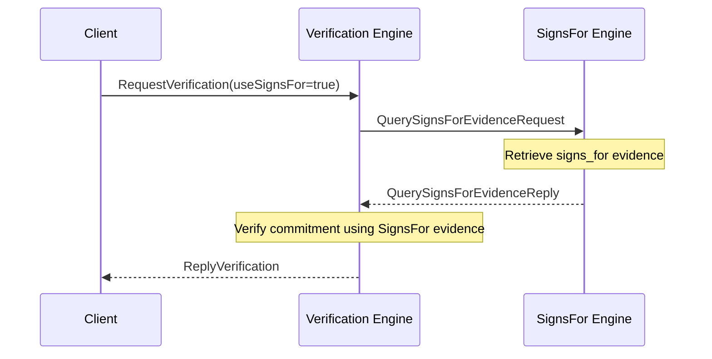

??? quote "Juvix imports"

    ```juvix
    module arch.node.engines.verification_messages;
    import prelude open;
    import arch.node.types.identities open;
    ```

# Verification Messages

## Message interface

--8<-- "./verification_messages.juvix.md:VerificationMsg"

## Message sequence diagrams

---

---

### Verification sequence (without `signs_for` evidence)

<!-- --8<-- [start:message-sequence-diagram-no-signs-for] -->
<figure markdown="span">


<figcaption markdown="span">
Sequence diagram for verification (no `signs_for` evidence).
</figcaption>
</figure>
<!-- --8<-- [end:message-sequence-diagram-no-signs-for] -->

---

### Verification sequence (with `signs_for` evidence)

<!-- --8<-- [start:message-sequence-diagram-signs-for] -->
<figure markdown="span">



<figcaption markdown="span">
Sequence diagram for verification (with `signs_for` evidence).
</figcaption>
</figure>
<!-- --8<-- [end:message-sequence-diagram-signs-for] -->

---

## Message types

---

### `RequestVerification`

```juvix
type RequestVerification := mkRequestVerification {
  data : Signable;
  commitment : Commitment;
  externalIdentity : ExternalIdentity;
  useSignsFor : Bool
};
```

A `RequestVerification` instructs the Verification Engine to verify a commitment
(signature) from a particular external identity, possibly using known
`signs_for` relationships.

???+ quote "Arguments"

    `data`:
    : The data that was signed.

    `commitment`:
    : The commitment (signature) to verify.

    `externalIdentity`:
    : The external identity that supposedly made the commitment.

    `useSignsFor`:
    : Whether or not to use known `signs_for` relationships.

---

### `ReplyVerification`

```juvix
type ReplyVerification := mkReplyVerification {
  result : Bool;
  err : Option String
};
```

A `ReplyVerification` contains the result of verifying a commitment in
response to a `RequestVerification`.

???+ quote "Arguments"
    `result`:
    : True if the verification succeeded, False otherwise.

    `err`:
    : An error message if verification failed.

---

### `VerificationMsg`

<!-- --8<-- [start:VerificationMsg] -->
```juvix
type VerificationMsg :=
  | MsgVerificationRequest RequestVerification
  | MsgVerificationReply ReplyVerification
  | MsgVerificationReply ReplyVerification
  ;
```
<!-- --8<-- [end:VerificationMsg] -->

## Engine components

- [[Verification Configuration]]
- [[Verification Environment]]
- [[Verification Behaviour]]


