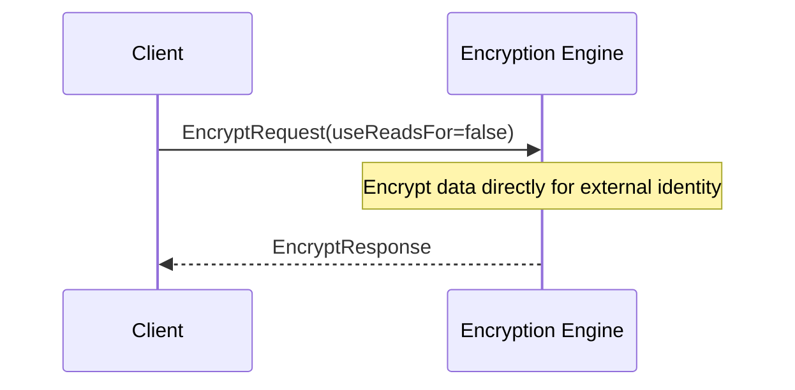
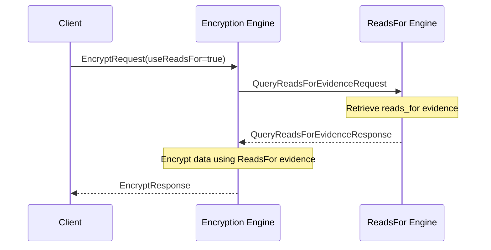

??? quote "Juvix imports"

    ```juvix
    module arch.node.engines.verification_messages;
    import prelude open;
    import arch.node.types.identities open;
    ```

# `Verification` Engine Family Overview

--8<-- "./docs/arch.node/engines/verification.juvix.md:verification-engine-family"

The Verification Engine is responsible for verifying commitments (signatures) made by external identities. It automatically uses "signs_for" relationship information from the Signs For Engine along with caller preference information to determine how to verify a commitment.

## Purpose

The Verification Engine verifies commitments (signatures) made by external identities. It can use "signs_for" relationship information and caller preferences to determine how to verify a commitment. This engine is designed to be stateless, allowing for efficient implementation by the runtime.

## Message interface

<!-- --8<-- [start:VerificationMsg] -->
```juvix
type VerificationMsg :=
  | -- --8<-- [start:VerifyRequest]
    VerifyRequest {
      data : Signable;
      commitment : Commitment;
      externalIdentity : ExternalIdentity;
      useSignsFor : Bool
    }
    -- --8<-- [end:VerifyRequest]
  | -- --8<-- [start:VerifyResponse]
    VerifyResponse {
      result : Bool;
      err : Option String
    }
    -- --8<-- [end:VerifyResponse]
  ;
```
<!-- --8<-- [end:VerificationMsg] -->

### `VerifyRequest` message

!!! quote "VerifyRequest"

    ```
    --8<-- "./verification_messages.juvix.md:VerifyRequest"
    ```

A `VerifyRequest` instructs the Verification Engine to verify a commitment (signature) from a particular external identity, possibly using known signs_for relationships.

- `commitment`: The commitment (signature) to verify.
- `data`: The data that was signed.
- `externalIdentity`: The external identity that supposedly made the commitment.
- `useSignsFor`: Whether or not to use known `signs_for` relationships.

### `VerifyResponse` message

!!! quote "VerifyResponse"

    ```
    --8<-- "./verification_messages.juvix.md:VerifyResponse"
    ```

A `VerifyResponse` contains the result of verifying a commitment in response to a VerifyRequest.

- `result`: True if the verification succeeded, False otherwise.
- `err`: An error message if verification failed.

## Message sequence diagrams

### Verification Sequence (Without SignsFor evidence)

<!-- --8<-- [start:message-sequence-diagram-no-signs-for] -->
<figure markdown="span">



<figcaption markdown="span">
Sequence diagram for encryption (no signs for).
</figcaption>
</figure>
<!-- --8<-- [end:message-sequence-diagram-no-signs-for] -->

### Verification Sequence (With SignsFor evidence)

<!-- --8<-- [start:message-sequence-diagram-signs-for] -->
<figure markdown="span">



<figcaption markdown="span">
Sequence diagram for encryption (signs for).
</figcaption>
</figure>
<!-- --8<-- [end:message-sequence-diagram-signs-for] -->

## Engine Components

- [[Verification Environment|`Verification` Engine Environment]]
- [[Verification Dynamics|`Verification` Engine Dynamics]]

## Useful links

