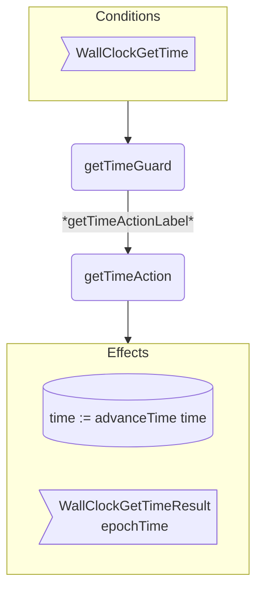

??? code "Juvix imports"

    ```juvix
    module arch.node.engines.wall_clock_behaviour;

    import arch.node.engines.wall_clock_messages open;
    import arch.node.engines.wall_clock_config open;
    import arch.node.engines.wall_clock_environment open;

    import prelude open;
    import arch.node.types.basics open;
    import arch.node.types.identities open;
    import arch.node.types.messages open;
    import arch.node.types.engine open;
    import arch.node.types.anoma as Anoma open;
    ```

# Wall Clock Behaviour


## Overview

The behavior of the Wall Clock Engine defines how it processes get time requests
and produces time results using the current wall clock time.

## Action arguments

### `MessageFrom`

<!-- --8<-- [start:MessageFrom] -->
```juvix
type MessageFrom := mkMessageFrom@{
  whoAsked : Option EngineID;
  mailbox : Option MailboxID
};
```
<!-- --8<-- [end:MessageFrom] -->

???+ code "Arguments"

    `whoAsked`:
    : The engine ID of the requester.

    `mailbox`:
    : The mailbox ID where the response message should be sent.

### `WallClockActionArgument`

<!-- --8<-- [start:WallClockActionArgument] -->
```juvix
type WallClockActionArgument :=
  | WallClockActionArgumentFrom MessageFrom;
```
<!-- --8<-- [end:WallClockActionArgument] -->

### `WallClockActionArguments`

<!-- --8<-- [start:wall-clock-action-arguments] -->
```juvix
WallClockActionArguments : Type := List WallClockActionArgument;
```
<!-- --8<-- [end:wall-clock-action-arguments] -->


## Actions

??? code "Auxiliary Juvix code"

    ### WallClockAction

    <!-- --8<-- [start:WallClockAction] -->
    ```juvix
    WallClockAction : Type :=
      Action
        WallClockCfg
        WallClockLocalState
        WallClockMailboxState
        WallClockTimerHandle
        WallClockActionArguments
        Anoma.Msg
        Anoma.Cfg
        Anoma.Env;
    ```
    <!-- --8<-- [end:WallClockAction] -->

    ### WallClockActionInput

    <!-- --8<-- [start:WallClockActionInput] -->
    ```juvix
    WallClockActionInput : Type :=
      ActionInput
        WallClockCfg
        WallClockLocalState
        WallClockMailboxState
        WallClockTimerHandle
        WallClockActionArguments
        Anoma.Msg;
    ```
    <!-- --8<-- [end:WallClockActionInput] -->

    ### `WallClockActionEffect`

    <!-- --8<-- [start:WallClockActionEffect] -->
    ```juvix
    WallClockActionEffect : Type :=
      ActionEffect
        WallClockLocalState
        WallClockMailboxState
        WallClockTimerHandle
        Anoma.Msg
        Anoma.Cfg
        Anoma.Env;
    ```
    <!-- --8<-- [end:WallClockActionEffect] -->

    ### `WallClockActionExec`

    <!-- --8<-- [start:WallClockActionExec] -->
    ```juvix
    WallClockActionExec : Type :=
      ActionExec
        WallClockCfg
        WallClockLocalState
        WallClockMailboxState
        WallClockTimerHandle
        WallClockActionArguments
        Anoma.Msg
        Anoma.Cfg
        Anoma.Env;
    ```
    <!-- --8<-- [end:WallClockActionExec] -->

### `getTimeAction`

Return the current wall clock time.

State update
: Time will have advanced.

Messages to be sent
: A `WallClockGetTimeResult` message with the current time.

Engines to be spawned
: No engine is created by this action.

Timer updates
: No timers are set or cancelled.

<!-- --8<-- [start:getTimeAction] -->
```juvix
getTimeAction
  (input : WallClockActionInput)
  : Option WallClockActionEffect :=
  let
    cfg := ActionInput.cfg input;
    env := ActionInput.env input;
    trigger := ActionInput.trigger input;
    currentTime := WallClockLocalState.currentTime (EngineEnv.localState env);
    newTime := advanceTime currentTime;
  in
    case getEngineMsgFromTimestampedTrigger trigger of {
    | some emsg :=
      some mkActionEffect@{
        env := env@EngineEnv{
          localState := mkWallClockLocalState@{
            currentTime := newTime
          }
        };
        msgs := [
          mkEngineMsg@{
            sender := getEngineIDFromEngineCfg cfg;
            target := EngineMsg.sender emsg;
            mailbox := some 0;
            msg :=
              Anoma.MsgWallClock
                (WallClockGetTimeResult
                  mkTimeResult@{
                    epochTime := newTime
                  })
          }
        ];
        timers := [];
        engines := [];
      }
    | _ := none
    };
```
<!-- --8<-- [end:getTimeAction] -->

## Action Labels

### `getTimeActionLabel`

```juvix
getTimeActionLabel : WallClockActionExec := Seq [ getTimeAction ];
```

## Guards

??? code "Auxiliary Juvix code"

    ### `WallClockGuard`

    <!-- --8<-- [start:WallClockGuard] -->
    ```juvix
    WallClockGuard : Type :=
      Guard
        WallClockCfg
        WallClockLocalState
        WallClockMailboxState
        WallClockTimerHandle
        WallClockActionArguments
        Anoma.Msg
        Anoma.Cfg
        Anoma.Env;
    ```
    <!-- --8<-- [end:WallClockGuard] -->

    ### `WallClockGuardOutput`

    <!-- --8<-- [start:WallClockGuardOutput] -->
    ```juvix
    WallClockGuardOutput : Type :=
      GuardOutput
        WallClockCfg
        WallClockLocalState
        WallClockMailboxState
        WallClockTimerHandle
        WallClockActionArguments
        Anoma.Msg
        Anoma.Cfg
        Anoma.Env;
    ```
    <!-- --8<-- [end:WallClockGuardOutput] -->

    ### `WallClockGuardEval`

    <!-- --8<-- [start:WallClockGuardEval] -->
    ```juvix
    WallClockGuardEval : Type :=
      GuardEval
        WallClockCfg
        WallClockLocalState
        WallClockMailboxState
        WallClockTimerHandle
        WallClockActionArguments
        Anoma.Msg
        Anoma.Cfg
        Anoma.Env;
    ```
    <!-- --8<-- [end:WallClockGuardEval] -->

### `getTimeGuard`

Condition
: Message type is `WallClockGetTime`.

<!-- --8<-- [start:getTimeGuard] -->
```juvix
getTimeGuard
  (trigger : TimestampedTrigger WallClockTimerHandle Anoma.Msg)
  (cfg : EngineCfg WallClockCfg)
  (env : WallClockEnv)
  : Option WallClockGuardOutput :=
  case getEngineMsgFromTimestampedTrigger trigger of {
    | some mkEngineMsg@{
        msg := Anoma.MsgWallClock WallClockGetTime;
      } := some mkGuardOutput@{
        action := getTimeActionLabel;
        args := [];
      }
    | _ := none
    };
```
<!-- --8<-- [end:getTimeGuard] -->

## The Wall Clock behaviour

### `WallClockBehaviour`

<!-- --8<-- [start:WallClockBehaviour] -->
```juvix
WallClockBehaviour : Type :=
  EngineBehaviour
    WallClockCfg
    WallClockLocalState
    WallClockMailboxState
    WallClockTimerHandle
    WallClockActionArguments
    Anoma.Msg
    Anoma.Cfg
    Anoma.Env;
```
<!-- --8<-- [end:WallClockBehaviour] -->

#### Instantiation

<!-- --8<-- [start:wallClockBehaviour] -->
```juvix
wallClockBehaviour : WallClockBehaviour :=
  mkEngineBehaviour@{
    guards := First [
      getTimeGuard
    ];
  };
```
<!-- --8<-- [end:wallClockBehaviour] -->


## Wall Clock Action Flowchart

### `getTime` Flowchart

<figure markdown>



<figcaption markdown="span">

`getTime` flowchart

</figcaption>
</figure>
