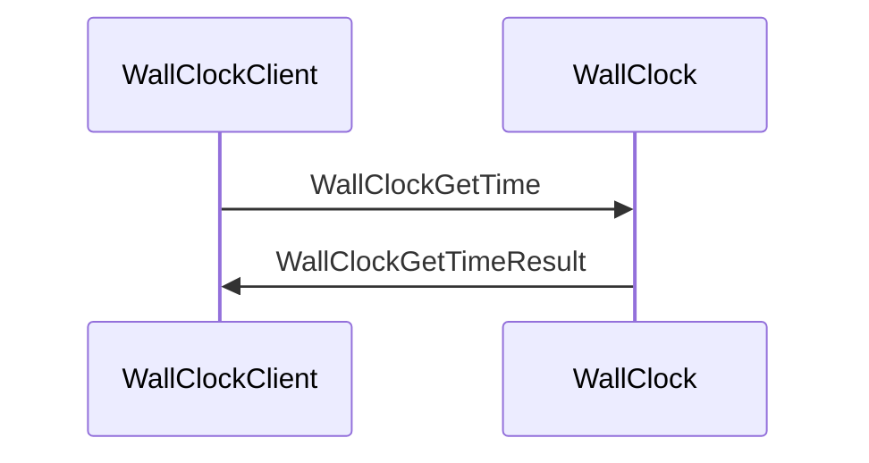

??? quote "Juvix imports"

    ```juvix
    module arch.node.engines.wall_clock_messages;
    import prelude open;
    ```

# Wall Clock Messages

These are the messages that the Wall Clock engine can receive/respond to.

## Message Interface

??? quote "Auxiliary Juvix code"

    ```juvix
    syntax alias StorageKey := String;
    syntax alias StorageValue := String;
    syntax alias EpochTimestamp := Nat;
    ```

### `WallClockGetTime`

A `WallClockGetTime` message tracks and manages time within the
local computing environment. This message doesn't require any
arguments.

### `WallClockGetTimeResult TimeResult`

Response to a `WallClockGetTime` request.

<!-- --8<-- [start:TimeResult] -->
```juvix
type TimeResult : Type :=
  mkTimeResult {
    epochTime : EpochTimestamp;
  }
```
<!-- --8<-- [end:TimeResult] -->

???+ quote "Arguments"

    `epochTime`
    : The current time in epoch format (seconds/milliseconds since epoch)

### `WallClockMsg`

<!-- --8<-- [start:WallClockMsg] -->
```juvix
type WallClockMsg :=
  | WallClockGetTime
  | WallClockGetTimeResult TimeResult
  ;
```
<!-- --8<-- [end:WallClockMsg] -->

## Message Flow

### Wall Clock Request & Response

<!-- --8<-- [start:message-sequence-diagram-gettime] -->
<figure markdown="span">



<figcaption markdown="span">
Sequence Diagram: Wall Clock Time Request & Response
</figcaption>
</figure>
<!-- --8<-- [end:message-sequence-diagram-gettime] -->
