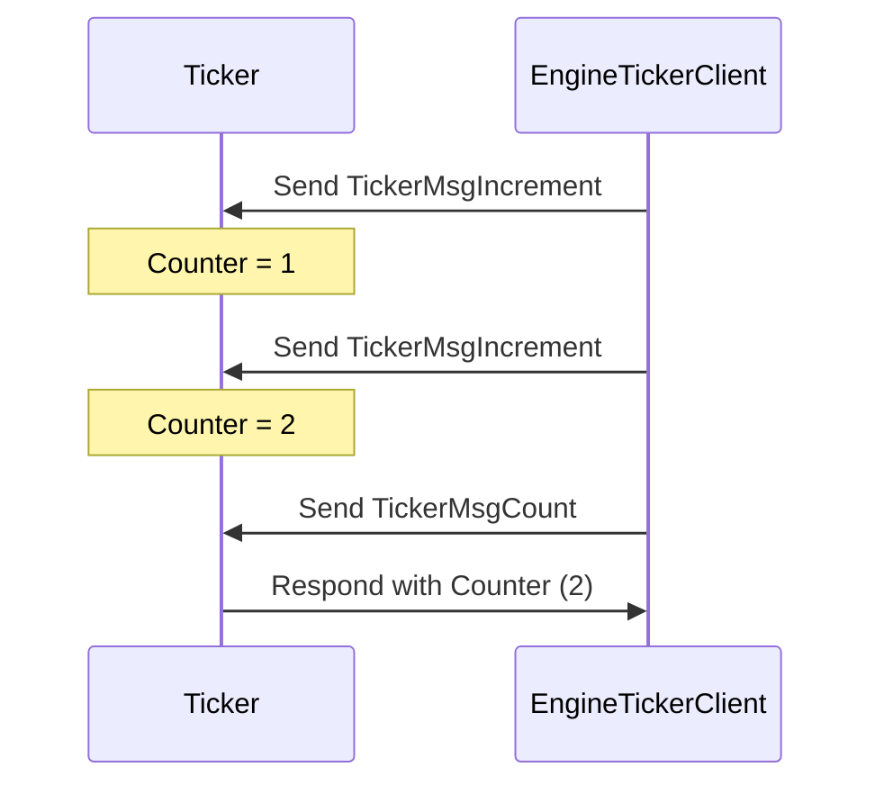

??? quote "Juvix imports"

    ```juvix
    module arch.node.example.ticker_messages;
    import prelude open;
    ```

# TickerMsg Message Interface

## TickerMsg Message Constructors

### `TickerMsgIncrement`

A `TickerMsgIncrement` message instructs the engine to increase the counter.
This message doesn't require any arguments.

### `TickerMsgCountRequest`

A `TickerMsgCountRequest` message requests the engine to send the current counter value back to
the requester. This message doesn't require any arguments.

### `TickerMsgCountReply CountReply`

The `TickerMsgCountReply` contains the counter value.

```juvix
type CountReply : Type :=
  mkCountReply {
    counter : Nat;
  }
```

### `TickerMsg`

<!-- --8<-- [start:TickerMsg] -->
```juvix
type TickerMsg :=
  | TickerMsgIncrement
  | TickerMsgCountRequest
  | TickerMsgCountReply CountReply
```
<!-- --8<-- [end:TickerMsg] -->

There are only two message tags: `TickerMsgIncrement`, which increases the counter
state of the ticker, and `TickerMsgCount`, which the ticker responds to with the current
counter state.

## Ticker Interaction Diagram

This diagram represents a simple interaction between a `Ticker` engine instance
and another entity sending increment requests and count requests.

<!-- --8<-- [start:message-sequence-diagram] -->
<figure markdown="span">



<figcaption markdown="span">
A client interacts with the `Ticker` engine, which increments and responds with the counter value.
</figcaption>
</figure>
