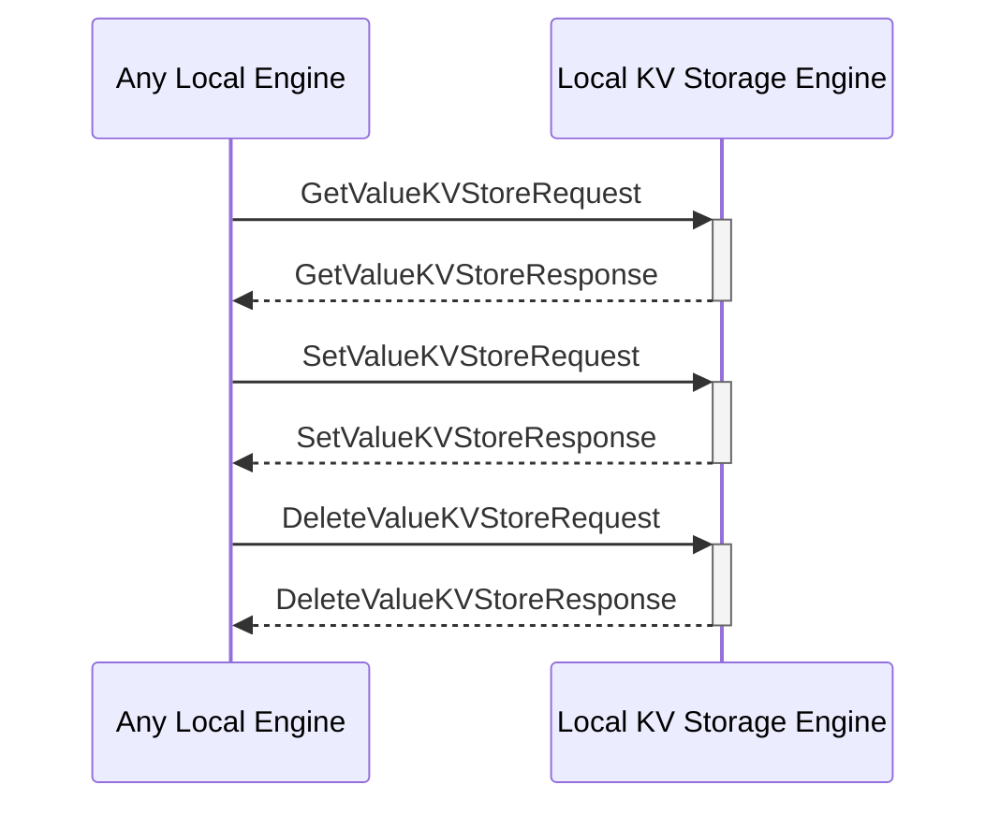

# Local Key-Value Storage Engine

## Purpose

The *Local Key-Value Storage Engine* provides the local storage and retrieval of data in a key-value format.

## State

## Messages received

### [[GetValueKVStoreRequest#getvaluekvstorerequest]]

--8<-- "local_kv_storage_engine/messages/get_value_kv_store_request.md:purpose"

--8<-- "local_kv_storage_engine/messages/get_value_kv_store_request.md:type"

### [[SetValueKVStoreRequest#setvaluekvstorerequest]]

--8<-- "local_kv_storage_engine/messages/set_value_kv_store_request.md:purpose"

--8<-- "local_kv_storage_engine/messages/set_value_kv_store_request.md:type"

### [[DeleteValueKVStoreRequest#deletevaluekvstorerequest]]

--8<-- "local_kv_storage_engine/messages/delete_value_kv_store_request.md:purpose"

--8<-- "local_kv_storage_engine/messages/delete_value_kv_store_request.md:type"

## Notifications sent

### [[ValueChangedKVStore#valuechangedkvstore]]

--8<-- "local_kv_storage_engine/notifications/value_changed_kv_store.md:purpose"

--8<-- "local_kv_storage_engine/notifications/value_changed_kv_store.md:type"

## Message Flow

 <!-- --8<-- [start:messages] -->

 <!-- --8<-- [end:messages] -->

