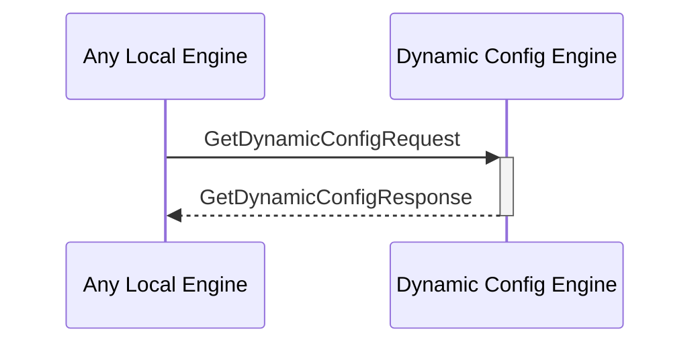

# DeleteValueKVStoreResponse

## Purpose

<!-- --8<-- [start:purpose] -->
Response to [[DeleteValueKVStoreRequest#deletevaluekvstorerequest]].
<!-- --8<-- [end:purpose] -->

## Type

<!-- --8<-- [start:type] -->
**Reception:**

[[DeleteValueKVStoreRequestV1#deletevaluekvstorerequestv1]]

--8<-- "../types/delete_value_kv_store_response_v1.md:type"

**Triggers**

<!-- --8<-- [end:type] -->

## Behaviour

<!-- --8<-- [start:behaviour] -->
After deleting the KV-pair from the KV-store, send a message indicating the success or failure of the operation.
<!-- --8<-- [end:behaviour] -->

## Message Flow

<!-- --8<-- [start:messages] -->

<!-- --8<-- [end:messages] -->

