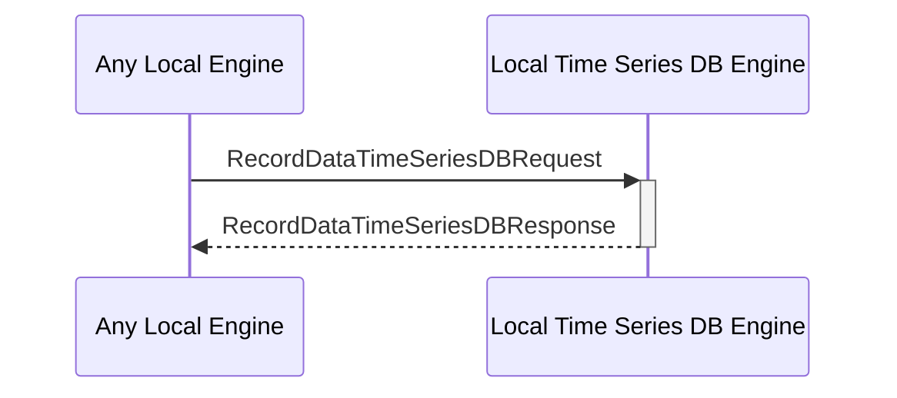

# RecordDataTimeSeriesDBRequest

## Purpose

<!-- --8<-- [start:purpose] -->
Add time series data to the DB.
<!-- --8<-- [end:purpose] -->

## Type

<!-- --8<-- [start:type] -->
**Reception:**

[[RecordDataTimeSeriesDBRequestV1#recorddatatimeseriesdbrequestv1]]

--8<-- "../types/record_data_time_series_db_request_v1.md:type"

**Triggers**

[[RecordDataTimeSeriesDBResponseV1#recorddatatimeseriesdbresponsev1]]

--8<-- "../types/record_data_time_series_db_response_v1.md:type"

<!-- --8<-- [end:type] -->

## Behaviour

<!-- --8<-- [start:behaviour] -->
Add time series data to the time series DB.
<!-- --8<-- [end:behaviour] -->

## Message Flow

<!-- --8<-- [start:messages] -->

<!-- --8<-- [end:messages] -->

