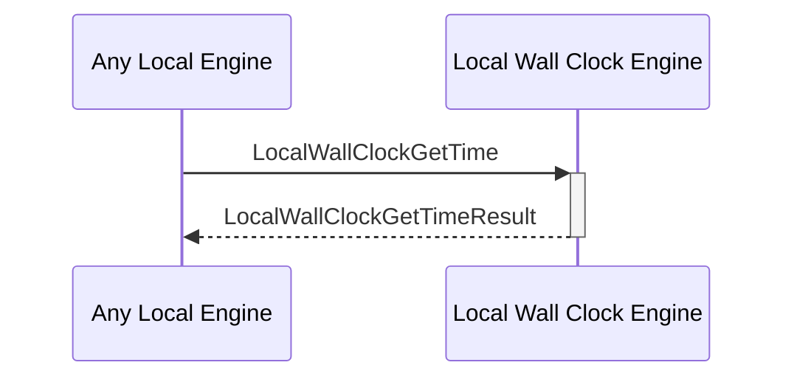

# LocalWallClockGetTimeResult

## Purpose

<!-- --8<-- [start:purpose] -->
Response to a [[LocalWallClockGetTime#localwallclockgettime]] request.
<!-- --8<-- [end:purpose] -->

## Type

<!-- --8<-- [start:type] -->
**Reception:**

[[LocalWallClockGetTimeResultV1#localwallclockgettimeresultv1]]

--8<-- "../types/local_wall_clock_get_time_result_v1.md:type"

**Triggers**

<!-- --8<-- [end:type] -->

## Behaviour

<!-- --8<-- [start:behaviour] -->
Give the current time according to the physical machine's internal clock system.
<!-- --8<-- [end:behaviour] -->

## Message Flow

<!-- --8<-- [start:messages] -->

<!-- --8<-- [end:messages] -->

