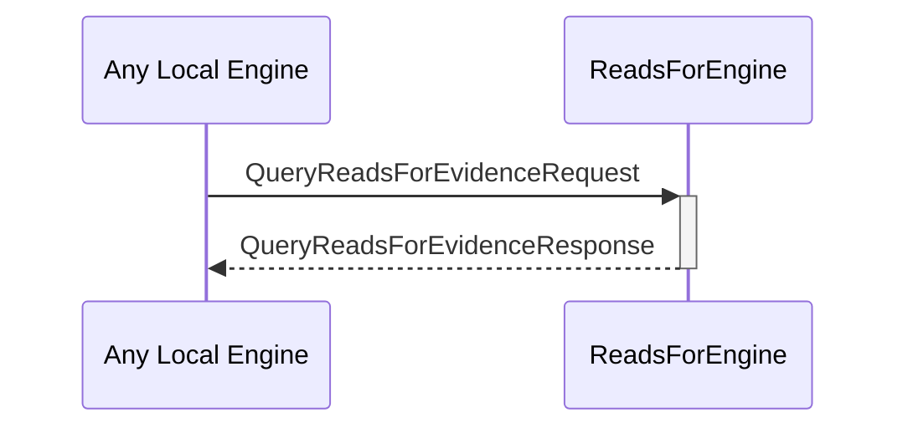

# QueryReadsForEvidenceRequest

# QueryReadsForEvidenceResponse

## Purpose

<!-- --8<-- [start:purpose] -->
A `QueryReadsForEvidenceRequest` instructs the reads_for engine to read and return the known reads_for evidence associated with a specific external identity.

A `QueryReadsForEvidenceResponse` is returned by the reads_for engine in response to a [[QueryReadsForEvidenceRequest]].
<!-- --8<-- [end:purpose] -->

## Type

<!-- --8<-- [start:type] -->
[[QueryReadsForEvidenceRequest]]
[[QueryReadsForEvidenceResponse]]
<!-- --8<-- [end:type] -->

## Behaviour

<!-- --8<-- [start:behaviour] -->
- Returns known evidence in a [[QueryReadsForEvidenceResponse]]
<!-- --8<-- [end:behaviour] -->

## Message flow

<!-- --8<-- [start:messages] -->

<!-- --8<-- [end:messages] -->

