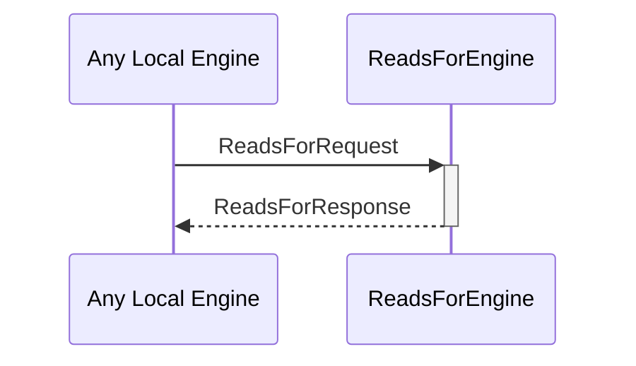

# ReadsForRequest

# ReadsForResponse

## Purpose

<!-- --8<-- [start:purpose] -->
A `ReadsForRequest` asks the reads_for engine whether one identity can read for another.

A `ReadsForResponse` is returned in response to a [[ReadsForRequest]]
<!-- --8<-- [end:purpose] -->

## Type

<!-- --8<-- [start:type] -->
[[ReadsForRequest]]
[[ReadsForResponse]]
<!-- --8<-- [end:type] -->

## Behaviour

<!-- --8<-- [start:behaviour] -->
- Returns a [[ReadsForResponse]] according to whether A `readsFor` B, given the known evidence
<!-- --8<-- [end:behaviour] -->

## Message flow

<!-- --8<-- [start:messages] -->

<!-- --8<-- [end:messages] -->

