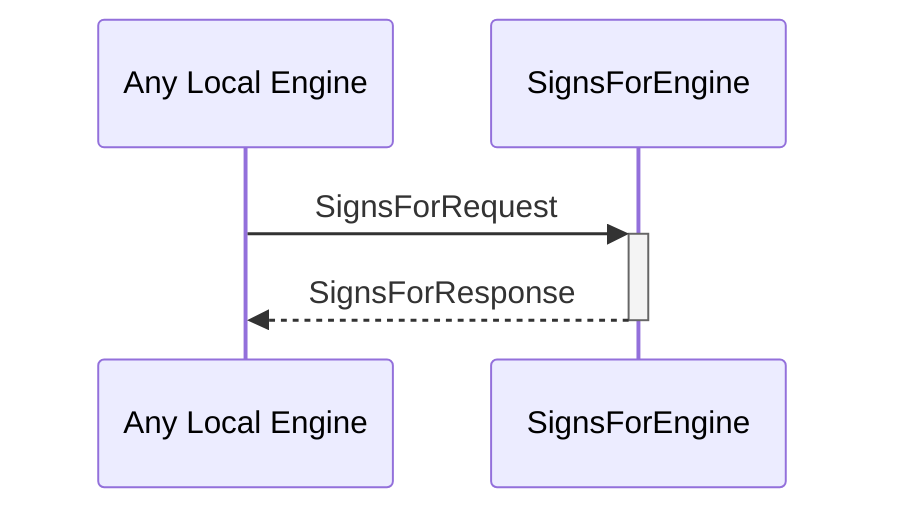

# SignsForRequest

# SignsForResponse

## Purpose

<!-- --8<-- [start:purpose] -->
A `SignsForRequest` asks the signs_for engine whether one identity can signs for another.

A `SignsForResponse` is returned in response to a [[SignsForRequest]]
<!-- --8<-- [end:purpose] -->

## Type

<!-- --8<-- [start:type] -->
[[SignsForRequest]]
[[SignsForResponse]]
<!-- --8<-- [end:type] -->

## Behaviour

<!-- --8<-- [start:behaviour] -->
- Returns a [[SignsForResponse]] according to whether A `signsFor` B, given the known evidence
<!-- --8<-- [end:behaviour] -->

## Message flow

<!-- --8<-- [start:messages] -->

<!-- --8<-- [end:messages] -->

