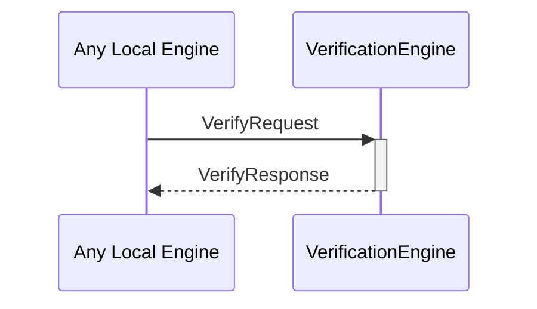

# VerifyRequest

# VerifyResponse

## Purpose

<!-- --8<-- [start:purpose] -->
A `VerifyRequest` instructs a verification engine to verify a commitment from a particular external identity, possibly using known signs_for relationships.

A `VerifyResponse` contains the result of verifying a commitment in response to a [[VerifyRequest]].
<!-- --8<-- [end:purpose] -->

## Type

<!-- --8<-- [start:type] -->
- [[VerifyRequest]]
- [[VerifyResponse]]
<!-- --8<-- [end:type] -->

## Behaviour

<!-- --8<-- [start:behaviour] -->
- Calls the `verify` method on the provided external identity, commitment, and data, and returns the result in an [[VerifyResponse]]
- If `useSignsFor` is true, uses known signs_for relationships to determine whether the commitment is valid
- If `useSignsFor` is false, only allows a commitment from the identity specifically provided
<!-- --8<-- [end:behaviour] -->

## Message flow

<!-- --8<-- [start:messages] -->

<!-- --8<-- [end:messages] -->

