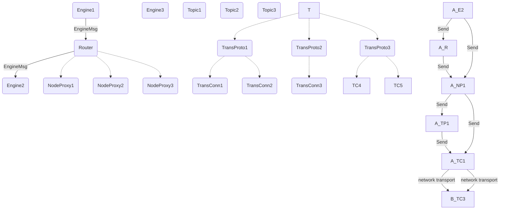

# Network Subsystem

## Purpose

The *Network Subsystem* is responsible for
sending and receiving messages to and from remote nodes.

## Overview

The *Network Subsystem* consists of the following engines.

### [[Router]]

--8<-- "./router.juvix.md:purpose"

### [[Node Proxy]]

--8<-- "./node_proxy.juvix.md:purpose"

### [[Transport Connection]]

--8<-- "./transport_connection.juvix.md:purpose"

### [[Transport Protocol]]

<!--  --8<-- "./transport_protocol.juvix.md:purpose" -->

### [[Pub/Sub Topic]]

--8<-- "./pub_sub_topic.juvix.md:purpose"

### [[Storage]]

--8<-- "./storage.juvix.md:purpose"

## Diagrams

### Spawn tree & message flow

