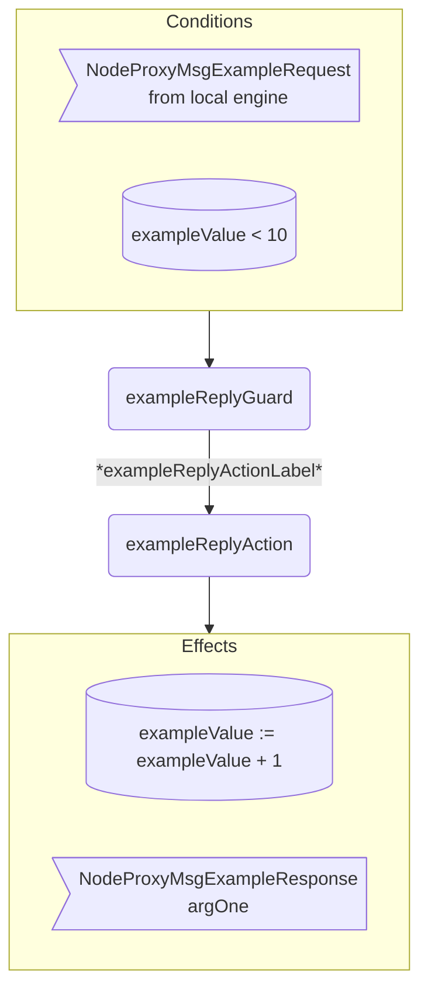

??? note "Juvix imports"

    ```juvix
    module arch.node.net.node_proxy_behaviour;

    import arch.node.net.node_proxy_messages open;
    import arch.node.net.node_proxy_config open;
    import arch.node.net.node_proxy_environment open;

    import arch.node.types.basics open;
    import arch.node.types.identities open;
    import arch.node.types.messages open;
    import arch.node.types.engine open;
    import arch.node.types.anoma as Anoma open;
    ```

# Node Proxy Behaviour

## Overview

A node proxy engine acts in the ways described on this page.
The action labels correspond to the actions that can be performed by the engine.
Using the action labels, we describe the effects of the actions.

## Action arguments

The action arguments are set by a guard
and passed to the action function as part of the `GuardOutput`.

### `NodeProxyActionArguments`

<!-- --8<-- [start:NodeProxyActionArguments] -->
```juvix
NodeProxyActionArguments : Type := Unit;
```
<!-- --8<-- [end:NodeProxyActionArguments] -->

## Actions

??? quote "Auxiliary Juvix code"

    ### `NodeProxyAction`

    <!-- --8<-- [start:NodeProxyAction] -->
    ```juvix
    NodeProxyAction : Type :=
      Action
        NodeProxyLocalCfg
        NodeProxyLocalState
        NodeProxyMailboxState
        NodeProxyTimerHandle
        NodeProxyActionArguments
        Anoma.Msg
        Anoma.Cfg
        Anoma.Env;
    ```
    <!-- --8<-- [end:NodeProxyAction] -->

    ### `NodeProxyActionInput`

    <!-- --8<-- [start:NodeProxyActionInput] -->
    ```juvix
    NodeProxyActionInput : Type :=
      ActionInput
        NodeProxyLocalCfg
        NodeProxyLocalState
        NodeProxyMailboxState
        NodeProxyTimerHandle
        NodeProxyActionArguments
        Anoma.Msg;
    ```
    <!-- --8<-- [end:NodeProxyActionInput] -->

    ### `NodeProxyActionEffect`

    <!-- --8<-- [start:NodeProxyActionEffect] -->
    ```juvix
    NodeProxyActionEffect : Type :=
      ActionEffect
        NodeProxyLocalState
        NodeProxyMailboxState
        NodeProxyTimerHandle
        Anoma.Msg
        Anoma.Cfg
        Anoma.Env;
    ```
    <!-- --8<-- [end:NodeProxyActionEffect] -->

    ### `NodeProxyActionExec`

    <!-- --8<-- [start:NodeProxyActionExec] -->
    ```juvix
    NodeProxyActionExec : Type :=
      ActionExec
        NodeProxyLocalCfg
        NodeProxyLocalState
        NodeProxyMailboxState
        NodeProxyTimerHandle
        NodeProxyActionArguments
        Anoma.Msg
        Anoma.Cfg
        Anoma.Env;
    ```
    <!-- --8<-- [end:NodeProxyActionExec] -->

#### `exampleReplyAction`

Respond with a `NodeProxyMsgExampleResponse`.

State update
: The state remains unchanged.

Messages to be sent
: A `NodeProxyMsgExampleReply` message with the data set by `exampleReplyGuard`.

Engines to be spawned
: No engine is created by this action.

Timer updates
: No timers are set or cancelled.

<!-- --8<-- [start:exampleReplyAction] -->
```juvix
exampleReplyAction
  (input : NodeProxyActionInput)
  : Option NodeProxyActionEffect :=
  TODO {-
  let
    cfg := ActionInput.cfg input;
    env := ActionInput.env input;
    trigger := ActionInput.trigger input;
    args := ActionInput.args input;
  in
    case getEngineMsgFromTimestampedTrigger trigger of {
    | some mkEngineMsg@{
        msg := Anoma.MsgNodeProxy (NodeProxyMsgExampleRequest req);
        sender := sender;
        target := target;
        mailbox := mailbox;
      } :=
      some mkActionEffect@{
        env := env;
        msgs := [
          mkEngineMsg@{
            sender := getEngineIDFromEngineCfg cfg;
            target := sender;
            mailbox := some 0;
            msg :=
              Anoma.MsgNodeProxy
                (NodeProxyMsgExampleReply
                  (ok mkExampleReplyOk@{
                    argOne := ExampleRequest.argOne req;
                  }));
          }
        ];
        timers := [];
        engines := [];
      }
  | _ := none
  -};
```
<!-- --8<-- [end:exampleReplyAction] -->

## Action Labels

### `exampleReplyActionLabel`

```juvix
exampleReplyActionLabel : NodeProxyActionExec := Seq [ exampleReplyAction ];
```

## Guards

??? quote "Auxiliary Juvix code"

    ### `NodeProxyGuard`

    <!-- --8<-- [start:NodeProxyGuard] -->
    ```juvix
    NodeProxyGuard : Type :=
      Guard
        NodeProxyLocalCfg
        NodeProxyLocalState
        NodeProxyMailboxState
        NodeProxyTimerHandle
        NodeProxyActionArguments
        Anoma.Msg
        Anoma.Cfg
        Anoma.Env;
    ```
    <!-- --8<-- [end:NodeProxyGuard] -->

    ### `NodeProxyGuardOutput`

    <!-- --8<-- [start:NodeProxyGuardOutput] -->
    ```juvix
    NodeProxyGuardOutput : Type :=
      GuardOutput
        NodeProxyLocalCfg
        NodeProxyLocalState
        NodeProxyMailboxState
        NodeProxyTimerHandle
        NodeProxyActionArguments
        Anoma.Msg
        Anoma.Cfg
        Anoma.Env;
    ```
    <!-- --8<-- [end:NodeProxyGuardOutput] -->

    ### `NodeProxyGuardEval`

    <!-- --8<-- [start:NodeProxyGuardEval] -->
    ```juvix
    NodeProxyGuardEval : Type :=
      GuardEval
        NodeProxyLocalCfg
        NodeProxyLocalState
        NodeProxyMailboxState
        NodeProxyTimerHandle
        NodeProxyActionArguments
        Anoma.Msg
        Anoma.Cfg
        Anoma.Env;
    ```
    <!-- --8<-- [end:NodeProxyGuardEval] -->

### `exampleReplyGuard`

Guard description (optional).

Condition
: Message type is `NodeProxyMsgExampleRequest`.

<!-- --8<-- [start:exampleReplyGuard] -->
```juvix
exampleReplyGuard
  (trigger : NodeProxyTimestampedTrigger)
  (cfg : NodeProxyCfg)
  (env : NodeProxyEnv)
  : Option NodeProxyGuardOutput :=
  TODO {-
  case getEngineMsgFromTimestampedTrigger trigger of {
    | some mkEngineMsg@{
        msg := Anoma.MsgNodeProxy (NodeProxyMsgExampleRequest req);
        sender := mkPair none _; -- from local engines only (NodeID is none)
      } := some mkGuardOutput@{
        action := exampleReplyActionLabel;
        args := [];
      }
    | _ := none
  -};
```
<!-- --8<-- [end:exampleReplyGuard] -->

## The Node Proxy behaviour

### `NodeProxyBehaviour`

<!-- --8<-- [start:NodeProxyBehaviour] -->
```juvix
NodeProxyBehaviour : Type :=
  EngineBehaviour
    NodeProxyLocalCfg
    NodeProxyLocalState
    NodeProxyMailboxState
    NodeProxyTimerHandle
    NodeProxyActionArguments
    Anoma.Msg
    Anoma.Cfg
    Anoma.Env;
```
<!-- --8<-- [end:NodeProxyBehaviour] -->

#### Instantiation

<!-- --8<-- [start:nodeProxyBehaviour] -->
```juvix
module node_proxy_behaviour_example;

nodeProxyBehaviour : NodeProxyBehaviour :=
  mkEngineBehaviour@{
    guards :=
      First [
        exampleReplyGuard;
      ];
  };

end;
```
<!-- --8<-- [end:nodeProxyBehaviour] -->

## Node Proxy Action Flowchart

### `exampleReply` Flowchart

<figure markdown>



<figcaption markdown="span">

`exampleReply` flowchart

</figcaption>
</figure>
