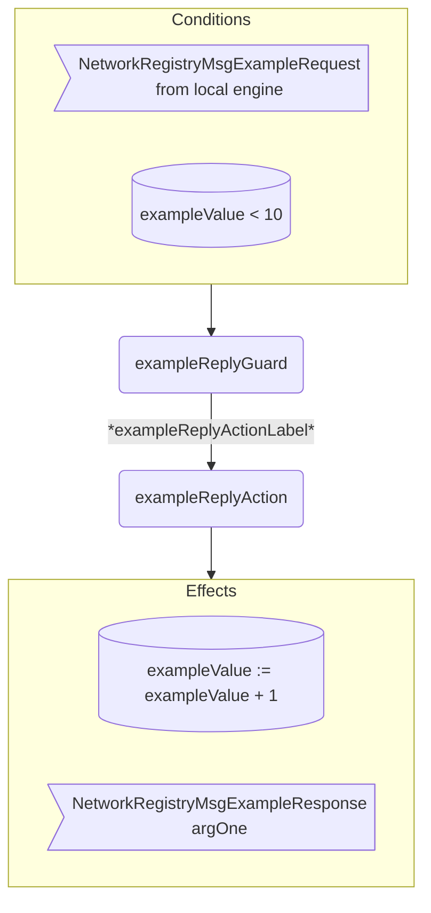

??? note "Juvix imports"

    ```juvix
    module arch.node.net.registry_behaviour;

    import arch.node.net.registry_messages open;
    import arch.node.net.registry_config open;
    import arch.node.net.registry_environment open;

    import arch.node.types.basics open;
    import arch.node.types.identities open;
    import arch.node.types.messages open;
    import arch.node.types.engine open;
    import arch.node.types.anoma as Anoma open;
    ```

# Network Registry Behaviour

## Overview

A *Network Registry* engine acts in the ways described on this page.
The action labels correspond to the actions that can be performed by the engine.
Using the action labels, we describe the effects of the actions.

## Action arguments

The action arguments are set by a guard
and passed to the action function as part of the `GuardOutput`.

### `NetworkRegistryActionArguments`

<!-- --8<-- [start:NetworkRegistryActionArguments] -->
```juvix
NetworkRegistryActionArguments : Type := Unit;
```
<!-- --8<-- [end:NetworkRegistryActionArguments] -->

## Actions

??? quote "Auxiliary Juvix code"

    ### `NetworkRegistryAction`

    <!-- --8<-- [start:NetworkRegistryAction] -->
    ```juvix
    NetworkRegistryAction : Type :=
      Action
        NetworkRegistryLocalCfg
        NetworkRegistryLocalState
        NetworkRegistryMailboxState
        NetworkRegistryTimerHandle
        NetworkRegistryActionArguments
        Anoma.Msg
        Anoma.Cfg
        Anoma.Env;
    ```
    <!-- --8<-- [end:NetworkRegistryAction] -->

    ### `NetworkRegistryActionInput`

    <!-- --8<-- [start:NetworkRegistryActionInput] -->
    ```juvix
    NetworkRegistryActionInput : Type :=
      ActionInput
        NetworkRegistryLocalCfg
        NetworkRegistryLocalState
        NetworkRegistryMailboxState
        NetworkRegistryTimerHandle
        NetworkRegistryActionArguments
        Anoma.Msg;
    ```
    <!-- --8<-- [end:NetworkRegistryActionInput] -->

    ### `NetworkRegistryActionEffect`

    <!-- --8<-- [start:NetworkRegistryActionEffect] -->
    ```juvix
    NetworkRegistryActionEffect : Type :=
      ActionEffect
        NetworkRegistryLocalState
        NetworkRegistryMailboxState
        NetworkRegistryTimerHandle
        Anoma.Msg
        Anoma.Cfg
        Anoma.Env;
    ```
    <!-- --8<-- [end:NetworkRegistryActionEffect] -->

    ### `NetworkRegistryActionExec`

    <!-- --8<-- [start:NetworkRegistryActionExec] -->
    ```juvix
    NetworkRegistryActionExec : Type :=
      ActionExec
        NetworkRegistryLocalCfg
        NetworkRegistryLocalState
        NetworkRegistryMailboxState
        NetworkRegistryTimerHandle
        NetworkRegistryActionArguments
        Anoma.Msg
        Anoma.Cfg
        Anoma.Env;
    ```
    <!-- --8<-- [end:NetworkRegistryActionExec] -->

#### `exampleReplyAction`

Respond with a `NetworkRegistryMsgExampleResponse`.

State update
: The state remains unchanged.

Messages to be sent
: A `NetworkRegistryMsgExampleReply` message with the data set by `exampleReplyGuard`.

Engines to be spawned
: No engine is created by this action.

Timer updates
: No timers are set or cancelled.

<!-- --8<-- [start:exampleReplyAction] -->
```juvix
exampleReplyAction
  (input : NetworkRegistryActionInput)
  : Option NetworkRegistryActionEffect :=
  TODO {-
  let
    cfg := ActionInput.cfg input;
    env := ActionInput.env input;
    trigger := ActionInput.trigger input;
    args := ActionInput.args input;
  in
    case getEngineMsgFromTimestampedTrigger trigger of {
    | some mkEngineMsg@{
        msg := Anoma.MsgNetworkRegistry (NetworkRegistryMsgExampleRequest req);
        sender := sender;
        target := target;
        mailbox := mailbox;
      } :=
      some mkActionEffect@{
        env := env;
        msgs := [
          mkEngineMsg@{
            sender := getEngineIDFromEngineCfg cfg;
            target := sender;
            mailbox := some 0;
            msg :=
              Anoma.MsgNetworkRegistry
                (NetworkRegistryMsgExampleReply
                  (ok mkExampleReplyOk@{
                    argOne := ExampleRequest.argOne req;
                  }));
          }
        ];
        timers := [];
        engines := [];
      }
  | _ := none
  -};
```
<!-- --8<-- [end:exampleReplyAction] -->

## Action Labels

### `exampleReplyActionLabel`

```juvix
exampleReplyActionLabel : NetworkRegistryActionExec := Seq [ exampleReplyAction ];
```

## Guards

??? quote "Auxiliary Juvix code"

    ### `NetworkRegistryGuard`

    <!-- --8<-- [start:NetworkRegistryGuard] -->
    ```juvix
    NetworkRegistryGuard : Type :=
      Guard
        NetworkRegistryLocalCfg
        NetworkRegistryLocalState
        NetworkRegistryMailboxState
        NetworkRegistryTimerHandle
        NetworkRegistryActionArguments
        Anoma.Msg
        Anoma.Cfg
        Anoma.Env;
    ```
    <!-- --8<-- [end:NetworkRegistryGuard] -->

    ### `NetworkRegistryGuardOutput`

    <!-- --8<-- [start:NetworkRegistryGuardOutput] -->
    ```juvix
    NetworkRegistryGuardOutput : Type :=
      GuardOutput
        NetworkRegistryLocalCfg
        NetworkRegistryLocalState
        NetworkRegistryMailboxState
        NetworkRegistryTimerHandle
        NetworkRegistryActionArguments
        Anoma.Msg
        Anoma.Cfg
        Anoma.Env;
    ```
    <!-- --8<-- [end:NetworkRegistryGuardOutput] -->

    ### `NetworkRegistryGuardEval`

    <!-- --8<-- [start:NetworkRegistryGuardEval] -->
    ```juvix
    NetworkRegistryGuardEval : Type :=
      GuardEval
        NetworkRegistryLocalCfg
        NetworkRegistryLocalState
        NetworkRegistryMailboxState
        NetworkRegistryTimerHandle
        NetworkRegistryActionArguments
        Anoma.Msg
        Anoma.Cfg
        Anoma.Env;
    ```
    <!-- --8<-- [end:NetworkRegistryGuardEval] -->

### `exampleReplyGuard`

Guard description (optional).

Condition
: Message type is `NetworkRegistryMsgExampleRequest`.

<!-- --8<-- [start:exampleReplyGuard] -->
```juvix
exampleReplyGuard
  (trigger : NetworkRegistryTimestampedTrigger)
  (cfg : NetworkRegistryCfg)
  (env : NetworkRegistryEnv)
  : Option NetworkRegistryGuardOutput :=
  TODO {-
  case getEngineMsgFromTimestampedTrigger trigger of {
    | some mkEngineMsg@{
        msg := Anoma.MsgNetworkRegistry (NetworkRegistryMsgExampleRequest req);
        sender := mkPair none _; -- from local engines only (NodeID is none)
      } := some mkGuardOutput@{
        action := exampleReplyActionLabel;
        args := [];
      }
    | _ := none
    -};
```
<!-- --8<-- [end:exampleReplyGuard] -->

## Engine behaviour

### `NetworkRegistryBehaviour`

<!-- --8<-- [start:NetworkRegistryBehaviour] -->
```juvix
NetworkRegistryBehaviour : Type :=
  EngineBehaviour
    NetworkRegistryLocalCfg
    NetworkRegistryLocalState
    NetworkRegistryMailboxState
    NetworkRegistryTimerHandle
    NetworkRegistryActionArguments
    Anoma.Msg
    Anoma.Cfg
    Anoma.Env;
```
<!-- --8<-- [end:NetworkRegistryBehaviour] -->

#### Instantiation

<!-- --8<-- [start:exNetworkRegistryBehaviour] -->
```juvix
module registry_behaviour_example;

  exNetworkRegistryBehaviour : NetworkRegistryBehaviour :=
    mkEngineBehaviour@{
      guards :=
        First [
          exampleReplyGuard;
        ];
    };
end;
```
<!-- --8<-- [end:exNetworkRegistryBehaviour] -->

## Action Flowchart

### `exampleReply` Flowchart

<figure markdown>



<figcaption markdown="span">

`exampleReply` flowchart

</figcaption>
</figure>
