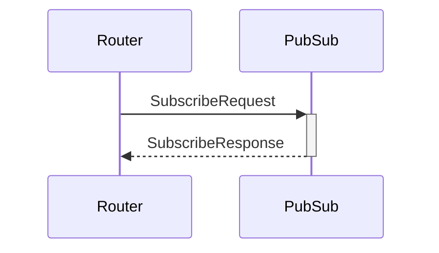

# SubscribeRequest

## Purpose

<!-- --8<-- [start:purpose] -->
Subscription request.
<!-- --8<-- [end:purpose] -->

## Type

 <!-- --8<-- [start:type] -->
**Reception:**

[[TopicRequestV1#topicrequestv1]]

--8<-- "../types/topic_request_v1.md:type"

**Triggers:**

[[TopicResponseV1#topicresponsev1]]

--8<-- "../types/topic_response_v1.md:type"
<!-- --8<-- [end:type] -->

## Behaviour

<!-- --8<-- [start:behaviour] -->
If not already subscribed, *PubSub* subscribes to the specified topic
by sending a P2P subscription request(s) to connected peers in the domain.
<!-- --8<-- [end:behaviour] -->

## Message flow

<!-- --8<-- [start:messages] -->

<!-- --8<-- [end:messages] -->

