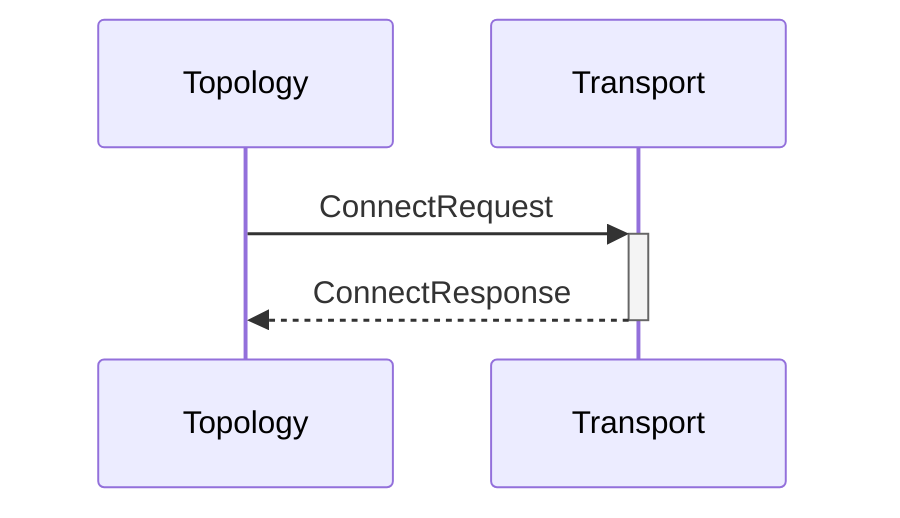

# ConnectRequest

# ConnectResponse

## Purpose

<!-- --8<-- [start:purpose] -->
Establish connection to a node.
<!-- --8<-- [end:purpose] -->

## Type

<!-- --8<-- [start:type] -->
**Reception:**

[[ConnectRequestV1#connectrequestv1]]

--8<-- "../types/connect_request_v1.md:type"

**Triggers:**

[[ConnectResponseV1#connectresponsev1]]

--8<-- "../types/connect_response_v1.md:type"
<!-- --8<-- [end:type] -->

## Behaviour

Establish connection to the specified node, if not yet connected.

## Message flow

<!-- --8<-- [start:messages] -->

<!-- --8<-- [end:messages] -->

