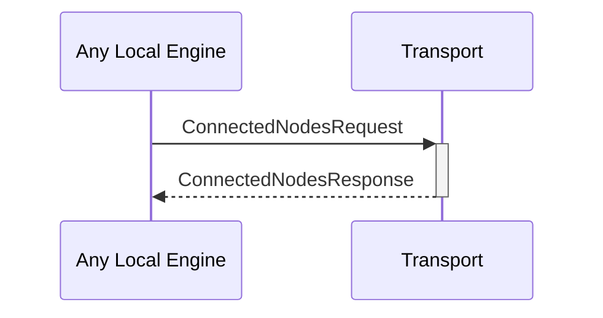

# ConnectedNodesRequest

# ConnectedNodesResponse

## Purpose

<!-- --8<-- [start:purpose] -->
Request the list of currently connected nodes.
<!-- --8<-- [end:purpose] -->

## Type

<!-- --8<-- [start:type] -->
**Reception:**

*unit*

**Triggers:**

[[ConnectedNodesResponseV1#connectednodesresponsev1]]

--8<-- "../types/connected_nodes_response_v1.md:type"
<!-- --8<-- [end:type] -->

## Behaviour

<!-- --8<-- [start:behaviour] -->
Return the list of currently connected nodes from the [[ConnectionPool#connectionpool]].
<!-- --8<-- [end:behaviour] -->

## Message flow

<!-- --8<-- [start:messages] -->

<!-- --8<-- [end:messages] -->

