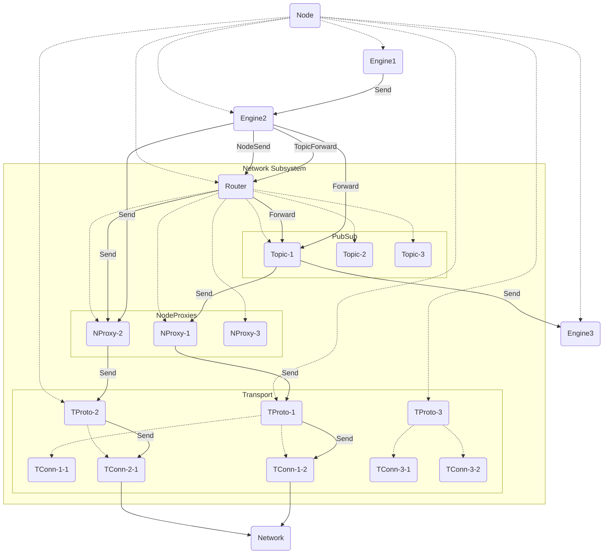

???+ code "Juvix imports"

    ```juvix
    module arch.node.subsystems.net;
    import arch.node.engines.net_registry open;
    import arch.node.engines.router open;
    import arch.node.engines.transport_connection open;
    import arch.node.engines.transport_protocol open;
    import arch.node.engines.pub_sub_topic open;
    import arch.node.engines.storage open;
    import arch.node.engines.verification open;
    ```

# Network Subsystem

## Purpose

The *Network Subsystem* is responsible for
sending and receiving messages to and from remote nodes,
and offers distributed pub/sub and storage protocols.

## Overview

The *Network Subsystem* consists of the following engines.

### [[Network Registry]]

--8<-- "./docs/arch/node/engines/net_registry.juvix.md:purpose"

### [[Router]]

--8<-- "./docs/arch/node/engines/router.juvix.md:purpose"

### [[Transport Connection]]

--8<-- "./docs/arch/node/engines/transport_connection.juvix.md:purpose"

### [[Transport Protocol]]

--8<-- "./docs/arch/node/engines/transport_protocol.juvix.md:purpose"

### [[Pub/Sub Topic]]

--8<-- "./docs/arch/node/engines/pub_sub_topic.juvix.md:purpose"

### [[Storage]]

--8<-- "./docs/arch/node/engines/storage.juvix.md:purpose"

## Diagrams

### Spawn tree & message flow

<figure markdown="span">


<figcaption markdown="span">

Spawn tree & message flow:
- dotted: spawn
- solid: message send

</figcaption>

</figure>

---
