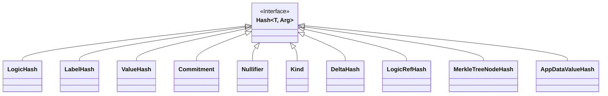

```juvix
module arch.system.state.resource_machine.primitive_interfaces.fixed_size_type.hash;
```

# Hash

Hash type is defined as a fixed size type that is *binding*, meaning that if the input value of type `Arg` changed, the output value would change as well.

In the context of hashes, we say `a` is an **opening** of a hash `h: Hash` if `h = hash(a)`.

!!! todo

    1. for shielded: cryptographic hash, hiding
    2. do we want a separate interface for the logic hash, given it is a verifier key? UPD in Taiga we had the verifier key hashed. Is it fixed size? If not, what was the reason for tripple hashing? vk + hash + function privacy commitment

### LogicHash

In the case of resource logic, the hash used to compute it should output the logic's verifying key and therefore is determined by the proving system used to compute resource logic proofs.

## Hash interface diagram



# Used in
1. Resource components:

  1. `logicRef`
  2. `labelRef`
  3. `valueRef`

2. Resource computable components:

  1. `commitment`
  2. `nullifier`
  3. `kind`
  4. `delta`

3. Computing Merkle tree nodes and roots