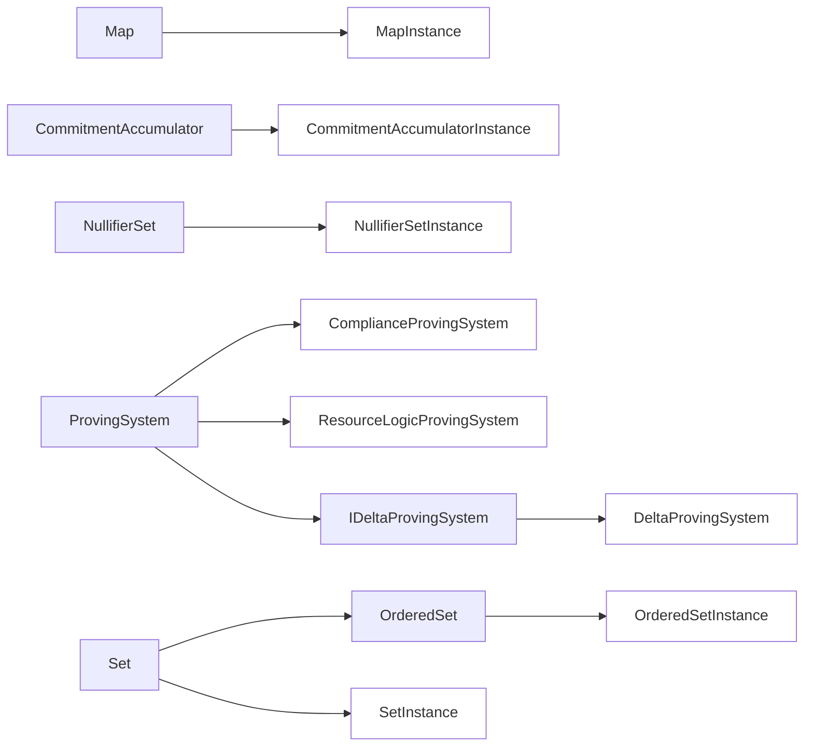
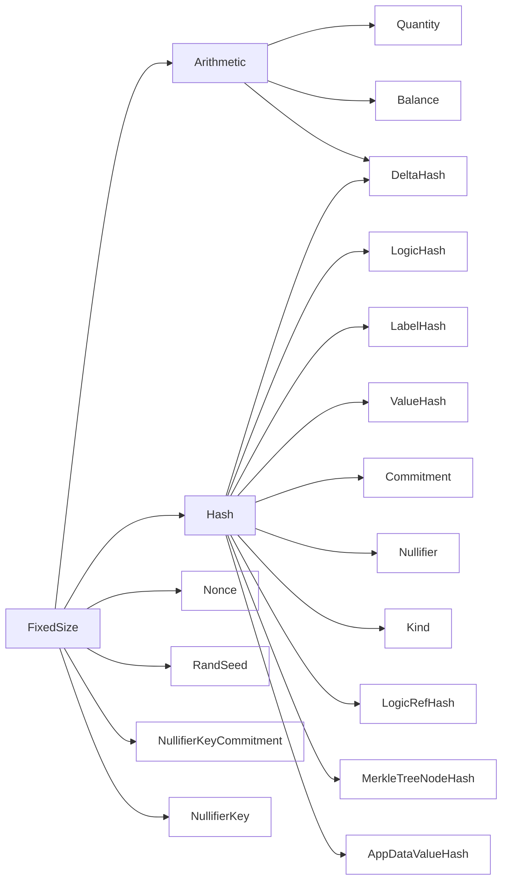

# Primitive interfaces

This section defines the hierarchy of primitives used in resource machine design and describes interfaces for each primitive.

The diagram below illustrates the primitive types required for resource machine. Red nodes correspond to primitive interfaces, green nodes correspond to instantiations of the interfaces. Each primitive instantiation has an associated type, e.g. delta hash instantiation of `Hash` interface has an associated type `DeltaHash`. Primitive instantiations' names are derived from the type name but written in lower camel case, e.g., for `DeltaHash` the corresponding function would be `deltaHash(..)`.

<figure markdown>

<figcaption>Primitive interfaces</figcaption>

</figure>

<figure markdown>

<figcaption>Primitive types</figcaption>

</figure>
